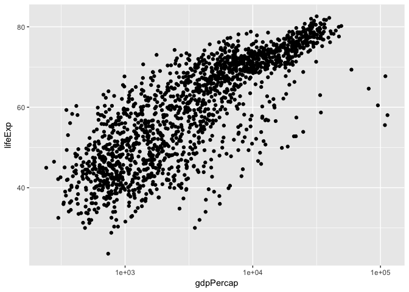
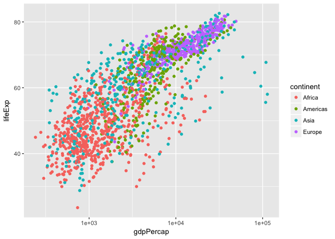
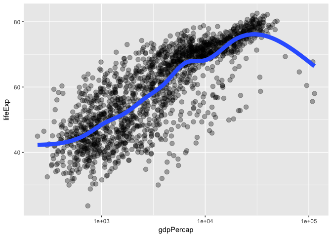
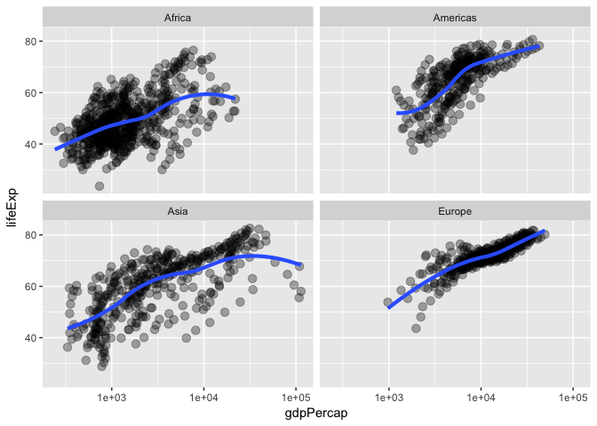

# Hw01-Tang-Jiahui
Jiahui Tang  
2017/9/18  
## Load Packages


```r
library(gapminder)
library(tidyverse)
```

```
## Loading tidyverse: ggplot2
## Loading tidyverse: tibble
## Loading tidyverse: tidyr
## Loading tidyverse: readr
## Loading tidyverse: purrr
## Loading tidyverse: dplyr
```

```
## Conflicts with tidy packages ----------------------------------------------
```

```
## filter(): dplyr, stats
## lag():    dplyr, stats
```

## Displays the structure of gapminder by using str()

```r
str(gapminder)
```

```
## Classes 'tbl_df', 'tbl' and 'data.frame':	1704 obs. of  6 variables:
##  $ country  : Factor w/ 142 levels "Afghanistan",..: 1 1 1 1 1 1 1 1 1 1 ...
##  $ continent: Factor w/ 5 levels "Africa","Americas",..: 3 3 3 3 3 3 3 3 3 3 ...
##  $ year     : int  1952 1957 1962 1967 1972 1977 1982 1987 1992 1997 ...
##  $ lifeExp  : num  28.8 30.3 32 34 36.1 ...
##  $ pop      : int  8425333 9240934 10267083 11537966 13079460 14880372 12881816 13867957 16317921 22227415 ...
##  $ gdpPercap: num  779 821 853 836 740 ...
```

## Print head and tail of gapminder

```r
head(gapminder)
```

```
## # A tibble: 6 x 6
##       country continent  year lifeExp      pop gdpPercap
##        <fctr>    <fctr> <int>   <dbl>    <int>     <dbl>
## 1 Afghanistan      Asia  1952  28.801  8425333  779.4453
## 2 Afghanistan      Asia  1957  30.332  9240934  820.8530
## 3 Afghanistan      Asia  1962  31.997 10267083  853.1007
## 4 Afghanistan      Asia  1967  34.020 11537966  836.1971
## 5 Afghanistan      Asia  1972  36.088 13079460  739.9811
## 6 Afghanistan      Asia  1977  38.438 14880372  786.1134
```

```r
tail(gapminder)
```

```
## # A tibble: 6 x 6
##    country continent  year lifeExp      pop gdpPercap
##     <fctr>    <fctr> <int>   <dbl>    <int>     <dbl>
## 1 Zimbabwe    Africa  1982  60.363  7636524  788.8550
## 2 Zimbabwe    Africa  1987  62.351  9216418  706.1573
## 3 Zimbabwe    Africa  1992  60.377 10704340  693.4208
## 4 Zimbabwe    Africa  1997  46.809 11404948  792.4500
## 5 Zimbabwe    Africa  2002  39.989 11926563  672.0386
## 6 Zimbabwe    Africa  2007  43.487 12311143  469.7093
```

## Print basic info of gapminder

```r
names(gapminder)
```

```
## [1] "country"   "continent" "year"      "lifeExp"   "pop"       "gdpPercap"
```

```r
dim(gapminder)
```

```
## [1] 1704    6
```

```r
length(gapminder)
```

```
## [1] 6
```

```r
nrow(gapminder)
```

```
## [1] 1704
```

```r
summary(gapminder)
```

```
##         country        continent        year         lifeExp     
##  Afghanistan:  12   Africa  :624   Min.   :1952   Min.   :23.60  
##  Albania    :  12   Americas:300   1st Qu.:1966   1st Qu.:48.20  
##  Algeria    :  12   Asia    :396   Median :1980   Median :60.71  
##  Angola     :  12   Europe  :360   Mean   :1980   Mean   :59.47  
##  Argentina  :  12   Oceania : 24   3rd Qu.:1993   3rd Qu.:70.85  
##  Australia  :  12                  Max.   :2007   Max.   :82.60  
##  (Other)    :1632                                                
##       pop              gdpPercap       
##  Min.   :6.001e+04   Min.   :   241.2  
##  1st Qu.:2.794e+06   1st Qu.:  1202.1  
##  Median :7.024e+06   Median :  3531.8  
##  Mean   :2.960e+07   Mean   :  7215.3  
##  3rd Qu.:1.959e+07   3rd Qu.:  9325.5  
##  Max.   :1.319e+09   Max.   :113523.1  
## 
```

## Make figures:

```r
plot(lifeExp ~ year, gapminder)
```

<!-- -->

```r
plot(lifeExp ~ log(gdpPercap), gapminder)
```

<!-- -->

## Explore the lifeExp variable from gapminder

```r
head(gapminder$lifeExp)
```

```
## [1] 28.801 30.332 31.997 34.020 36.088 38.438
```

```r
summary(gapminder$lifeExp)
```

```
##    Min. 1st Qu.  Median    Mean 3rd Qu.    Max. 
##   23.60   48.20   60.71   59.47   70.85   82.60
```

```r
hist(gapminder$lifeExp)
```

<!-- -->

## How factors can be put to work in figures
The `continent` factor is easily mapped into “facets” or colors and a legend by the `ggplot2` package. *Making figures with `ggplot2` is covered elsewhere so feel free to just sit back and enjoy these plots or blindly copy/paste.*

```r
p <- ggplot(filter(gapminder, continent != "Oceania"),
            aes(x = gdpPercap, y = lifeExp)) # just initializes
p <- p + scale_x_log10() # log the x axis the right way
p + geom_point() # scatterplot
```

<!-- -->

```r
p + geom_point(aes(color = continent)) # map continent to color
```

<!-- -->

```r
p + geom_point(alpha = (1/3), size = 3) + geom_smooth(lwd = 3, se = FALSE)
```

```
## `geom_smooth()` using method = 'gam'
```

<!-- -->

```r
p + geom_point(alpha = (1/3), size = 3) + facet_wrap(~ continent) + geom_smooth(lwd = 1.5, se = FALSE)
```

```
## `geom_smooth()` using method = 'loess'
```

<!-- -->
