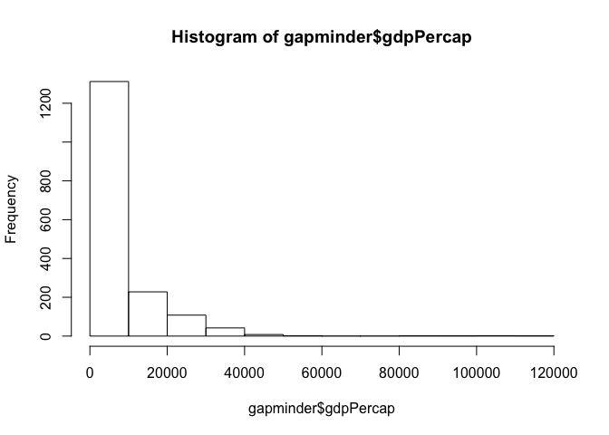
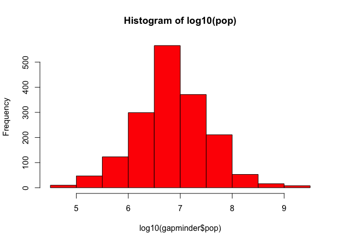

# hw02-Tang-Jiahui
Jiahui Tang  
2017/9/22  
## Load Packages


```r
library(gapminder)
library(tidyverse)
```

```
## Loading tidyverse: ggplot2
## Loading tidyverse: tibble
## Loading tidyverse: tidyr
## Loading tidyverse: readr
## Loading tidyverse: purrr
## Loading tidyverse: dplyr
```

```
## Conflicts with tidy packages ----------------------------------------------
```

```
## filter(): dplyr, stats
## lag():    dplyr, stats
```

## Smell test the data

- Q1: Is it a data.frame, a matrix, a vector, a list?
- Q2: What’s its class?

```r
#typeof(gapminder)
#mode(gapminder)
class(gapminder)
```

```
## [1] "tbl_df"     "tbl"        "data.frame"
```

```r
str(gapminder)
```

```
## Classes 'tbl_df', 'tbl' and 'data.frame':	1704 obs. of  6 variables:
##  $ country  : Factor w/ 142 levels "Afghanistan",..: 1 1 1 1 1 1 1 1 1 1 ...
##  $ continent: Factor w/ 5 levels "Africa","Americas",..: 3 3 3 3 3 3 3 3 3 3 ...
##  $ year     : int  1952 1957 1962 1967 1972 1977 1982 1987 1992 1997 ...
##  $ lifeExp  : num  28.8 30.3 32 34 36.1 ...
##  $ pop      : int  8425333 9240934 10267083 11537966 13079460 14880372 12881816 13867957 16317921 22227415 ...
##  $ gdpPercap: num  779 821 853 836 740 ...
```
  A1: It is a data.frame.
 
  A2: Gapminder is actually a tibble(data.frame tbl/tbl_df), which is useful for `dplyr`. 

Acutally I am kind of confused with `typeof()`, `mode()` and `class()`. There is a clear explanation on [stackoverflow](https://stackoverflow.com/questions/8855589/a-comprehensive-survey-of-the-types-of-things-in-r-mode-and-class-and-type). I believe `mode()` would get the type or storage mode of an object, while `typeof()` function would be more specific. The `class()` is used to define/identify what "type" an object is from the point of view of object-oriented programming in R.

- Q3: How many variables/columns?
- Q4: How many rows/observations?
- Q5: Can you get these facts about “extent” or “size” in more than one way? Can you imagine different functions being useful in different contexts?
- Q6: What data type is each variable?

```r
ncol(gapminder)
```

```
## [1] 6
```

```r
length(gapminder)
```

```
## [1] 6
```

```r
nrow(gapminder)
```

```
## [1] 1704
```

```r
dim(gapminder)
```

```
## [1] 1704    6
```

```r
summary(gapminder)
```

```
##         country        continent        year         lifeExp     
##  Afghanistan:  12   Africa  :624   Min.   :1952   Min.   :23.60  
##  Albania    :  12   Americas:300   1st Qu.:1966   1st Qu.:48.20  
##  Algeria    :  12   Asia    :396   Median :1980   Median :60.71  
##  Angola     :  12   Europe  :360   Mean   :1980   Mean   :59.47  
##  Argentina  :  12   Oceania : 24   3rd Qu.:1993   3rd Qu.:70.85  
##  Australia  :  12                  Max.   :2007   Max.   :82.60  
##  (Other)    :1632                                                
##       pop              gdpPercap       
##  Min.   :6.001e+04   Min.   :   241.2  
##  1st Qu.:2.794e+06   1st Qu.:  1202.1  
##  Median :7.024e+06   Median :  3531.8  
##  Mean   :2.960e+07   Mean   :  7215.3  
##  3rd Qu.:1.959e+07   3rd Qu.:  9325.5  
##  Max.   :1.319e+09   Max.   :113523.1  
## 
```

```r
str(gapminder)
```

```
## Classes 'tbl_df', 'tbl' and 'data.frame':	1704 obs. of  6 variables:
##  $ country  : Factor w/ 142 levels "Afghanistan",..: 1 1 1 1 1 1 1 1 1 1 ...
##  $ continent: Factor w/ 5 levels "Africa","Americas",..: 3 3 3 3 3 3 3 3 3 3 ...
##  $ year     : int  1952 1957 1962 1967 1972 1977 1982 1987 1992 1997 ...
##  $ lifeExp  : num  28.8 30.3 32 34 36.1 ...
##  $ pop      : int  8425333 9240934 10267083 11537966 13079460 14880372 12881816 13867957 16317921 22227415 ...
##  $ gdpPercap: num  779 821 853 836 740 ...
```

```r
head(gapminder)
```

```
## # A tibble: 6 x 6
##       country continent  year lifeExp      pop gdpPercap
##        <fctr>    <fctr> <int>   <dbl>    <int>     <dbl>
## 1 Afghanistan      Asia  1952  28.801  8425333  779.4453
## 2 Afghanistan      Asia  1957  30.332  9240934  820.8530
## 3 Afghanistan      Asia  1962  31.997 10267083  853.1007
## 4 Afghanistan      Asia  1967  34.020 11537966  836.1971
## 5 Afghanistan      Asia  1972  36.088 13079460  739.9811
## 6 Afghanistan      Asia  1977  38.438 14880372  786.1134
```
  A3: 6. As we can see above, we can use `ncol()`, `length()` and `dim()` to find out the number of variables/columns.
 
  A4: 1704. Similarly, `nrow()`, `dim()` can be used to look up the number of rows/observations.
 
  A5: As we know above, we can absolutely use different functions. I think some function like `nrow()` and `ncol()` are more specific to get direct answers, while others like `dim()`, `summary()` and `str()` would give basic informations and we can figure out what we want from the results.
 
  A6: From the results of `str()` and `head()`, we can get the type of each variable:country and continent -> Factor,year and pop -> Integer, LifeExp and gdpPercap -> num(double).
 
## Explore individual variables

We can easily find categorical variables and quantitative variables from the results above:

*categorical variables*: country, continent
*quantitative variables*:year, lifeExp, pop, gdpPercap

We will pick `country` and `gdpPercap` to explore.
- Q1: What are possible values (or range, whichever is appropriate) of each variable?
  A1: For categorical variables, we can use some functions as follows:

```r
print(gapminder$country)
```

```
##    [1] Afghanistan              Afghanistan             
##    [3] Afghanistan              Afghanistan             
##    [5] Afghanistan              Afghanistan             
##    [7] Afghanistan              Afghanistan             
##    [9] Afghanistan              Afghanistan             
##   [11] Afghanistan              Afghanistan             
##   [13] Albania                  Albania                 
##   [15] Albania                  Albania                 
##   [17] Albania                  Albania                 
##   [19] Albania                  Albania                 
##   [21] Albania                  Albania                 
##   [23] Albania                  Albania                 
##   [25] Algeria                  Algeria                 
##   [27] Algeria                  Algeria                 
##   [29] Algeria                  Algeria                 
##   [31] Algeria                  Algeria                 
##   [33] Algeria                  Algeria                 
##   [35] Algeria                  Algeria                 
##   [37] Angola                   Angola                  
##   [39] Angola                   Angola                  
##   [41] Angola                   Angola                  
##   [43] Angola                   Angola                  
##   [45] Angola                   Angola                  
##   [47] Angola                   Angola                  
##   [49] Argentina                Argentina               
##   [51] Argentina                Argentina               
##   [53] Argentina                Argentina               
##   [55] Argentina                Argentina               
##   [57] Argentina                Argentina               
##   [59] Argentina                Argentina               
##   [61] Australia                Australia               
##   [63] Australia                Australia               
##   [65] Australia                Australia               
##   [67] Australia                Australia               
##   [69] Australia                Australia               
##   [71] Australia                Australia               
##   [73] Austria                  Austria                 
##   [75] Austria                  Austria                 
##   [77] Austria                  Austria                 
##   [79] Austria                  Austria                 
##   [81] Austria                  Austria                 
##   [83] Austria                  Austria                 
##   [85] Bahrain                  Bahrain                 
##   [87] Bahrain                  Bahrain                 
##   [89] Bahrain                  Bahrain                 
##   [91] Bahrain                  Bahrain                 
##   [93] Bahrain                  Bahrain                 
##   [95] Bahrain                  Bahrain                 
##   [97] Bangladesh               Bangladesh              
##   [99] Bangladesh               Bangladesh              
##  [101] Bangladesh               Bangladesh              
##  [103] Bangladesh               Bangladesh              
##  [105] Bangladesh               Bangladesh              
##  [107] Bangladesh               Bangladesh              
##  [109] Belgium                  Belgium                 
##  [111] Belgium                  Belgium                 
##  [113] Belgium                  Belgium                 
##  [115] Belgium                  Belgium                 
##  [117] Belgium                  Belgium                 
##  [119] Belgium                  Belgium                 
##  [121] Benin                    Benin                   
##  [123] Benin                    Benin                   
##  [125] Benin                    Benin                   
##  [127] Benin                    Benin                   
##  [129] Benin                    Benin                   
##  [131] Benin                    Benin                   
##  [133] Bolivia                  Bolivia                 
##  [135] Bolivia                  Bolivia                 
##  [137] Bolivia                  Bolivia                 
##  [139] Bolivia                  Bolivia                 
##  [141] Bolivia                  Bolivia                 
##  [143] Bolivia                  Bolivia                 
##  [145] Bosnia and Herzegovina   Bosnia and Herzegovina  
##  [147] Bosnia and Herzegovina   Bosnia and Herzegovina  
##  [149] Bosnia and Herzegovina   Bosnia and Herzegovina  
##  [151] Bosnia and Herzegovina   Bosnia and Herzegovina  
##  [153] Bosnia and Herzegovina   Bosnia and Herzegovina  
##  [155] Bosnia and Herzegovina   Bosnia and Herzegovina  
##  [157] Botswana                 Botswana                
##  [159] Botswana                 Botswana                
##  [161] Botswana                 Botswana                
##  [163] Botswana                 Botswana                
##  [165] Botswana                 Botswana                
##  [167] Botswana                 Botswana                
##  [169] Brazil                   Brazil                  
##  [171] Brazil                   Brazil                  
##  [173] Brazil                   Brazil                  
##  [175] Brazil                   Brazil                  
##  [177] Brazil                   Brazil                  
##  [179] Brazil                   Brazil                  
##  [181] Bulgaria                 Bulgaria                
##  [183] Bulgaria                 Bulgaria                
##  [185] Bulgaria                 Bulgaria                
##  [187] Bulgaria                 Bulgaria                
##  [189] Bulgaria                 Bulgaria                
##  [191] Bulgaria                 Bulgaria                
##  [193] Burkina Faso             Burkina Faso            
##  [195] Burkina Faso             Burkina Faso            
##  [197] Burkina Faso             Burkina Faso            
##  [199] Burkina Faso             Burkina Faso            
##  [201] Burkina Faso             Burkina Faso            
##  [203] Burkina Faso             Burkina Faso            
##  [205] Burundi                  Burundi                 
##  [207] Burundi                  Burundi                 
##  [209] Burundi                  Burundi                 
##  [211] Burundi                  Burundi                 
##  [213] Burundi                  Burundi                 
##  [215] Burundi                  Burundi                 
##  [217] Cambodia                 Cambodia                
##  [219] Cambodia                 Cambodia                
##  [221] Cambodia                 Cambodia                
##  [223] Cambodia                 Cambodia                
##  [225] Cambodia                 Cambodia                
##  [227] Cambodia                 Cambodia                
##  [229] Cameroon                 Cameroon                
##  [231] Cameroon                 Cameroon                
##  [233] Cameroon                 Cameroon                
##  [235] Cameroon                 Cameroon                
##  [237] Cameroon                 Cameroon                
##  [239] Cameroon                 Cameroon                
##  [241] Canada                   Canada                  
##  [243] Canada                   Canada                  
##  [245] Canada                   Canada                  
##  [247] Canada                   Canada                  
##  [249] Canada                   Canada                  
##  [251] Canada                   Canada                  
##  [253] Central African Republic Central African Republic
##  [255] Central African Republic Central African Republic
##  [257] Central African Republic Central African Republic
##  [259] Central African Republic Central African Republic
##  [261] Central African Republic Central African Republic
##  [263] Central African Republic Central African Republic
##  [265] Chad                     Chad                    
##  [267] Chad                     Chad                    
##  [269] Chad                     Chad                    
##  [271] Chad                     Chad                    
##  [273] Chad                     Chad                    
##  [275] Chad                     Chad                    
##  [277] Chile                    Chile                   
##  [279] Chile                    Chile                   
##  [281] Chile                    Chile                   
##  [283] Chile                    Chile                   
##  [285] Chile                    Chile                   
##  [287] Chile                    Chile                   
##  [289] China                    China                   
##  [291] China                    China                   
##  [293] China                    China                   
##  [295] China                    China                   
##  [297] China                    China                   
##  [299] China                    China                   
##  [301] Colombia                 Colombia                
##  [303] Colombia                 Colombia                
##  [305] Colombia                 Colombia                
##  [307] Colombia                 Colombia                
##  [309] Colombia                 Colombia                
##  [311] Colombia                 Colombia                
##  [313] Comoros                  Comoros                 
##  [315] Comoros                  Comoros                 
##  [317] Comoros                  Comoros                 
##  [319] Comoros                  Comoros                 
##  [321] Comoros                  Comoros                 
##  [323] Comoros                  Comoros                 
##  [325] Congo, Dem. Rep.         Congo, Dem. Rep.        
##  [327] Congo, Dem. Rep.         Congo, Dem. Rep.        
##  [329] Congo, Dem. Rep.         Congo, Dem. Rep.        
##  [331] Congo, Dem. Rep.         Congo, Dem. Rep.        
##  [333] Congo, Dem. Rep.         Congo, Dem. Rep.        
##  [335] Congo, Dem. Rep.         Congo, Dem. Rep.        
##  [337] Congo, Rep.              Congo, Rep.             
##  [339] Congo, Rep.              Congo, Rep.             
##  [341] Congo, Rep.              Congo, Rep.             
##  [343] Congo, Rep.              Congo, Rep.             
##  [345] Congo, Rep.              Congo, Rep.             
##  [347] Congo, Rep.              Congo, Rep.             
##  [349] Costa Rica               Costa Rica              
##  [351] Costa Rica               Costa Rica              
##  [353] Costa Rica               Costa Rica              
##  [355] Costa Rica               Costa Rica              
##  [357] Costa Rica               Costa Rica              
##  [359] Costa Rica               Costa Rica              
##  [361] Cote d'Ivoire            Cote d'Ivoire           
##  [363] Cote d'Ivoire            Cote d'Ivoire           
##  [365] Cote d'Ivoire            Cote d'Ivoire           
##  [367] Cote d'Ivoire            Cote d'Ivoire           
##  [369] Cote d'Ivoire            Cote d'Ivoire           
##  [371] Cote d'Ivoire            Cote d'Ivoire           
##  [373] Croatia                  Croatia                 
##  [375] Croatia                  Croatia                 
##  [377] Croatia                  Croatia                 
##  [379] Croatia                  Croatia                 
##  [381] Croatia                  Croatia                 
##  [383] Croatia                  Croatia                 
##  [385] Cuba                     Cuba                    
##  [387] Cuba                     Cuba                    
##  [389] Cuba                     Cuba                    
##  [391] Cuba                     Cuba                    
##  [393] Cuba                     Cuba                    
##  [395] Cuba                     Cuba                    
##  [397] Czech Republic           Czech Republic          
##  [399] Czech Republic           Czech Republic          
##  [401] Czech Republic           Czech Republic          
##  [403] Czech Republic           Czech Republic          
##  [405] Czech Republic           Czech Republic          
##  [407] Czech Republic           Czech Republic          
##  [409] Denmark                  Denmark                 
##  [411] Denmark                  Denmark                 
##  [413] Denmark                  Denmark                 
##  [415] Denmark                  Denmark                 
##  [417] Denmark                  Denmark                 
##  [419] Denmark                  Denmark                 
##  [421] Djibouti                 Djibouti                
##  [423] Djibouti                 Djibouti                
##  [425] Djibouti                 Djibouti                
##  [427] Djibouti                 Djibouti                
##  [429] Djibouti                 Djibouti                
##  [431] Djibouti                 Djibouti                
##  [433] Dominican Republic       Dominican Republic      
##  [435] Dominican Republic       Dominican Republic      
##  [437] Dominican Republic       Dominican Republic      
##  [439] Dominican Republic       Dominican Republic      
##  [441] Dominican Republic       Dominican Republic      
##  [443] Dominican Republic       Dominican Republic      
##  [445] Ecuador                  Ecuador                 
##  [447] Ecuador                  Ecuador                 
##  [449] Ecuador                  Ecuador                 
##  [451] Ecuador                  Ecuador                 
##  [453] Ecuador                  Ecuador                 
##  [455] Ecuador                  Ecuador                 
##  [457] Egypt                    Egypt                   
##  [459] Egypt                    Egypt                   
##  [461] Egypt                    Egypt                   
##  [463] Egypt                    Egypt                   
##  [465] Egypt                    Egypt                   
##  [467] Egypt                    Egypt                   
##  [469] El Salvador              El Salvador             
##  [471] El Salvador              El Salvador             
##  [473] El Salvador              El Salvador             
##  [475] El Salvador              El Salvador             
##  [477] El Salvador              El Salvador             
##  [479] El Salvador              El Salvador             
##  [481] Equatorial Guinea        Equatorial Guinea       
##  [483] Equatorial Guinea        Equatorial Guinea       
##  [485] Equatorial Guinea        Equatorial Guinea       
##  [487] Equatorial Guinea        Equatorial Guinea       
##  [489] Equatorial Guinea        Equatorial Guinea       
##  [491] Equatorial Guinea        Equatorial Guinea       
##  [493] Eritrea                  Eritrea                 
##  [495] Eritrea                  Eritrea                 
##  [497] Eritrea                  Eritrea                 
##  [499] Eritrea                  Eritrea                 
##  [501] Eritrea                  Eritrea                 
##  [503] Eritrea                  Eritrea                 
##  [505] Ethiopia                 Ethiopia                
##  [507] Ethiopia                 Ethiopia                
##  [509] Ethiopia                 Ethiopia                
##  [511] Ethiopia                 Ethiopia                
##  [513] Ethiopia                 Ethiopia                
##  [515] Ethiopia                 Ethiopia                
##  [517] Finland                  Finland                 
##  [519] Finland                  Finland                 
##  [521] Finland                  Finland                 
##  [523] Finland                  Finland                 
##  [525] Finland                  Finland                 
##  [527] Finland                  Finland                 
##  [529] France                   France                  
##  [531] France                   France                  
##  [533] France                   France                  
##  [535] France                   France                  
##  [537] France                   France                  
##  [539] France                   France                  
##  [541] Gabon                    Gabon                   
##  [543] Gabon                    Gabon                   
##  [545] Gabon                    Gabon                   
##  [547] Gabon                    Gabon                   
##  [549] Gabon                    Gabon                   
##  [551] Gabon                    Gabon                   
##  [553] Gambia                   Gambia                  
##  [555] Gambia                   Gambia                  
##  [557] Gambia                   Gambia                  
##  [559] Gambia                   Gambia                  
##  [561] Gambia                   Gambia                  
##  [563] Gambia                   Gambia                  
##  [565] Germany                  Germany                 
##  [567] Germany                  Germany                 
##  [569] Germany                  Germany                 
##  [571] Germany                  Germany                 
##  [573] Germany                  Germany                 
##  [575] Germany                  Germany                 
##  [577] Ghana                    Ghana                   
##  [579] Ghana                    Ghana                   
##  [581] Ghana                    Ghana                   
##  [583] Ghana                    Ghana                   
##  [585] Ghana                    Ghana                   
##  [587] Ghana                    Ghana                   
##  [589] Greece                   Greece                  
##  [591] Greece                   Greece                  
##  [593] Greece                   Greece                  
##  [595] Greece                   Greece                  
##  [597] Greece                   Greece                  
##  [599] Greece                   Greece                  
##  [601] Guatemala                Guatemala               
##  [603] Guatemala                Guatemala               
##  [605] Guatemala                Guatemala               
##  [607] Guatemala                Guatemala               
##  [609] Guatemala                Guatemala               
##  [611] Guatemala                Guatemala               
##  [613] Guinea                   Guinea                  
##  [615] Guinea                   Guinea                  
##  [617] Guinea                   Guinea                  
##  [619] Guinea                   Guinea                  
##  [621] Guinea                   Guinea                  
##  [623] Guinea                   Guinea                  
##  [625] Guinea-Bissau            Guinea-Bissau           
##  [627] Guinea-Bissau            Guinea-Bissau           
##  [629] Guinea-Bissau            Guinea-Bissau           
##  [631] Guinea-Bissau            Guinea-Bissau           
##  [633] Guinea-Bissau            Guinea-Bissau           
##  [635] Guinea-Bissau            Guinea-Bissau           
##  [637] Haiti                    Haiti                   
##  [639] Haiti                    Haiti                   
##  [641] Haiti                    Haiti                   
##  [643] Haiti                    Haiti                   
##  [645] Haiti                    Haiti                   
##  [647] Haiti                    Haiti                   
##  [649] Honduras                 Honduras                
##  [651] Honduras                 Honduras                
##  [653] Honduras                 Honduras                
##  [655] Honduras                 Honduras                
##  [657] Honduras                 Honduras                
##  [659] Honduras                 Honduras                
##  [661] Hong Kong, China         Hong Kong, China        
##  [663] Hong Kong, China         Hong Kong, China        
##  [665] Hong Kong, China         Hong Kong, China        
##  [667] Hong Kong, China         Hong Kong, China        
##  [669] Hong Kong, China         Hong Kong, China        
##  [671] Hong Kong, China         Hong Kong, China        
##  [673] Hungary                  Hungary                 
##  [675] Hungary                  Hungary                 
##  [677] Hungary                  Hungary                 
##  [679] Hungary                  Hungary                 
##  [681] Hungary                  Hungary                 
##  [683] Hungary                  Hungary                 
##  [685] Iceland                  Iceland                 
##  [687] Iceland                  Iceland                 
##  [689] Iceland                  Iceland                 
##  [691] Iceland                  Iceland                 
##  [693] Iceland                  Iceland                 
##  [695] Iceland                  Iceland                 
##  [697] India                    India                   
##  [699] India                    India                   
##  [701] India                    India                   
##  [703] India                    India                   
##  [705] India                    India                   
##  [707] India                    India                   
##  [709] Indonesia                Indonesia               
##  [711] Indonesia                Indonesia               
##  [713] Indonesia                Indonesia               
##  [715] Indonesia                Indonesia               
##  [717] Indonesia                Indonesia               
##  [719] Indonesia                Indonesia               
##  [721] Iran                     Iran                    
##  [723] Iran                     Iran                    
##  [725] Iran                     Iran                    
##  [727] Iran                     Iran                    
##  [729] Iran                     Iran                    
##  [731] Iran                     Iran                    
##  [733] Iraq                     Iraq                    
##  [735] Iraq                     Iraq                    
##  [737] Iraq                     Iraq                    
##  [739] Iraq                     Iraq                    
##  [741] Iraq                     Iraq                    
##  [743] Iraq                     Iraq                    
##  [745] Ireland                  Ireland                 
##  [747] Ireland                  Ireland                 
##  [749] Ireland                  Ireland                 
##  [751] Ireland                  Ireland                 
##  [753] Ireland                  Ireland                 
##  [755] Ireland                  Ireland                 
##  [757] Israel                   Israel                  
##  [759] Israel                   Israel                  
##  [761] Israel                   Israel                  
##  [763] Israel                   Israel                  
##  [765] Israel                   Israel                  
##  [767] Israel                   Israel                  
##  [769] Italy                    Italy                   
##  [771] Italy                    Italy                   
##  [773] Italy                    Italy                   
##  [775] Italy                    Italy                   
##  [777] Italy                    Italy                   
##  [779] Italy                    Italy                   
##  [781] Jamaica                  Jamaica                 
##  [783] Jamaica                  Jamaica                 
##  [785] Jamaica                  Jamaica                 
##  [787] Jamaica                  Jamaica                 
##  [789] Jamaica                  Jamaica                 
##  [791] Jamaica                  Jamaica                 
##  [793] Japan                    Japan                   
##  [795] Japan                    Japan                   
##  [797] Japan                    Japan                   
##  [799] Japan                    Japan                   
##  [801] Japan                    Japan                   
##  [803] Japan                    Japan                   
##  [805] Jordan                   Jordan                  
##  [807] Jordan                   Jordan                  
##  [809] Jordan                   Jordan                  
##  [811] Jordan                   Jordan                  
##  [813] Jordan                   Jordan                  
##  [815] Jordan                   Jordan                  
##  [817] Kenya                    Kenya                   
##  [819] Kenya                    Kenya                   
##  [821] Kenya                    Kenya                   
##  [823] Kenya                    Kenya                   
##  [825] Kenya                    Kenya                   
##  [827] Kenya                    Kenya                   
##  [829] Korea, Dem. Rep.         Korea, Dem. Rep.        
##  [831] Korea, Dem. Rep.         Korea, Dem. Rep.        
##  [833] Korea, Dem. Rep.         Korea, Dem. Rep.        
##  [835] Korea, Dem. Rep.         Korea, Dem. Rep.        
##  [837] Korea, Dem. Rep.         Korea, Dem. Rep.        
##  [839] Korea, Dem. Rep.         Korea, Dem. Rep.        
##  [841] Korea, Rep.              Korea, Rep.             
##  [843] Korea, Rep.              Korea, Rep.             
##  [845] Korea, Rep.              Korea, Rep.             
##  [847] Korea, Rep.              Korea, Rep.             
##  [849] Korea, Rep.              Korea, Rep.             
##  [851] Korea, Rep.              Korea, Rep.             
##  [853] Kuwait                   Kuwait                  
##  [855] Kuwait                   Kuwait                  
##  [857] Kuwait                   Kuwait                  
##  [859] Kuwait                   Kuwait                  
##  [861] Kuwait                   Kuwait                  
##  [863] Kuwait                   Kuwait                  
##  [865] Lebanon                  Lebanon                 
##  [867] Lebanon                  Lebanon                 
##  [869] Lebanon                  Lebanon                 
##  [871] Lebanon                  Lebanon                 
##  [873] Lebanon                  Lebanon                 
##  [875] Lebanon                  Lebanon                 
##  [877] Lesotho                  Lesotho                 
##  [879] Lesotho                  Lesotho                 
##  [881] Lesotho                  Lesotho                 
##  [883] Lesotho                  Lesotho                 
##  [885] Lesotho                  Lesotho                 
##  [887] Lesotho                  Lesotho                 
##  [889] Liberia                  Liberia                 
##  [891] Liberia                  Liberia                 
##  [893] Liberia                  Liberia                 
##  [895] Liberia                  Liberia                 
##  [897] Liberia                  Liberia                 
##  [899] Liberia                  Liberia                 
##  [901] Libya                    Libya                   
##  [903] Libya                    Libya                   
##  [905] Libya                    Libya                   
##  [907] Libya                    Libya                   
##  [909] Libya                    Libya                   
##  [911] Libya                    Libya                   
##  [913] Madagascar               Madagascar              
##  [915] Madagascar               Madagascar              
##  [917] Madagascar               Madagascar              
##  [919] Madagascar               Madagascar              
##  [921] Madagascar               Madagascar              
##  [923] Madagascar               Madagascar              
##  [925] Malawi                   Malawi                  
##  [927] Malawi                   Malawi                  
##  [929] Malawi                   Malawi                  
##  [931] Malawi                   Malawi                  
##  [933] Malawi                   Malawi                  
##  [935] Malawi                   Malawi                  
##  [937] Malaysia                 Malaysia                
##  [939] Malaysia                 Malaysia                
##  [941] Malaysia                 Malaysia                
##  [943] Malaysia                 Malaysia                
##  [945] Malaysia                 Malaysia                
##  [947] Malaysia                 Malaysia                
##  [949] Mali                     Mali                    
##  [951] Mali                     Mali                    
##  [953] Mali                     Mali                    
##  [955] Mali                     Mali                    
##  [957] Mali                     Mali                    
##  [959] Mali                     Mali                    
##  [961] Mauritania               Mauritania              
##  [963] Mauritania               Mauritania              
##  [965] Mauritania               Mauritania              
##  [967] Mauritania               Mauritania              
##  [969] Mauritania               Mauritania              
##  [971] Mauritania               Mauritania              
##  [973] Mauritius                Mauritius               
##  [975] Mauritius                Mauritius               
##  [977] Mauritius                Mauritius               
##  [979] Mauritius                Mauritius               
##  [981] Mauritius                Mauritius               
##  [983] Mauritius                Mauritius               
##  [985] Mexico                   Mexico                  
##  [987] Mexico                   Mexico                  
##  [989] Mexico                   Mexico                  
##  [991] Mexico                   Mexico                  
##  [993] Mexico                   Mexico                  
##  [995] Mexico                   Mexico                  
##  [997] Mongolia                 Mongolia                
##  [999] Mongolia                 Mongolia                
## [1001] Mongolia                 Mongolia                
## [1003] Mongolia                 Mongolia                
## [1005] Mongolia                 Mongolia                
## [1007] Mongolia                 Mongolia                
## [1009] Montenegro               Montenegro              
## [1011] Montenegro               Montenegro              
## [1013] Montenegro               Montenegro              
## [1015] Montenegro               Montenegro              
## [1017] Montenegro               Montenegro              
## [1019] Montenegro               Montenegro              
## [1021] Morocco                  Morocco                 
## [1023] Morocco                  Morocco                 
## [1025] Morocco                  Morocco                 
## [1027] Morocco                  Morocco                 
## [1029] Morocco                  Morocco                 
## [1031] Morocco                  Morocco                 
## [1033] Mozambique               Mozambique              
## [1035] Mozambique               Mozambique              
## [1037] Mozambique               Mozambique              
## [1039] Mozambique               Mozambique              
## [1041] Mozambique               Mozambique              
## [1043] Mozambique               Mozambique              
## [1045] Myanmar                  Myanmar                 
## [1047] Myanmar                  Myanmar                 
## [1049] Myanmar                  Myanmar                 
## [1051] Myanmar                  Myanmar                 
## [1053] Myanmar                  Myanmar                 
## [1055] Myanmar                  Myanmar                 
## [1057] Namibia                  Namibia                 
## [1059] Namibia                  Namibia                 
## [1061] Namibia                  Namibia                 
## [1063] Namibia                  Namibia                 
## [1065] Namibia                  Namibia                 
## [1067] Namibia                  Namibia                 
## [1069] Nepal                    Nepal                   
## [1071] Nepal                    Nepal                   
## [1073] Nepal                    Nepal                   
## [1075] Nepal                    Nepal                   
## [1077] Nepal                    Nepal                   
## [1079] Nepal                    Nepal                   
## [1081] Netherlands              Netherlands             
## [1083] Netherlands              Netherlands             
## [1085] Netherlands              Netherlands             
## [1087] Netherlands              Netherlands             
## [1089] Netherlands              Netherlands             
## [1091] Netherlands              Netherlands             
## [1093] New Zealand              New Zealand             
## [1095] New Zealand              New Zealand             
## [1097] New Zealand              New Zealand             
## [1099] New Zealand              New Zealand             
## [1101] New Zealand              New Zealand             
## [1103] New Zealand              New Zealand             
## [1105] Nicaragua                Nicaragua               
## [1107] Nicaragua                Nicaragua               
## [1109] Nicaragua                Nicaragua               
## [1111] Nicaragua                Nicaragua               
## [1113] Nicaragua                Nicaragua               
## [1115] Nicaragua                Nicaragua               
## [1117] Niger                    Niger                   
## [1119] Niger                    Niger                   
## [1121] Niger                    Niger                   
## [1123] Niger                    Niger                   
## [1125] Niger                    Niger                   
## [1127] Niger                    Niger                   
## [1129] Nigeria                  Nigeria                 
## [1131] Nigeria                  Nigeria                 
## [1133] Nigeria                  Nigeria                 
## [1135] Nigeria                  Nigeria                 
## [1137] Nigeria                  Nigeria                 
## [1139] Nigeria                  Nigeria                 
## [1141] Norway                   Norway                  
## [1143] Norway                   Norway                  
## [1145] Norway                   Norway                  
## [1147] Norway                   Norway                  
## [1149] Norway                   Norway                  
## [1151] Norway                   Norway                  
## [1153] Oman                     Oman                    
## [1155] Oman                     Oman                    
## [1157] Oman                     Oman                    
## [1159] Oman                     Oman                    
## [1161] Oman                     Oman                    
## [1163] Oman                     Oman                    
## [1165] Pakistan                 Pakistan                
## [1167] Pakistan                 Pakistan                
## [1169] Pakistan                 Pakistan                
## [1171] Pakistan                 Pakistan                
## [1173] Pakistan                 Pakistan                
## [1175] Pakistan                 Pakistan                
## [1177] Panama                   Panama                  
## [1179] Panama                   Panama                  
## [1181] Panama                   Panama                  
## [1183] Panama                   Panama                  
## [1185] Panama                   Panama                  
## [1187] Panama                   Panama                  
## [1189] Paraguay                 Paraguay                
## [1191] Paraguay                 Paraguay                
## [1193] Paraguay                 Paraguay                
## [1195] Paraguay                 Paraguay                
## [1197] Paraguay                 Paraguay                
## [1199] Paraguay                 Paraguay                
## [1201] Peru                     Peru                    
## [1203] Peru                     Peru                    
## [1205] Peru                     Peru                    
## [1207] Peru                     Peru                    
## [1209] Peru                     Peru                    
## [1211] Peru                     Peru                    
## [1213] Philippines              Philippines             
## [1215] Philippines              Philippines             
## [1217] Philippines              Philippines             
## [1219] Philippines              Philippines             
## [1221] Philippines              Philippines             
## [1223] Philippines              Philippines             
## [1225] Poland                   Poland                  
## [1227] Poland                   Poland                  
## [1229] Poland                   Poland                  
## [1231] Poland                   Poland                  
## [1233] Poland                   Poland                  
## [1235] Poland                   Poland                  
## [1237] Portugal                 Portugal                
## [1239] Portugal                 Portugal                
## [1241] Portugal                 Portugal                
## [1243] Portugal                 Portugal                
## [1245] Portugal                 Portugal                
## [1247] Portugal                 Portugal                
## [1249] Puerto Rico              Puerto Rico             
## [1251] Puerto Rico              Puerto Rico             
## [1253] Puerto Rico              Puerto Rico             
## [1255] Puerto Rico              Puerto Rico             
## [1257] Puerto Rico              Puerto Rico             
## [1259] Puerto Rico              Puerto Rico             
## [1261] Reunion                  Reunion                 
## [1263] Reunion                  Reunion                 
## [1265] Reunion                  Reunion                 
## [1267] Reunion                  Reunion                 
## [1269] Reunion                  Reunion                 
## [1271] Reunion                  Reunion                 
## [1273] Romania                  Romania                 
## [1275] Romania                  Romania                 
## [1277] Romania                  Romania                 
## [1279] Romania                  Romania                 
## [1281] Romania                  Romania                 
## [1283] Romania                  Romania                 
## [1285] Rwanda                   Rwanda                  
## [1287] Rwanda                   Rwanda                  
## [1289] Rwanda                   Rwanda                  
## [1291] Rwanda                   Rwanda                  
## [1293] Rwanda                   Rwanda                  
## [1295] Rwanda                   Rwanda                  
## [1297] Sao Tome and Principe    Sao Tome and Principe   
## [1299] Sao Tome and Principe    Sao Tome and Principe   
## [1301] Sao Tome and Principe    Sao Tome and Principe   
## [1303] Sao Tome and Principe    Sao Tome and Principe   
## [1305] Sao Tome and Principe    Sao Tome and Principe   
## [1307] Sao Tome and Principe    Sao Tome and Principe   
## [1309] Saudi Arabia             Saudi Arabia            
## [1311] Saudi Arabia             Saudi Arabia            
## [1313] Saudi Arabia             Saudi Arabia            
## [1315] Saudi Arabia             Saudi Arabia            
## [1317] Saudi Arabia             Saudi Arabia            
## [1319] Saudi Arabia             Saudi Arabia            
## [1321] Senegal                  Senegal                 
## [1323] Senegal                  Senegal                 
## [1325] Senegal                  Senegal                 
## [1327] Senegal                  Senegal                 
## [1329] Senegal                  Senegal                 
## [1331] Senegal                  Senegal                 
## [1333] Serbia                   Serbia                  
## [1335] Serbia                   Serbia                  
## [1337] Serbia                   Serbia                  
## [1339] Serbia                   Serbia                  
## [1341] Serbia                   Serbia                  
## [1343] Serbia                   Serbia                  
## [1345] Sierra Leone             Sierra Leone            
## [1347] Sierra Leone             Sierra Leone            
## [1349] Sierra Leone             Sierra Leone            
## [1351] Sierra Leone             Sierra Leone            
## [1353] Sierra Leone             Sierra Leone            
## [1355] Sierra Leone             Sierra Leone            
## [1357] Singapore                Singapore               
## [1359] Singapore                Singapore               
## [1361] Singapore                Singapore               
## [1363] Singapore                Singapore               
## [1365] Singapore                Singapore               
## [1367] Singapore                Singapore               
## [1369] Slovak Republic          Slovak Republic         
## [1371] Slovak Republic          Slovak Republic         
## [1373] Slovak Republic          Slovak Republic         
## [1375] Slovak Republic          Slovak Republic         
## [1377] Slovak Republic          Slovak Republic         
## [1379] Slovak Republic          Slovak Republic         
## [1381] Slovenia                 Slovenia                
## [1383] Slovenia                 Slovenia                
## [1385] Slovenia                 Slovenia                
## [1387] Slovenia                 Slovenia                
## [1389] Slovenia                 Slovenia                
## [1391] Slovenia                 Slovenia                
## [1393] Somalia                  Somalia                 
## [1395] Somalia                  Somalia                 
## [1397] Somalia                  Somalia                 
## [1399] Somalia                  Somalia                 
## [1401] Somalia                  Somalia                 
## [1403] Somalia                  Somalia                 
## [1405] South Africa             South Africa            
## [1407] South Africa             South Africa            
## [1409] South Africa             South Africa            
## [1411] South Africa             South Africa            
## [1413] South Africa             South Africa            
## [1415] South Africa             South Africa            
## [1417] Spain                    Spain                   
## [1419] Spain                    Spain                   
## [1421] Spain                    Spain                   
## [1423] Spain                    Spain                   
## [1425] Spain                    Spain                   
## [1427] Spain                    Spain                   
## [1429] Sri Lanka                Sri Lanka               
## [1431] Sri Lanka                Sri Lanka               
## [1433] Sri Lanka                Sri Lanka               
## [1435] Sri Lanka                Sri Lanka               
## [1437] Sri Lanka                Sri Lanka               
## [1439] Sri Lanka                Sri Lanka               
## [1441] Sudan                    Sudan                   
## [1443] Sudan                    Sudan                   
## [1445] Sudan                    Sudan                   
## [1447] Sudan                    Sudan                   
## [1449] Sudan                    Sudan                   
## [1451] Sudan                    Sudan                   
## [1453] Swaziland                Swaziland               
## [1455] Swaziland                Swaziland               
## [1457] Swaziland                Swaziland               
## [1459] Swaziland                Swaziland               
## [1461] Swaziland                Swaziland               
## [1463] Swaziland                Swaziland               
## [1465] Sweden                   Sweden                  
## [1467] Sweden                   Sweden                  
## [1469] Sweden                   Sweden                  
## [1471] Sweden                   Sweden                  
## [1473] Sweden                   Sweden                  
## [1475] Sweden                   Sweden                  
## [1477] Switzerland              Switzerland             
## [1479] Switzerland              Switzerland             
## [1481] Switzerland              Switzerland             
## [1483] Switzerland              Switzerland             
## [1485] Switzerland              Switzerland             
## [1487] Switzerland              Switzerland             
## [1489] Syria                    Syria                   
## [1491] Syria                    Syria                   
## [1493] Syria                    Syria                   
## [1495] Syria                    Syria                   
## [1497] Syria                    Syria                   
## [1499] Syria                    Syria                   
## [1501] Taiwan                   Taiwan                  
## [1503] Taiwan                   Taiwan                  
## [1505] Taiwan                   Taiwan                  
## [1507] Taiwan                   Taiwan                  
## [1509] Taiwan                   Taiwan                  
## [1511] Taiwan                   Taiwan                  
## [1513] Tanzania                 Tanzania                
## [1515] Tanzania                 Tanzania                
## [1517] Tanzania                 Tanzania                
## [1519] Tanzania                 Tanzania                
## [1521] Tanzania                 Tanzania                
## [1523] Tanzania                 Tanzania                
## [1525] Thailand                 Thailand                
## [1527] Thailand                 Thailand                
## [1529] Thailand                 Thailand                
## [1531] Thailand                 Thailand                
## [1533] Thailand                 Thailand                
## [1535] Thailand                 Thailand                
## [1537] Togo                     Togo                    
## [1539] Togo                     Togo                    
## [1541] Togo                     Togo                    
## [1543] Togo                     Togo                    
## [1545] Togo                     Togo                    
## [1547] Togo                     Togo                    
## [1549] Trinidad and Tobago      Trinidad and Tobago     
## [1551] Trinidad and Tobago      Trinidad and Tobago     
## [1553] Trinidad and Tobago      Trinidad and Tobago     
## [1555] Trinidad and Tobago      Trinidad and Tobago     
## [1557] Trinidad and Tobago      Trinidad and Tobago     
## [1559] Trinidad and Tobago      Trinidad and Tobago     
## [1561] Tunisia                  Tunisia                 
## [1563] Tunisia                  Tunisia                 
## [1565] Tunisia                  Tunisia                 
## [1567] Tunisia                  Tunisia                 
## [1569] Tunisia                  Tunisia                 
## [1571] Tunisia                  Tunisia                 
## [1573] Turkey                   Turkey                  
## [1575] Turkey                   Turkey                  
## [1577] Turkey                   Turkey                  
## [1579] Turkey                   Turkey                  
## [1581] Turkey                   Turkey                  
## [1583] Turkey                   Turkey                  
## [1585] Uganda                   Uganda                  
## [1587] Uganda                   Uganda                  
## [1589] Uganda                   Uganda                  
## [1591] Uganda                   Uganda                  
## [1593] Uganda                   Uganda                  
## [1595] Uganda                   Uganda                  
## [1597] United Kingdom           United Kingdom          
## [1599] United Kingdom           United Kingdom          
## [1601] United Kingdom           United Kingdom          
## [1603] United Kingdom           United Kingdom          
## [1605] United Kingdom           United Kingdom          
## [1607] United Kingdom           United Kingdom          
## [1609] United States            United States           
## [1611] United States            United States           
## [1613] United States            United States           
## [1615] United States            United States           
## [1617] United States            United States           
## [1619] United States            United States           
## [1621] Uruguay                  Uruguay                 
## [1623] Uruguay                  Uruguay                 
## [1625] Uruguay                  Uruguay                 
## [1627] Uruguay                  Uruguay                 
## [1629] Uruguay                  Uruguay                 
## [1631] Uruguay                  Uruguay                 
## [1633] Venezuela                Venezuela               
## [1635] Venezuela                Venezuela               
## [1637] Venezuela                Venezuela               
## [1639] Venezuela                Venezuela               
## [1641] Venezuela                Venezuela               
## [1643] Venezuela                Venezuela               
## [1645] Vietnam                  Vietnam                 
## [1647] Vietnam                  Vietnam                 
## [1649] Vietnam                  Vietnam                 
## [1651] Vietnam                  Vietnam                 
## [1653] Vietnam                  Vietnam                 
## [1655] Vietnam                  Vietnam                 
## [1657] West Bank and Gaza       West Bank and Gaza      
## [1659] West Bank and Gaza       West Bank and Gaza      
## [1661] West Bank and Gaza       West Bank and Gaza      
## [1663] West Bank and Gaza       West Bank and Gaza      
## [1665] West Bank and Gaza       West Bank and Gaza      
## [1667] West Bank and Gaza       West Bank and Gaza      
## [1669] Yemen, Rep.              Yemen, Rep.             
## [1671] Yemen, Rep.              Yemen, Rep.             
## [1673] Yemen, Rep.              Yemen, Rep.             
## [1675] Yemen, Rep.              Yemen, Rep.             
## [1677] Yemen, Rep.              Yemen, Rep.             
## [1679] Yemen, Rep.              Yemen, Rep.             
## [1681] Zambia                   Zambia                  
## [1683] Zambia                   Zambia                  
## [1685] Zambia                   Zambia                  
## [1687] Zambia                   Zambia                  
## [1689] Zambia                   Zambia                  
## [1691] Zambia                   Zambia                  
## [1693] Zimbabwe                 Zimbabwe                
## [1695] Zimbabwe                 Zimbabwe                
## [1697] Zimbabwe                 Zimbabwe                
## [1699] Zimbabwe                 Zimbabwe                
## [1701] Zimbabwe                 Zimbabwe                
## [1703] Zimbabwe                 Zimbabwe                
## 142 Levels: Afghanistan Albania Algeria Angola Argentina ... Zimbabwe
```

```r
summary(gapminder$country)
```

```
##              Afghanistan                  Albania                  Algeria 
##                       12                       12                       12 
##                   Angola                Argentina                Australia 
##                       12                       12                       12 
##                  Austria                  Bahrain               Bangladesh 
##                       12                       12                       12 
##                  Belgium                    Benin                  Bolivia 
##                       12                       12                       12 
##   Bosnia and Herzegovina                 Botswana                   Brazil 
##                       12                       12                       12 
##                 Bulgaria             Burkina Faso                  Burundi 
##                       12                       12                       12 
##                 Cambodia                 Cameroon                   Canada 
##                       12                       12                       12 
## Central African Republic                     Chad                    Chile 
##                       12                       12                       12 
##                    China                 Colombia                  Comoros 
##                       12                       12                       12 
##         Congo, Dem. Rep.              Congo, Rep.               Costa Rica 
##                       12                       12                       12 
##            Cote d'Ivoire                  Croatia                     Cuba 
##                       12                       12                       12 
##           Czech Republic                  Denmark                 Djibouti 
##                       12                       12                       12 
##       Dominican Republic                  Ecuador                    Egypt 
##                       12                       12                       12 
##              El Salvador        Equatorial Guinea                  Eritrea 
##                       12                       12                       12 
##                 Ethiopia                  Finland                   France 
##                       12                       12                       12 
##                    Gabon                   Gambia                  Germany 
##                       12                       12                       12 
##                    Ghana                   Greece                Guatemala 
##                       12                       12                       12 
##                   Guinea            Guinea-Bissau                    Haiti 
##                       12                       12                       12 
##                 Honduras         Hong Kong, China                  Hungary 
##                       12                       12                       12 
##                  Iceland                    India                Indonesia 
##                       12                       12                       12 
##                     Iran                     Iraq                  Ireland 
##                       12                       12                       12 
##                   Israel                    Italy                  Jamaica 
##                       12                       12                       12 
##                    Japan                   Jordan                    Kenya 
##                       12                       12                       12 
##         Korea, Dem. Rep.              Korea, Rep.                   Kuwait 
##                       12                       12                       12 
##                  Lebanon                  Lesotho                  Liberia 
##                       12                       12                       12 
##                    Libya               Madagascar                   Malawi 
##                       12                       12                       12 
##                 Malaysia                     Mali               Mauritania 
##                       12                       12                       12 
##                Mauritius                   Mexico                 Mongolia 
##                       12                       12                       12 
##               Montenegro                  Morocco               Mozambique 
##                       12                       12                       12 
##                  Myanmar                  Namibia                    Nepal 
##                       12                       12                       12 
##              Netherlands              New Zealand                Nicaragua 
##                       12                       12                       12 
##                    Niger                  Nigeria                   Norway 
##                       12                       12                       12 
##                     Oman                 Pakistan                   Panama 
##                       12                       12                       12 
##                  (Other) 
##                      516
```

```r
gapminder %>% 
  distinct(country)
```

```
## # A tibble: 142 x 1
##        country
##         <fctr>
##  1 Afghanistan
##  2     Albania
##  3     Algeria
##  4      Angola
##  5   Argentina
##  6   Australia
##  7     Austria
##  8     Bahrain
##  9  Bangladesh
## 10     Belgium
## # ... with 132 more rows
```
  A1: We can use `print()` to print all values of `country` beacuse it is actually a Factor of gapminder. What's more, `summary()` and `distinct()` can also give the levels of `country`.

  A1: For quantitative variables, we can use some functions as follows:

```r
print(gapminder$gdpPercap)
```

```
##    [1]    779.4453    820.8530    853.1007    836.1971    739.9811
##    [6]    786.1134    978.0114    852.3959    649.3414    635.3414
##   [11]    726.7341    974.5803   1601.0561   1942.2842   2312.8890
##   [16]   2760.1969   3313.4222   3533.0039   3630.8807   3738.9327
##   [21]   2497.4379   3193.0546   4604.2117   5937.0295   2449.0082
##   [26]   3013.9760   2550.8169   3246.9918   4182.6638   4910.4168
##   [31]   5745.1602   5681.3585   5023.2166   4797.2951   5288.0404
##   [36]   6223.3675   3520.6103   3827.9405   4269.2767   5522.7764
##   [41]   5473.2880   3008.6474   2756.9537   2430.2083   2627.8457
##   [46]   2277.1409   2773.2873   4797.2313   5911.3151   6856.8562
##   [51]   7133.1660   8052.9530   9443.0385  10079.0267   8997.8974
##   [56]   9139.6714   9308.4187  10967.2820   8797.6407  12779.3796
##   [61]  10039.5956  10949.6496  12217.2269  14526.1246  16788.6295
##   [66]  18334.1975  19477.0093  21888.8890  23424.7668  26997.9366
##   [71]  30687.7547  34435.3674   6137.0765   8842.5980  10750.7211
##   [76]  12834.6024  16661.6256  19749.4223  21597.0836  23687.8261
##   [81]  27042.0187  29095.9207  32417.6077  36126.4927   9867.0848
##   [86]  11635.7995  12753.2751  14804.6727  18268.6584  19340.1020
##   [91]  19211.1473  18524.0241  19035.5792  20292.0168  23403.5593
##   [96]  29796.0483    684.2442    661.6375    686.3416    721.1861
##  [101]    630.2336    659.8772    676.9819    751.9794    837.8102
##  [106]    972.7700   1136.3904   1391.2538   8343.1051   9714.9606
##  [111]  10991.2068  13149.0412  16672.1436  19117.9745  20979.8459
##  [116]  22525.5631  25575.5707  27561.1966  30485.8838  33692.6051
##  [121]   1062.7522    959.6011    949.4991   1035.8314   1085.7969
##  [126]   1029.1613   1277.8976   1225.8560   1191.2077   1232.9753
##  [131]   1372.8779   1441.2849   2677.3263   2127.6863   2180.9725
##  [136]   2586.8861   2980.3313   3548.0978   3156.5105   2753.6915
##  [141]   2961.6997   3326.1432   3413.2627   3822.1371    973.5332
##  [146]   1353.9892   1709.6837   2172.3524   2860.1698   3528.4813
##  [151]   4126.6132   4314.1148   2546.7814   4766.3559   6018.9752
##  [156]   7446.2988    851.2411    918.2325    983.6540   1214.7093
##  [161]   2263.6111   3214.8578   4551.1421   6205.8839   7954.1116
##  [166]   8647.1423  11003.6051  12569.8518   2108.9444   2487.3660
##  [171]   3336.5858   3429.8644   4985.7115   6660.1187   7030.8359
##  [176]   7807.0958   6950.2830   7957.9808   8131.2128   9065.8008
##  [181]   2444.2866   3008.6707   4254.3378   5577.0028   6597.4944
##  [186]   7612.2404   8224.1916   8239.8548   6302.6234   5970.3888
##  [191]   7696.7777  10680.7928    543.2552    617.1835    722.5120
##  [196]    794.8266    854.7360    743.3870    807.1986    912.0631
##  [201]    931.7528    946.2950   1037.6452   1217.0330    339.2965
##  [206]    379.5646    355.2032    412.9775    464.0995    556.1033
##  [211]    559.6032    621.8188    631.6999    463.1151    446.4035
##  [216]    430.0707    368.4693    434.0383    496.9136    523.4323
##  [221]    421.6240    524.9722    624.4755    683.8956    682.3032
##  [226]    734.2852    896.2260   1713.7787   1172.6677   1313.0481
##  [231]   1399.6074   1508.4531   1684.1465   1783.4329   2367.9833
##  [236]   2602.6642   1793.1633   1694.3375   1934.0114   2042.0952
##  [241]  11367.1611  12489.9501  13462.4855  16076.5880  18970.5709
##  [246]  22090.8831  22898.7921  26626.5150  26342.8843  28954.9259
##  [251]  33328.9651  36319.2350   1071.3107   1190.8443   1193.0688
##  [256]   1136.0566   1070.0133   1109.3743    956.7530    844.8764
##  [261]    747.9055    740.5063    738.6906    706.0165   1178.6659
##  [266]   1308.4956   1389.8176   1196.8106   1104.1040   1133.9850
##  [271]    797.9081    952.3861   1058.0643   1004.9614   1156.1819
##  [276]   1704.0637   3939.9788   4315.6227   4519.0943   5106.6543
##  [281]   5494.0244   4756.7638   5095.6657   5547.0638   7596.1260
##  [286]  10118.0532  10778.7838  13171.6388    400.4486    575.9870
##  [291]    487.6740    612.7057    676.9001    741.2375    962.4214
##  [296]   1378.9040   1655.7842   2289.2341   3119.2809   4959.1149
##  [301]   2144.1151   2323.8056   2492.3511   2678.7298   3264.6600
##  [306]   3815.8079   4397.5757   4903.2191   5444.6486   6117.3617
##  [311]   5755.2600   7006.5804   1102.9909   1211.1485   1406.6483
##  [316]   1876.0296   1937.5777   1172.6030   1267.1001   1315.9808
##  [321]   1246.9074   1173.6182   1075.8116    986.1479    780.5423
##  [326]    905.8602    896.3146    861.5932    904.8961    795.7573
##  [331]    673.7478    672.7748    457.7192    312.1884    241.1659
##  [336]    277.5519   2125.6214   2315.0566   2464.7832   2677.9396
##  [341]   3213.1527   3259.1790   4879.5075   4201.1949   4016.2395
##  [346]   3484.1644   3484.0620   3632.5578   2627.0095   2990.0108
##  [351]   3460.9370   4161.7278   5118.1469   5926.8770   5262.7348
##  [356]   5629.9153   6160.4163   6677.0453   7723.4472   9645.0614
##  [361]   1388.5947   1500.8959   1728.8694   2052.0505   2378.2011
##  [366]   2517.7365   2602.7102   2156.9561   1648.0738   1786.2654
##  [371]   1648.8008   1544.7501   3119.2365   4338.2316   5477.8900
##  [376]   6960.2979   9164.0901  11305.3852  13221.8218  13822.5839
##  [381]   8447.7949   9875.6045  11628.3890  14619.2227   5586.5388
##  [386]   6092.1744   5180.7559   5690.2680   5305.4453   6380.4950
##  [391]   7316.9181   7532.9248   5592.8440   5431.9904   6340.6467
##  [396]   8948.1029   6876.1403   8256.3439  10136.8671  11399.4449
##  [401]  13108.4536  14800.1606  15377.2285  16310.4434  14297.0212
##  [406]  16048.5142  17596.2102  22833.3085   9692.3852  11099.6593
##  [411]  13583.3135  15937.2112  18866.2072  20422.9015  21688.0405
##  [416]  25116.1758  26406.7399  29804.3457  32166.5001  35278.4187
##  [421]   2669.5295   2864.9691   3020.9893   3020.0505   3694.2124
##  [426]   3081.7610   2879.4681   2880.1026   2377.1562   1895.0170
##  [431]   1908.2609   2082.4816   1397.7171   1544.4030   1662.1374
##  [436]   1653.7230   2189.8745   2681.9889   2861.0924   2899.8422
##  [441]   3044.2142   3614.1013   4563.8082   6025.3748   3522.1107
##  [446]   3780.5467   4086.1141   4579.0742   5280.9947   6679.6233
##  [451]   7213.7913   6481.7770   7103.7026   7429.4559   5773.0445
##  [456]   6873.2623   1418.8224   1458.9153   1693.3359   1814.8807
##  [461]   2024.0081   2785.4936   3503.7296   3885.4607   3794.7552
##  [466]   4173.1818   4754.6044   5581.1810   3048.3029   3421.5232
##  [471]   3776.8036   4358.5954   4520.2460   5138.9224   4098.3442
##  [476]   4140.4421   4444.2317   5154.8255   5351.5687   5728.3535
##  [481]    375.6431    426.0964    582.8420    915.5960    672.4123
##  [486]    958.5668    927.8253    966.8968   1132.0550   2814.4808
##  [491]   7703.4959  12154.0897    328.9406    344.1619    380.9958
##  [496]    468.7950    514.3242    505.7538    524.8758    521.1341
##  [501]    582.8585    913.4708    765.3500    641.3695    362.1463
##  [506]    378.9042    419.4564    516.1186    566.2439    556.8084
##  [511]    577.8607    573.7413    421.3535    515.8894    530.0535
##  [516]    690.8056   6424.5191   7545.4154   9371.8426  10921.6363
##  [521]  14358.8759  15605.4228  18533.1576  21141.0122  20647.1650
##  [526]  23723.9502  28204.5906  33207.0844   7029.8093   8662.8349
##  [531]  10560.4855  12999.9177  16107.1917  18292.6351  20293.8975
##  [536]  22066.4421  24703.7961  25889.7849  28926.0323  30470.0167
##  [541]   4293.4765   4976.1981   6631.4592   8358.7620  11401.9484
##  [546]  21745.5733  15113.3619  11864.4084  13522.1575  14722.8419
##  [551]  12521.7139  13206.4845    485.2307    520.9267    599.6503
##  [556]    734.7829    756.0868    884.7553    835.8096    611.6589
##  [561]    665.6244    653.7302    660.5856    752.7497   7144.1144
##  [566]  10187.8267  12902.4629  14745.6256  18016.1803  20512.9212
##  [571]  22031.5327  24639.1857  26505.3032  27788.8842  30035.8020
##  [576]  32170.3744    911.2989   1043.5615   1190.0411   1125.6972
##  [581]   1178.2237    993.2240    876.0326    847.0061    925.0602
##  [586]   1005.2458   1111.9846   1327.6089   3530.6901   4916.2999
##  [591]   6017.1907   8513.0970  12724.8296  14195.5243  15268.4209
##  [596]  16120.5284  17541.4963  18747.6981  22514.2548  27538.4119
##  [601]   2428.2378   2617.1560   2750.3644   3242.5311   4031.4083
##  [606]   4879.9927   4820.4948   4246.4860   4439.4508   4684.3138
##  [611]   4858.3475   5186.0500    510.1965    576.2670    686.3737
##  [616]    708.7595    741.6662    874.6859    857.2504    805.5725
##  [621]    794.3484    869.4498    945.5836    942.6542    299.8503
##  [626]    431.7905    522.0344    715.5806    820.2246    764.7260
##  [631]    838.1240    736.4154    745.5399    796.6645    575.7047
##  [636]    579.2317   1840.3669   1726.8879   1796.5890   1452.0577
##  [641]   1654.4569   1874.2989   2011.1595   1823.0160   1456.3095
##  [646]   1341.7269   1270.3649   1201.6372   2194.9262   2220.4877
##  [651]   2291.1568   2538.2694   2529.8423   3203.2081   3121.7608
##  [656]   3023.0967   3081.6946   3160.4549   3099.7287   3548.3308
##  [661]   3054.4212   3629.0765   4692.6483   6197.9628   8315.9281
##  [666]  11186.1413  14560.5305  20038.4727  24757.6030  28377.6322
##  [671]  30209.0152  39724.9787   5263.6738   6040.1800   7550.3599
##  [676]   9326.6447  10168.6561  11674.8374  12545.9907  12986.4800
##  [681]  10535.6285  11712.7768  14843.9356  18008.9444   7267.6884
##  [686]   9244.0014  10350.1591  13319.8957  15798.0636  19654.9625
##  [691]  23269.6075  26923.2063  25144.3920  28061.0997  31163.2020
##  [696]  36180.7892    546.5657    590.0620    658.3472    700.7706
##  [701]    724.0325    813.3373    855.7235    976.5127   1164.4068
##  [706]   1458.8174   1746.7695   2452.2104    749.6817    858.9003
##  [711]    849.2898    762.4318   1111.1079   1382.7021   1516.8730
##  [716]   1748.3570   2383.1409   3119.3356   2873.9129   3540.6516
##  [721]   3035.3260   3290.2576   4187.3298   5906.7318   9613.8186
##  [726]  11888.5951   7608.3346   6642.8814   7235.6532   8263.5903
##  [731]   9240.7620  11605.7145   4129.7661   6229.3336   8341.7378
##  [736]   8931.4598   9576.0376  14688.2351  14517.9071  11643.5727
##  [741]   3745.6407   3076.2398   4390.7173   4471.0619   5210.2803
##  [746]   5599.0779   6631.5973   7655.5690   9530.7729  11150.9811
##  [751]  12618.3214  13872.8665  17558.8155  24521.9471  34077.0494
##  [756]  40675.9964   4086.5221   5385.2785   7105.6307   8393.7414
##  [761]  12786.9322  13306.6192  15367.0292  17122.4799  18051.5225
##  [766]  20896.6092  21905.5951  25523.2771   4931.4042   6248.6562
##  [771]   8243.5823  10022.4013  12269.2738  14255.9847  16537.4835
##  [776]  19207.2348  22013.6449  24675.0245  27968.0982  28569.7197
##  [781]   2898.5309   4756.5258   5246.1075   6124.7035   7433.8893
##  [786]   6650.1956   6068.0513   6351.2375   7404.9237   7121.9247
##  [791]   6994.7749   7320.8803   3216.9563   4317.6944   6576.6495
##  [796]   9847.7886  14778.7864  16610.3770  19384.1057  22375.9419
##  [801]  26824.8951  28816.5850  28604.5919  31656.0681   1546.9078
##  [806]   1886.0806   2348.0092   2741.7963   2110.8563   2852.3516
##  [811]   4161.4160   4448.6799   3431.5936   3645.3796   3844.9172
##  [816]   4519.4612    853.5409    944.4383    896.9664   1056.7365
##  [821]   1222.3600   1267.6132   1348.2258   1361.9369   1341.9217
##  [826]   1360.4850   1287.5147   1463.2493   1088.2778   1571.1347
##  [831]   1621.6936   2143.5406   3701.6215   4106.3012   4106.5253
##  [836]   4106.4923   3726.0635   1690.7568   1646.7582   1593.0655
##  [841]   1030.5922   1487.5935   1536.3444   2029.2281   3030.8767
##  [846]   4657.2210   5622.9425   8533.0888  12104.2787  15993.5280
##  [851]  19233.9882  23348.1397 108382.3529 113523.1329  95458.1118
##  [856]  80894.8833 109347.8670  59265.4771  31354.0357  28118.4300
##  [861]  34932.9196  40300.6200  35110.1057  47306.9898   4834.8041
##  [866]   6089.7869   5714.5606   6006.9830   7486.3843   8659.6968
##  [871]   7640.5195   5377.0913   6890.8069   8754.9639   9313.9388
##  [876]  10461.0587    298.8462    335.9971    411.8006    498.6390
##  [881]    496.5816    745.3695    797.2631    773.9932    977.4863
##  [886]   1186.1480   1275.1846   1569.3314    575.5730    620.9700
##  [891]    634.1952    713.6036    803.0055    640.3224    572.1996
##  [896]    506.1139    636.6229    609.1740    531.4824    414.5073
##  [901]   2387.5481   3448.2844   6757.0308  18772.7517  21011.4972
##  [906]  21951.2118  17364.2754  11770.5898   9640.1385   9467.4461
##  [911]   9534.6775  12057.4993   1443.0117   1589.2027   1643.3871
##  [916]   1634.0473   1748.5630   1544.2286   1302.8787   1155.4419
##  [921]   1040.6762    986.2959    894.6371   1044.7701    369.1651
##  [926]    416.3698    427.9011    495.5148    584.6220    663.2237
##  [931]    632.8039    635.5174    563.2000    692.2758    665.4231
##  [936]    759.3499   1831.1329   1810.0670   2036.8849   2277.7424
##  [941]   2849.0948   3827.9216   4920.3560   5249.8027   7277.9128
##  [946]  10132.9096  10206.9779  12451.6558    452.3370    490.3822
##  [951]    496.1743    545.0099    581.3689    686.3953    618.0141
##  [956]    684.1716    739.0144    790.2580    951.4098   1042.5816
##  [961]    743.1159    846.1203   1055.8960   1421.1452   1586.8518
##  [966]   1497.4922   1481.1502   1421.6036   1361.3698   1483.1361
##  [971]   1579.0195   1803.1515   1967.9557   2034.0380   2529.0675
##  [976]   2475.3876   2575.4842   3710.9830   3688.0377   4783.5869
##  [981]   6058.2538   7425.7053   9021.8159  10956.9911   3478.1255
##  [986]   4131.5466   4581.6094   5754.7339   6809.4067   7674.9291
##  [991]   9611.1475   8688.1560   9472.3843   9767.2975  10742.4405
##  [996]  11977.5750    786.5669    912.6626   1056.3540   1226.0411
## [1001]   1421.7420   1647.5117   2000.6031   2338.0083   1785.4020
## [1006]   1902.2521   2140.7393   3095.7723   2647.5856   3682.2599
## [1011]   4649.5938   5907.8509   7778.4140   9595.9299  11222.5876
## [1016]  11732.5102   7003.3390   6465.6133   6557.1943   9253.8961
## [1021]   1688.2036   1642.0023   1566.3535   1711.0448   1930.1950
## [1026]   2370.6200   2702.6204   2755.0470   2948.0473   2982.1019
## [1031]   3258.4956   3820.1752    468.5260    495.5868    556.6864
## [1036]    566.6692    724.9178    502.3197    462.2114    389.8762
## [1041]    410.8968    472.3461    633.6179    823.6856    331.0000
## [1046]    350.0000    388.0000    349.0000    357.0000    371.0000
## [1051]    424.0000    385.0000    347.0000    415.0000    611.0000
## [1056]    944.0000   2423.7804   2621.4481   3173.2156   3793.6948
## [1061]   3746.0809   3876.4860   4191.1005   3693.7313   3804.5380
## [1066]   3899.5243   4072.3248   4811.0604    545.8657    597.9364
## [1071]    652.3969    676.4422    674.7881    694.1124    718.3731
## [1076]    775.6325    897.7404   1010.8921   1057.2063   1091.3598
## [1081]   8941.5719  11276.1934  12790.8496  15363.2514  18794.7457
## [1086]  21209.0592  21399.4605  23651.3236  26790.9496  30246.1306
## [1091]  33724.7578  36797.9333  10556.5757  12247.3953  13175.6780
## [1096]  14463.9189  16046.0373  16233.7177  17632.4104  19007.1913
## [1101]  18363.3249  21050.4138  23189.8014  25185.0091   3112.3639
## [1106]   3457.4159   3634.3644   4643.3935   4688.5933   5486.3711
## [1111]   3470.3382   2955.9844   2170.1517   2253.0230   2474.5488
## [1116]   2749.3210    761.8794    835.5234    997.7661   1054.3849
## [1121]    954.2092    808.8971    909.7221    668.3000    581.1827
## [1126]    580.3052    601.0745    619.6769   1077.2819   1100.5926
## [1131]   1150.9275   1014.5141   1698.3888   1981.9518   1576.9738
## [1136]   1385.0296   1619.8482   1624.9413   1615.2864   2013.9773
## [1141]  10095.4217  11653.9730  13450.4015  16361.8765  18965.0555
## [1146]  23311.3494  26298.6353  31540.9748  33965.6611  41283.1643
## [1151]  44683.9753  49357.1902   1828.2303   2242.7466   2924.6381
## [1156]   4720.9427  10618.0385  11848.3439  12954.7910  18115.2231
## [1161]  18616.7069  19702.0558  19774.8369  22316.1929    684.5971
## [1166]    747.0835    803.3427    942.4083   1049.9390   1175.9212
## [1171]   1443.4298   1704.6866   1971.8295   2049.3505   2092.7124
## [1176]   2605.9476   2480.3803   2961.8009   3536.5403   4421.0091
## [1181]   5364.2497   5351.9121   7009.6016   7034.7792   6618.7431
## [1186]   7113.6923   7356.0319   9809.1856   1952.3087   2046.1547
## [1191]   2148.0271   2299.3763   2523.3380   3248.3733   4258.5036
## [1196]   3998.8757   4196.4111   4247.4003   3783.6742   4172.8385
## [1201]   3758.5234   4245.2567   4957.0380   5788.0933   5937.8273
## [1206]   6281.2909   6434.5018   6360.9434   4446.3809   5838.3477
## [1211]   5909.0201   7408.9056   1272.8810   1547.9448   1649.5522
## [1216]   1814.1274   1989.3741   2373.2043   2603.2738   2189.6350
## [1221]   2279.3240   2536.5349   2650.9211   3190.4810   4029.3297
## [1226]   4734.2530   5338.7521   6557.1528   8006.5070   9508.1415
## [1231]   8451.5310   9082.3512   7738.8812  10159.5837  12002.2391
## [1236]  15389.9247   3068.3199   3774.5717   4727.9549   6361.5180
## [1241]   9022.2474  10172.4857  11753.8429  13039.3088  16207.2666
## [1246]  17641.0316  19970.9079  20509.6478   3081.9598   3907.1562
## [1251]   5108.3446   6929.2777   9123.0417   9770.5249  10330.9891
## [1256]  12281.3419  14641.5871  16999.4333  18855.6062  19328.7090
## [1261]   2718.8853   2769.4518   3173.7233   4021.1757   5047.6586
## [1266]   4319.8041   5267.2194   5303.3775   6101.2558   6071.9414
## [1271]   6316.1652   7670.1226   3144.6132   3943.3702   4734.9976
## [1276]   6470.8665   8011.4144   9356.3972   9605.3141   9696.2733
## [1281]   6598.4099   7346.5476   7885.3601  10808.4756    493.3239
## [1286]    540.2894    597.4731    510.9637    590.5807    670.0806
## [1291]    881.5706    847.9912    737.0686    589.9445    785.6538
## [1296]    863.0885    879.5836    860.7369   1071.5511   1384.8406
## [1301]   1532.9853   1737.5617   1890.2181   1516.5255   1428.7778
## [1306]   1339.0760   1353.0924   1598.4351   6459.5548   8157.5912
## [1311]  11626.4197  16903.0489  24837.4287  34167.7626  33693.1753
## [1316]  21198.2614  24841.6178  20586.6902  19014.5412  21654.8319
## [1321]   1450.3570   1567.6530   1654.9887   1612.4046   1597.7121
## [1326]   1561.7691   1518.4800   1441.7207   1367.8994   1392.3683
## [1331]   1519.6353   1712.4721   3581.4594   4981.0909   6289.6292
## [1336]   7991.7071  10522.0675  12980.6696  15181.0927  15870.8785
## [1341]   9325.0682   7914.3203   7236.0753   9786.5347    879.7877
## [1346]   1004.4844   1116.6399   1206.0435   1353.7598   1348.2852
## [1351]   1465.0108   1294.4478   1068.6963    574.6482    699.4897
## [1356]    862.5408   2315.1382   2843.1044   3674.7356   4977.4185
## [1361]   8597.7562  11210.0895  15169.1611  18861.5308  24769.8912
## [1366]  33519.4766  36023.1054  47143.1796   5074.6591   6093.2630
## [1371]   7481.1076   8412.9024   9674.1676  10922.6640  11348.5459
## [1376]  12037.2676   9498.4677  12126.2306  13638.7784  18678.3144
## [1381]   4215.0417   5862.2766   7402.3034   9405.4894  12383.4862
## [1386]  15277.0302  17866.7218  18678.5349  14214.7168  17161.1073
## [1391]  20660.0194  25768.2576   1135.7498   1258.1474   1369.4883
## [1396]   1284.7332   1254.5761   1450.9925   1176.8070   1093.2450
## [1401]    926.9603    930.5964    882.0818    926.1411   4725.2955
## [1406]   5487.1042   5768.7297   7114.4780   7765.9626   8028.6514
## [1411]   8568.2662   7825.8234   7225.0693   7479.1882   7710.9464
## [1416]   9269.6578   3834.0347   4564.8024   5693.8439   7993.5123
## [1421]  10638.7513  13236.9212  13926.1700  15764.9831  18603.0645
## [1426]  20445.2990  24835.4717  28821.0637   1083.5320   1072.5466
## [1431]   1074.4720   1135.5143   1213.3955   1348.7757   1648.0798
## [1436]   1876.7668   2153.7392   2664.4773   3015.3788   3970.0954
## [1441]   1615.9911   1770.3371   1959.5938   1687.9976   1659.6528
## [1446]   2202.9884   1895.5441   1507.8192   1492.1970   1632.2108
## [1451]   1993.3983   2602.3950   1148.3766   1244.7084   1856.1821
## [1456]   2613.1017   3364.8366   3781.4106   3895.3840   3984.8398
## [1461]   3553.0224   3876.7685   4128.1169   4513.4806   8527.8447
## [1466]   9911.8782  12329.4419  15258.2970  17832.0246  18855.7252
## [1471]  20667.3812  23586.9293  23880.0168  25266.5950  29341.6309
## [1476]  33859.7484  14734.2327  17909.4897  20431.0927  22966.1443
## [1481]  27195.1130  26982.2905  28397.7151  30281.7046  31871.5303
## [1486]  32135.3230  34480.9577  37506.4191   1643.4854   2117.2349
## [1491]   2193.0371   1881.9236   2571.4230   3195.4846   3761.8377
## [1496]   3116.7743   3340.5428   4014.2390   4090.9253   4184.5481
## [1501]   1206.9479   1507.8613   1822.8790   2643.8587   4062.5239
## [1506]   5596.5198   7426.3548  11054.5618  15215.6579  20206.8210
## [1511]  23235.4233  28718.2768    716.6501    698.5356    722.0038
## [1516]    848.2187    915.9851    962.4923    874.2426    831.8221
## [1521]    825.6825    789.1862    899.0742   1107.4822    757.7974
## [1526]    793.5774   1002.1992   1295.4607   1524.3589   1961.2246
## [1531]   2393.2198   2982.6538   4616.8965   5852.6255   5913.1875
## [1536]   7458.3963    859.8087    925.9083   1067.5348   1477.5968
## [1541]   1649.6602   1532.7770   1344.5780   1202.2014   1034.2989
## [1546]    982.2869    886.2206    882.9699   3023.2719   4100.3934
## [1551]   4997.5240   5621.3685   6619.5514   7899.5542   9119.5286
## [1556]   7388.5978   7370.9909   8792.5731  11460.6002  18008.5092
## [1561]   1468.4756   1395.2325   1660.3032   1932.3602   2753.2860
## [1566]   3120.8768   3560.2332   3810.4193   4332.7202   4876.7986
## [1571]   5722.8957   7092.9230   1969.1010   2218.7543   2322.8699
## [1576]   2826.3564   3450.6964   4269.1223   4241.3563   5089.0437
## [1581]   5678.3483   6601.4299   6508.0857   8458.2764    734.7535
## [1586]    774.3711    767.2717    908.9185    950.7359    843.7331
## [1591]    682.2662    617.7244    644.1708    816.5591    927.7210
## [1596]   1056.3801   9979.5085  11283.1779  12477.1771  14142.8509
## [1601]  15895.1164  17428.7485  18232.4245  21664.7877  22705.0925
## [1606]  26074.5314  29478.9992  33203.2613  13990.4821  14847.1271
## [1611]  16173.1459  19530.3656  21806.0359  24072.6321  25009.5591
## [1616]  29884.3504  32003.9322  35767.4330  39097.0995  42951.6531
## [1621]   5716.7667   6150.7730   5603.3577   5444.6196   5703.4089
## [1626]   6504.3397   6920.2231   7452.3990   8137.0048   9230.2407
## [1631]   7727.0020  10611.4630   7689.7998   9802.4665   8422.9742
## [1636]   9541.4742  10505.2597  13143.9510  11152.4101   9883.5846
## [1641]  10733.9263  10165.4952   8605.0478  11415.8057    605.0665
## [1646]    676.2854    772.0492    637.1233    699.5016    713.5371
## [1651]    707.2358    820.7994    989.0231   1385.8968   1764.4567
## [1656]   2441.5764   1515.5923   1827.0677   2198.9563   2649.7150
## [1661]   3133.4093   3682.8315   4336.0321   5107.1974   6017.6548
## [1666]   7110.6676   4515.4876   3025.3498    781.7176    804.8305
## [1671]    825.6232    862.4421   1265.0470   1829.7652   1977.5570
## [1676]   1971.7415   1879.4967   2117.4845   2234.8208   2280.7699
## [1681]   1147.3888   1311.9568   1452.7258   1777.0773   1773.4983
## [1686]   1588.6883   1408.6786   1213.3151   1210.8846   1071.3538
## [1691]   1071.6139   1271.2116    406.8841    518.7643    527.2722
## [1696]    569.7951    799.3622    685.5877    788.8550    706.1573
## [1701]    693.4208    792.4500    672.0386    469.7093
```

```r
summary(gapminder$gdpPercap)
```

```
##     Min.  1st Qu.   Median     Mean  3rd Qu.     Max. 
##    241.2   1202.1   3531.8   7215.3   9325.5 113523.1
```

```r
gapminder %>% 
  summarise(min_gdpPercap=min(gdpPercap),max_gdpPercap=max(gdpPercap),mean_gdpPercap=mean(gdpPercap))
```

```
## # A tibble: 1 x 3
##   min_gdpPercap max_gdpPercap mean_gdpPercap
##           <dbl>         <dbl>          <dbl>
## 1      241.1659      113523.1       7215.327
```
  A1:Similarly, We can use `print()` to print all values of `gdpPercap`. What's more, `summary()` and `summarise()` can also give the range of `gdpPercap`.
  
- Q2: What values are typical? What’s the spread? What’s the distribution? Etc., tailored to the variable at hand.

In this part, categorical variable `continent` and quantitative variable `gdpPercap` will be used to explore.

```r
#typical value
summary(gapminder$continent)
```

```
##   Africa Americas     Asia   Europe  Oceania 
##      624      300      396      360       24
```

```r
table(gapminder$gdpPercap)
```

```
## 
## 241.1658765 277.5518587 298.8462121  299.850319  312.188423 328.9405571 
##           1           1           1           1           1           1 
##         331 335.9971151 339.2964587 344.1618859         347         349 
##           1           1           1           1           1           1 
##         350 355.2032273         357 362.1462796 368.4692856 369.1650802 
##           1           1           1           1           1           1 
##         371 375.6431231 378.9041632 379.5646281 380.9958433         385 
##           1           1           1           1           1           1 
##         388 389.8761846  400.448611 406.8841148 410.8968239 411.8006266 
##           1           1           1           1           1           1 
## 412.9775136 414.5073415         415 416.3698064 419.4564161 421.3534653 
##           1           1           1           1           1           1 
## 421.6240257         424 426.0964081 427.9010856 430.0706916 431.7904566 
##           1           1           1           1           1           1 
## 434.0383364 446.4035126 452.3369807 457.7191807 462.2114149 463.1151478 
##           1           1           1           1           1           1 
## 464.0995039 468.5260381 468.7949699 469.7092981 472.3460771 485.2306591 
##           1           1           1           1           1           1 
## 487.6740183 490.3821867 493.3238752 495.5147806 495.5868333 496.1743428 
##           1           1           1           1           1           1 
## 496.5815922 496.9136476 498.6390265 502.3197334 505.7538077 506.1138573 
##           1           1           1           1           1           1 
## 510.1964923 510.9637142 514.3242082 515.8894013 516.1186438 518.7642681 
##           1           1           1           1           1           1 
## 520.9267111 521.1341333 522.0343725 523.4323142 524.8758493 524.9721832 
##           1           1           1           1           1           1 
## 527.2721818 530.0535319 531.4823679 540.2893983 543.2552413 545.0098873 
##           1           1           1           1           1           1 
## 545.8657229 546.5657493 556.1032651 556.6863539 556.8083834  559.603231 
##           1           1           1           1           1           1 
## 563.2000145 566.2439442 566.6691539 569.7950712 572.1995694 573.7413142 
##           1           1           1           1           1           1 
## 574.6481576 575.5729961 575.7047176 575.9870009 576.2670245 577.8607471 
##           1           1           1           1           1           1 
##  579.231743 580.3052092  581.182725 581.3688761 582.8419714 582.8585102 
##           1           1           1           1           1           1 
## 584.6219709 589.9445051  590.061996 590.5806638 597.4730727 597.9363558 
##           1           1           1           1           1           1 
##  599.650276 601.0745012 605.0664917 609.1739508         611 611.6588611 
##           1           1           1           1           1           1 
## 612.7056934 617.1834648 617.7244065 618.0140641 619.6768924 620.9699901 
##           1           1           1           1           1           1 
## 621.8188189 624.4754784 630.2336265 631.6998778 632.8039209 633.6179466 
##           1           1           1           1           1           1 
## 634.1951625  635.341351 635.5173634 636.6229191 637.1232887 640.3224383 
##           1           1           1           1           1           1 
## 641.3695236 644.1707969 649.3413952 652.3968593 653.7301704 658.3471509 
##           1           1           1           1           1           1 
## 659.8772322 660.5855997 661.6374577 663.2236766 665.4231186 665.6244126 
##           1           1           1           1           1           1 
## 668.3000228 670.0806011 672.0386227 672.4122571  672.774812 673.7478181 
##           1           1           1           1           1           1 
## 674.7881296 676.2854478 676.4422254 676.9000921 676.9818656 682.2662268 
##           1           1           1           1           1           1 
## 682.3031755 683.8955732 684.1715576 684.2441716 684.5971438 685.5876821 
##           1           1           1           1           1           1 
## 686.3415538 686.3736739 686.3952693 690.8055759 692.2758103 693.4207856 
##           1           1           1           1           1           1 
## 694.1124398 698.5356073  699.489713 699.5016441 700.7706107  706.016537 
##           1           1           1           1           1           1 
## 706.1573059 707.2357863 708.7595409 713.5371196 713.6036483 715.5806402 
##           1           1           1           1           1           1 
## 716.6500721 718.3730947 721.1860862 722.0038073 722.5120206  724.032527 
##           1           1           1           1           1           1 
## 724.9178037 726.7340548   734.28517  734.753484 734.7829124 736.4153921 
##           1           1           1           1           1           1 
## 737.0685949 738.6906068  739.014375 739.9811058 740.5063317 741.2374699 
##           1           1           1           1           1           1 
## 741.6662307 743.1159097 743.3870368 745.3695408 745.5398706 747.0835292 
##           1           1           1           1           1           1 
## 747.9055252 749.6816546 751.9794035 752.7497265 756.0868363 757.7974177 
##           1           1           1           1           1           1 
## 759.3499101  761.879376 762.4317721 764.7259628 765.3500015 767.2717398 
##           1           1           1           1           1           1 
## 772.0491602 773.9932141 774.3710692 775.6324501 779.4453145 780.5423257 
##           1           1           1           1           1           1 
## 781.7175761 785.6537648   786.11336 786.5668575 788.8550411 789.1862231 
##           1           1           1           1           1           1 
## 790.2579846 792.4499603 793.5774148 794.3484384 794.8265597  795.757282 
##           1           1           1           1           1           1 
## 796.6644681 797.2631074 797.9081006 799.3621758 803.0054535 803.3427418 
##           1           1           1           1           1           1 
## 804.8304547 805.5724718 807.1985855 808.8970728  813.337323  816.559081 
##           1           1           1           1           1           1 
## 820.2245876 820.7994449 820.8530296 823.6856205 825.6232006  825.682454 
##           1           1           1           1           1           1 
## 831.8220794 835.5234025 835.8096108 836.1971382 837.8101643 838.1239671 
##           1           1           1           1           1           1 
## 843.7331372 844.8763504 846.1202613 847.0061135  847.991217 848.2186575 
##           1           1           1           1           1           1 
## 849.2897701 851.2411407 852.3959448   853.10071  853.540919 854.7359763 
##           1           1           1           1           1           1 
## 855.7235377 857.2503577 858.9002707 859.8086567 860.7369026 861.5932424 
##           1           1           1           1           1           1 
## 862.4421463 862.5407561 863.0884639 869.4497668 874.2426069 874.6858643 
##           1           1           1           1           1           1 
##  876.032569 879.5835855 879.7877358 881.5706467 882.0818218 882.9699438 
##           1           1           1           1           1           1 
## 884.7552507 886.2205765 894.6370822 896.2260153 896.3146335 896.9663732 
##           1           1           1           1           1           1 
## 897.7403604 899.0742111 904.8960685 905.8602303 908.9185217 909.7221354 
##           1           1           1           1           1           1 
## 911.2989371 912.0631417 912.6626085   913.47079 915.5960025 915.9850592 
##           1           1           1           1           1           1 
## 918.2325349  925.060154 925.9083202 926.1410683 926.9602964 927.7210018 
##           1           1           1           1           1           1 
## 927.8253427 930.5964284 931.7527731 942.4082588 942.6542111         944 
##           1           1           1           1           1           1 
## 944.4383152 945.5835837 946.2949618 949.4990641  950.735869 951.4097518 
##           1           1           1           1           1           1 
##  952.386129 954.2092363 956.7529907 958.5668124 959.6010805 962.4213805 
##           1           1           1           1           1           1 
## 962.4922932 966.8968149 972.7700352 973.5331948 974.5803384 976.5126756 
##           1           1           1           1           1           1 
## 977.4862725 978.0114388 982.2869243 983.6539764 986.1478792 986.2958956 
##           1           1           1           1           1           1 
## 989.0231487 993.2239571 997.7661127 1002.199172 1004.484437 1004.961353 
##           1           1           1           1           1           1 
## 1005.245812 1010.892138 1014.514104 1029.161251 1030.592226 1034.298904 
##           1           1           1           1           1           1 
## 1035.831411 1037.645221  1040.67619 1042.581557 1043.561537 1044.770126 
##           1           1           1           1           1           1 
## 1049.938981 1054.384891 1055.896036 1056.353958 1056.380121 1056.736457 
##           1           1           1           1           1           1 
## 1057.206311   1058.0643   1062.7522  1067.53481 1068.696278 1070.013275 
##           1           1           1           1           1           1 
## 1071.310713 1071.353818 1071.551119 1071.613938 1072.546602  1074.47196 
##           1           1           1           1           1           1 
## 1075.811558 1077.281856  1083.53203 1085.796879 1088.277758 1091.359778 
##           1           1           1           1           1           1 
## 1093.244963 1100.592563 1102.990936 1104.103987 1107.482182 1109.374338 
##           1           1           1           1           1           1 
## 1111.107907 1111.984578 1116.639877  1125.69716 1132.055034  1133.98495 
##           1           1           1           1           1           1 
## 1135.514326 1135.749842 1136.056615  1136.39043 1147.388831 1148.376626 
##           1           1           1           1           1           1 
## 1150.927478 1155.441948  1156.18186 1164.406809 1172.603047 1172.667655 
##           1           1           1           1           1           1 
## 1173.618235 1175.921193 1176.807031 1178.223708 1178.665927 1186.147994 
##           1           1           1           1           1           1 
## 1190.041118 1190.844328 1191.207681 1193.068753 1196.810565 1201.637154 
##           1           1           1           1           1           1 
## 1202.201361 1206.043465 1206.947913 1210.884633 1211.148548 1213.315116 
##           1           1           1           1           1           1 
##  1213.39553 1214.709294 1217.032994 1222.359968  1225.85601  1226.04113 
##           1           1           1           1           1           1 
## 1232.975292 1244.708364  1246.90737 1254.576127 1258.147413 1265.047031 
##           1           1           1           1           1           1 
## 1267.100083 1267.613204 1270.364932 1271.211593 1272.880995 1275.184575 
##           1           1           1           1           1           1 
## 1277.897616  1284.73318 1287.514732 1294.447788  1295.46066 1302.878658 
##           1           1           1           1           1           1 
## 1308.495577 1311.956766 1313.048099 1315.980812  1327.60891 1339.076036 
##           1           1           1           1           1           1 
## 1341.726931 1341.921721 1344.577953 1348.225791 1348.285159 1348.775651 
##           1           1           1           1           1           1 
##  1353.09239 1353.759762 1353.989176 1360.485021 1361.369784 1361.936856 
##           1           1           1           1           1           1 
## 1367.899369 1369.488336 1372.877931 1378.904018 1382.702056 1384.840593 
##           1           1           1           1           1           1 
## 1385.029563 1385.896769 1388.594732 1389.817618 1391.253792 1392.368347 
##           1           1           1           1           1           1 
## 1395.232468 1397.717137 1399.607441 1406.648278 1408.678565 1418.822445 
##           1           1           1           1           1           1 
## 1421.145193 1421.603576 1421.741975 1428.777814 1441.284873  1441.72072 
##           1           1           1           1           1           1 
## 1443.011715 1443.429832 1450.356983 1450.992513 1452.057666 1452.725766 
##           1           1           1           1           1           1 
## 1456.309517 1458.817442 1458.915272 1463.249282 1465.010784 1468.475631 
##           1           1           1           1           1           1 
##  1477.59676 1481.150189 1483.136136 1487.593537 1492.197043 1497.492223 
##           1           1           1           1           1           1 
## 1500.895925 1507.819159  1507.86129 1508.453148 1515.592329 1516.525457 
##           1           1           1           1           1           1 
## 1516.872988 1518.479984 1519.635262 1524.358936 1532.776998 1532.985254 
##           1           1           1           1           1           1 
## 1536.344387 1544.228586 1544.402995 1544.750112 1546.907807 1547.944844 
##           1           1           1           1           1           1 
## 1561.769116 1566.353493 1567.653006 1569.331442 1571.134655  1576.97375 
##           1           1           1           1           1           1 
## 1579.019543 1586.851781 1588.688299  1589.20275  1593.06548 1597.712056 
##           1           1           1           1           1           1 
## 1598.435089 1601.056136 1612.404632 1615.286395 1615.991129 1619.848217 
##           1           1           1           1           1           1 
## 1621.693598 1624.941275 1632.210764 1634.047282 1642.002314  1643.38711 
##           1           1           1           1           1           1 
## 1643.485354 1646.758151 1647.511665 1648.073791 1648.079789 1648.800823 
##           1           1           1           1           1           1 
## 1649.552153 1649.660188 1653.723003 1654.456946 1654.988723 1655.784158 
##           1           1           1           1           1           1 
## 1659.652775  1660.30321 1662.137359 1684.146528 1687.997641  1688.20357 
##           1           1           1           1           1           1 
## 1690.756814 1693.335853 1694.337469 1698.388838 1704.063724 1704.686583 
##           1           1           1           1           1           1 
## 1709.683679  1711.04477 1712.472136 1713.778686 1726.887882 1728.869428 
##           1           1           1           1           1           1 
## 1737.561657 1746.769454 1748.356961 1748.562982 1764.456677 1770.337074 
##           1           1           1           1           1           1 
## 1773.498265 1777.077318 1783.432873 1785.402016 1786.265407 1793.163278 
##           1           1           1           1           1           1 
## 1796.589032 1803.151496 1810.066992  1814.12743 1814.880728 1822.879028 
##           1           1           1           1           1           1 
## 1823.015995 1827.067742 1828.230307 1829.765177 1831.132894 1840.366939 
##           1           1           1           1           1           1 
## 1856.182125 1874.298931 1876.029643 1876.766827 1879.496673 1881.923632 
##           1           1           1           1           1           1 
## 1886.080591 1890.218117 1895.016984 1895.544073   1902.2521 1908.260867 
##           1           1           1           1           1           1 
## 1930.194975 1932.360167 1934.011449 1937.577675 1942.284244 1952.308701 
##           1           1           1           1           1           1 
## 1959.593767 1961.224635 1967.955707  1969.10098 1971.741538 1971.829464 
##           1           1           1           1           1           1 
##  1977.55701 1981.951806  1989.37407 1993.398314 2000.603139 2011.159549 
##           1           1           1           1           1           1 
## 2013.977305 2024.008147 2029.228142 2034.037981 2036.884944  2042.09524 
##           1           1           1           1           1           1 
## 2046.154706 2049.350521 2052.050473 2082.481567 2092.712441 2108.944355 
##           1           1           1           1           1           1 
## 2110.856309 2117.234893 2117.484526 2125.621418 2127.686326 2140.739323 
##           1           1           1           1           1           1 
## 2143.540609 2144.115096 2148.027146 2153.739222 2156.956069 2170.151724 
##           1           1           1           1           1           1 
## 2172.352423 2180.972546 2189.634995 2189.874499 2193.037133 2194.926204 
##           1           1           1           1           1           1 
## 2198.956312 2202.988423 2218.754257 2220.487682 2234.820827 2242.746551 
##           1           1           1           1           1           1 
## 2253.023004 2263.611114 2277.140884 2277.742396 2279.324017 2280.769906 
##           1           1           1           1           1           1 
## 2289.234136 2291.156835 2299.376311 2312.888958 2315.056572 2315.138227 
##           1           1           1           1           1           1 
## 2322.869908 2323.805581 2338.008304 2348.009158 2367.983282 2370.619976 
##           1           1           1           1           1           1 
## 2373.204287 2377.156192 2378.201111 2383.140898  2387.54806 2393.219781 
##           1           1           1           1           1           1 
## 2423.780443 2428.237769 2430.208311 2441.576404 2444.286648 2449.008185 
##           1           1           1           1           1           1 
## 2452.210407 2464.783157 2474.548819 2475.387562 2480.380334 2487.365989 
##           1           1           1           1           1           1 
## 2492.351109 2497.437901 2517.736547 2523.337977 2529.067487 2529.842345 
##           1           1           1           1           1           1 
## 2536.534925 2538.269358 2546.781445  2550.81688 2571.423014 2575.484158 
##           1           1           1           1           1           1 
## 2586.886053 2602.394995 2602.664206 2602.710169 2603.273765  2605.94758 
##           1           1           1           1           1           1 
## 2613.101665 2617.155967 2621.448058 2627.009471 2627.845685 2643.858681 
##           1           1           1           1           1           1 
## 2647.585601 2649.715007 2650.921068 2664.477257 2669.529475 2677.326347 
##           1           1           1           1           1           1 
## 2677.939642 2678.729839   2681.9889 2702.620356 2718.885295 2741.796252 
##           1           1           1           1           1           1 
## 2749.320965 2750.364446 2753.285994  2753.69149 2755.046991 2756.953672 
##           1           1           1           1           1           1 
## 2760.196931 2769.451844 2773.287312 2785.493582 2814.480755 2826.356387 
##           1           1           1           1           1           1 
## 2843.104409  2849.09478 2852.351568  2860.16975 2861.092386 2864.969076 
##           1           1           1           1           1           1 
##  2873.91287 2879.468067 2880.102568 2898.530881 2899.842175 2924.638113 
##           1           1           1           1           1           1 
## 2948.047252 2955.984375 2961.699694 2961.800905 2980.331339 2982.101858 
##           1           1           1           1           1           1 
## 2982.653773 2990.010802 3008.647355 3008.670727 3013.976023 3015.378833 
##           1           1           1           1           1           1 
## 3020.050513 3020.989263 3023.096699 3023.271928 3025.349798  3030.87665 
##           1           1           1           1           1           1 
## 3035.326002 3044.214214   3048.3029 3054.421209 3068.319867 3076.239795 
##           1           1           1           1           1           1 
## 3081.694603 3081.761022 3081.959785 3095.772271  3099.72866 3112.363948 
##           1           1           1           1           1           1 
## 3116.774285  3119.23652 3119.280896 3119.335603 3120.876811 3121.760794 
##           1           1           1           1           1           1 
## 3133.409277 3144.613186 3156.510452 3160.454906 3173.215595  3173.72334 
##           1           1           1           1           1           1 
## 3190.481016 3193.054604 3195.484582 3203.208066 3213.152683 3214.857818 
##           1           1           1           1           1           1 
## 3216.956347 3242.531147 3246.991771 3248.373311 3258.495584 3259.178978 
##           1           1           1           1           1           1 
## 3264.660041 3290.257643 3313.422188 3326.143191 3336.585802 3340.542768 
##           1           1           1           1           1           1 
## 3364.836625  3413.26269 3421.523218 3429.864357 3431.593647 3448.284395 
##           1           1           1           1           1           1 
##  3450.69638 3457.415947 3460.937025 3470.338156 3478.125529  3484.06197 
##           1           1           1           1           1           1 
## 3484.164376 3503.729636 3520.610273 3522.110717 3528.481305 3530.690067 
##           1           1           1           1           1           1 
##  3533.00391 3536.540301 3540.651564 3548.097832 3548.330846   3553.0224 
##           1           1           1           1           1           1 
## 3560.233174 3581.459448 3614.101285 3629.076457 3630.880722 3632.557798 
##           1           1           1           1           1           1 
## 3634.364406 3645.379572 3674.735572 3682.259903 3682.831494 3688.037739 
##           1           1           1           1           1           1 
## 3693.731337 3694.212352 3701.621503 3710.982963 3726.063507 3738.932735 
##           1           1           1           1           1           1 
## 3745.640687 3746.080948 3758.523437 3761.837715 3774.571743 3776.803627 
##           1           1           1           1           1           1 
## 3780.546651 3781.410618 3783.674243 3793.694753 3794.755195 3804.537999 
##           1           1           1           1           1           1 
## 3810.419296  3815.80787  3820.17523 3822.137084 3827.921571 3827.940465 
##           1           1           1           1           1           1 
## 3834.034742 3844.917194 3876.485958  3876.76846  3885.46071 3895.384018 
##           1           1           1           1           1           1 
##  3899.52426 3907.156189 3939.978789 3943.370225 3970.095407 3984.839812 
##           1           1           1           1           1           1 
## 3998.875695 4014.238972 4016.239529 4021.175739 4029.329699 4031.408271 
##           1           1           1           1           1           1 
## 4062.523897 4072.324751 4086.114078 4086.522128 4090.925331 4098.344175 
##           1           1           1           1           1           1 
##   4100.3934 4106.301249 4106.492315 4106.525293 4126.613157 4128.116943 
##           1           1           1           1           1           1 
## 4129.766056 4131.546641 4140.442097 4161.415959 4161.727834 4172.838464 
##           1           1           1           1           1           1 
## 4173.181797 4182.663766 4184.548089 4187.329802 4191.100511 4196.411078 
##           1           1           1           1           1           1 
## 4201.194937 4215.041741 4241.356344 4245.256698 4246.485974 4247.400261 
##           1           1           1           1           1           1 
## 4254.337839 4258.503604 4269.122326 4269.276742 4293.476475 4314.114757 
##           1           1           1           1           1           1 
## 4315.622723 4317.694365 4319.804067 4332.720164 4336.032082 4338.231617 
##           1           1           1           1           1           1 
## 4358.595393 4390.717312 4397.575659 4421.009084  4439.45084   4444.2317 
##           1           1           1           1           1           1 
## 4446.380924 4448.679912 4471.061906 4513.480643 4515.487575 4519.094331 
##           1           1           1           1           1           1 
## 4519.461171 4520.246008  4551.14215 4563.808154  4564.80241 4579.074215 
##           1           1           1           1           1           1 
## 4581.609385 4604.211737 4616.896545 4643.393534 4649.593785  4657.22102 
##           1           1           1           1           1           1 
## 4684.313807 4688.593267 4692.648272 4720.942687 4725.295531 4727.954889 
##           1           1           1           1           1           1 
## 4734.253019 4734.997586 4754.604414 4756.525781 4756.763836 4766.355904 
##           1           1           1           1           1           1 
## 4783.586903 4797.231267 4797.295051 4811.060429  4820.49479 4834.804067 
##           1           1           1           1           1           1 
## 4858.347495 4876.798614 4879.507522 4879.992748   4903.2191 4910.416756 
##           1           1           1           1           1           1 
## 4916.299889 4920.355951 4931.404155 4957.037982 4959.114854 4976.198099 
##           1           1           1           1           1           1 
##  4977.41854 4981.090891 4985.711467 4997.523971 5023.216647 5047.658563 
##           1           1           1           1           1           1 
## 5074.659104 5089.043686 5095.665738 5106.654313 5107.197384  5108.34463 
##           1           1           1           1           1           1 
## 5118.146939 5138.922374 5154.825496  5180.75591 5186.050003 5210.280328 
##           1           1           1           1           1           1 
## 5246.107524 5249.802653 5262.734751 5263.673816 5267.219353  5280.99471 
##           1           1           1           1           1           1 
## 5288.040382 5303.377488 5305.445256 5338.752143 5351.568666 5351.912144 
##           1           1           1           1           1           1 
## 5364.249663 5377.091329 5385.278451 5431.990415  5444.61962 5444.648617 
##           1           1           1           1           1           1 
## 5473.288005 5477.890018 5486.371089 5487.104219 5494.024437 5522.776375 
##           1           1           1           1           1           1 
## 5547.063754   5577.0028 5581.180998  5586.53878 5592.843963 5596.519826 
##           1           1           1           1           1           1 
## 5599.077872 5603.357717 5621.368472 5622.942464 5629.915318 5678.348271 
##           1           1           1           1           1           1 
## 5681.358539 5690.268015 5693.843879 5703.408898 5714.560611 5716.766744 
##           1           1           1           1           1           1 
## 5722.895655 5728.353514 5745.160213 5754.733883 5755.259962 5768.729717 
##           1           1           1           1           1           1 
## 5773.044512  5788.09333 5838.347657 5852.625497 5862.276629 5906.731805 
##           1           1           1           1           1           1 
## 5907.850937 5909.020073 5911.315053 5913.187529 5926.876967 5937.029526 
##           1           1           1           1           1           1 
## 5937.827283  5970.38876 6006.983042 6017.190733 6017.654756 6018.975239 
##           1           1           1           1           1           1 
## 6025.374752 6040.180011 6058.253846  6068.05135 6071.941411 6089.786934 
##           1           1           1           1           1           1 
## 6092.174359  6093.26298 6101.255823 6117.361746 6124.703451 6137.076492 
##           1           1           1           1           1           1 
## 6150.772969 6160.416317 6197.962814  6205.88385 6223.367465 6229.333562 
##           1           1           1           1           1           1 
## 6248.656232 6281.290855 6289.629157 6302.623438   6316.1652 6340.646683 
##           1           1           1           1           1           1 
## 6351.237495 6360.943444 6361.517993 6380.494966 6424.519071 6434.501797 
##           1           1           1           1           1           1 
## 6459.554823 6465.613349 6470.866545 6481.776993 6504.339663 6508.085718 
##           1           1           1           1           1           1 
## 6557.152776 6557.194282 6576.649461 6597.494398 6598.409903 6601.429915 
##           1           1           1           1           1           1 
##  6618.74305 6619.551419 6631.459222 6631.597314 6642.881371 6650.195573 
##           1           1           1           1           1           1 
## 6660.118654 6677.045314  6679.62326 6757.030816  6809.40669 6856.856212 
##           1           1           1           1           1           1 
## 6873.262326  6876.14025 6890.806854 6920.223051 6929.277714 6950.283021 
##           1           1           1           1           1           1 
## 6960.297861 6994.774861 7003.339037 7006.580419 7009.601598 7029.809327 
##           1           1           1           1           1           1 
## 7030.835878 7034.779161 7092.923025 7103.702595 7105.630706 7110.667619 
##           1           1           1           1           1           1 
## 7113.692252 7114.477971 7121.924704 7133.166023 7144.114393 7213.791267 
##           1           1           1           1           1           1 
## 7225.069258 7235.653188 7236.075251 7267.688428 7277.912802 7316.918107 
##           1           1           1           1           1           1 
## 7320.880262 7346.547557 7356.031934 7370.990932 7388.597823 7402.303395 
##           1           1           1           1           1           1 
## 7404.923685 7408.905561 7425.705295 7426.354774 7429.455877 7433.889293 
##           1           1           1           1           1           1 
## 7446.298803 7452.398969 7458.396327 7479.188244 7481.107598 7486.384341 
##           1           1           1           1           1           1 
## 7532.924763 7545.415386 7550.359877 7596.125964 7608.334602 7612.240438 
##           1           1           1           1           1           1 
## 7640.519521 7655.568963 7670.122558 7674.929108 7689.799761 7696.777725 
##           1           1           1           1           1           1 
##   7703.4959 7710.946444 7723.447195 7727.002004 7738.881247 7765.962636 
##           1           1           1           1           1           1 
## 7778.414017 7807.095818 7825.823398 7885.360081 7899.554209 7914.320304 
##           1           1           1           1           1           1 
## 7954.111645 7957.980824 7991.707066 7993.512294 8006.506993 8011.414402 
##           1           1           1           1           1           1 
## 8028.651439 8052.953021 8131.212843 8137.004775 8157.591248 8224.191647 
##           1           1           1           1           1           1 
## 8239.854824  8243.58234 8256.343918 8263.590301 8315.928145 8341.737815 
##           1           1           1           1           1           1 
## 8343.105127 8358.761987 8393.741404 8412.902397 8422.974165 8447.794873 
##           1           1           1           1           1           1 
## 8451.531004 8458.276384 8513.097016 8527.844662 8533.088805 8568.266228 
##           1           1           1           1           1           1 
## 8597.756202 8605.047831 8647.142313 8659.696836 8662.834898 8688.156003 
##           1           1           1           1           1           1 
##  8754.96385 8792.573126 8797.640716  8842.59803 8931.459811 8941.571858 
##           1           1           1           1           1           1 
## 8948.102923 8997.897412 9021.815894 9022.247417 9065.800825 9082.351172 
##           1           1           1           1           1           1 
## 9119.528607 9123.041742 9139.671389 9164.090127 9230.240708 9240.761975 
##           1           1           1           1           1           1 
## 9244.001412 9253.896111 9269.657808  9308.41871  9313.93883 9325.068238 
##           1           1           1           1           1           1 
##  9326.64467  9356.39724 9371.842561 9405.489397 9443.038526 9467.446056 
##           1           1           1           1           1           1 
## 9472.384295 9498.467723 9508.141454 9530.772896 9534.677467 9541.474188 
##           1           1           1           1           1           1 
## 9576.037596 9595.929905 9605.314053 9611.147541 9613.818607 9640.138501 
##           1           1           1           1           1           1 
##  9645.06142 9674.167626 9692.385245 9696.273295 9714.960623  9767.29753 
##           1           1           1           1           1           1 
## 9770.524921 9786.534714 9802.466526 9809.185636 9847.788607 9867.084765 
##           1           1           1           1           1           1 
## 9875.604515 9883.584648 9911.878226 9979.508487 10022.40131 10039.59564 
##           1           1           1           1           1           1 
## 10079.02674 10095.42172 10118.05318 10132.90964 10136.86713 10159.58368 
##           1           1           1           1           1           1 
## 10165.49518 10168.65611 10172.48572 10187.82665 10206.97794 10330.98915 
##           1           1           1           1           1           1 
## 10350.15906 10461.05868 10505.25966 10522.06749 10535.62855 10556.57566 
##           1           1           1           1           1           1 
## 10560.48553 10611.46299 10618.03855 10638.75131 10680.79282 10733.92631 
##           1           1           1           1           1           1 
## 10742.44053 10750.72111 10778.78385 10808.47561 10921.63626 10922.66404 
##           1           1           1           1           1           1 
## 10949.64959 10956.99112 10967.28195 10991.20676 11003.60508 11054.56175 
##           1           1           1           1           1           1 
## 11099.65935 11150.98113 11152.41011 11186.14125 11210.08948 11222.58762 
##           1           1           1           1           1           1 
## 11276.19344 11283.17795 11305.38517 11348.54585 11367.16112 11399.44489 
##           1           1           1           1           1           1 
## 11401.94841 11415.80569 11460.60023 11605.71449 11626.41975 11628.38895 
##           1           1           1           1           1           1 
## 11635.79945 11643.57268 11653.97304 11674.83737  11712.7768 11732.51017 
##           1           1           1           1           1           1 
## 11753.84291  11770.5898 11848.34392 11864.40844 11888.59508 11977.57496 
##           1           1           1           1           1           1 
## 12002.23908 12037.26758 12057.49928 12104.27872 12126.23065 12154.08975 
##           1           1           1           1           1           1 
## 12217.22686 12247.39532 12269.27378 12281.34191 12329.44192  12383.4862 
##           1           1           1           1           1           1 
##  12451.6558 12477.17707 12489.95006 12521.71392 12545.99066 12569.85177 
##           1           1           1           1           1           1 
## 12618.32141 12724.82957 12753.27514 12779.37964 12786.93223 12790.84956 
##           1           1           1           1           1           1 
##  12834.6024 12902.46291 12954.79101 12980.66956 12986.47998 12999.91766 
##           1           1           1           1           1           1 
## 13039.30876  13108.4536 13143.95095 13149.04119 13171.63885   13175.678 
##           1           1           1           1           1           1 
## 13206.48452 13221.82184 13236.92117 13306.61921 13319.89568 13450.40151 
##           1           1           1           1           1           1 
## 13462.48555 13522.15752 13583.31351 13638.77837 13822.58394 13872.86652 
##           1           1           1           1           1           1 
## 13926.16997 13990.48208 14142.85089 14195.52428 14214.71681 14255.98475 
##           1           1           1           1           1           1 
## 14297.02122  14358.8759 14463.91893 14517.90711 14526.12465 14560.53051 
##           1           1           1           1           1           1 
## 14619.22272 14641.58711 14688.23507 14722.84188 14734.23275 14745.62561 
##           1           1           1           1           1           1 
## 14778.78636 14800.16062  14804.6727 14843.93556 14847.12712 15113.36194 
##           1           1           1           1           1           1 
## 15169.16112  15181.0927  15215.6579 15258.29697 15268.42089 15277.03017 
##           1           1           1           1           1           1 
## 15363.25136  15367.0292 15377.22855 15389.92468 15605.42283 15764.98313 
##           1           1           1           1           1           1 
## 15798.06362 15870.87851 15895.11641 15937.21123 15993.52796 16046.03728 
##           1           1           1           1           1           1 
## 16048.51424 16076.58803 16107.19171 16120.52839 16173.14586 16207.26663 
##           1           1           1           1           1           1 
##  16233.7177  16310.4434 16361.87647  16537.4835 16610.37701  16661.6256 
##           1           1           1           1           1           1 
## 16672.14356 16788.62948 16903.04886  16999.4333 17122.47986 17161.10735 
##           1           1           1           1           1           1 
## 17364.27538 17428.74846 17541.49634 17558.81555 17596.21022  17632.4104 
##           1           1           1           1           1           1 
## 17641.03156 17832.02464 17866.72175 17909.48973 18008.50924 18008.94444 
##           1           1           1           1           1           1 
## 18016.18027 18051.52254 18115.22313 18232.42452 18268.65839 18292.63514 
##           1           1           1           1           1           1 
## 18334.19751 18363.32494 18524.02406 18533.15761 18603.06452 18616.70691 
##           1           1           1           1           1           1 
## 18678.31435 18678.53492 18747.69814 18772.75169 18794.74567 18855.60618 
##           1           1           1           1           1           1 
## 18855.72521 18861.53081 18866.20721 18965.05551 18970.57086 19007.19129 
##           1           1           1           1           1           1 
## 19014.54118 19035.57917 19117.97448 19207.23482 19211.14731 19233.98818 
##           1           1           1           1           1           1 
## 19328.70901 19340.10196 19384.10571 19477.00928 19530.36557 19654.96247 
##           1           1           1           1           1           1 
## 19702.05581  19749.4223 19774.83687 19970.90787 20038.47269 20206.82098 
##           1           1           1           1           1           1 
## 20292.01679 20293.89746  20422.9015  20431.0927 20445.29896 20509.64777 
##           1           1           1           1           1           1 
## 20512.92123 20586.69019 20647.16499 20660.01936 20667.38125 20896.60924 
##           1           1           1           1           1           1 
## 20979.84589 21011.49721 21050.41377 21141.01223 21198.26136  21209.0592 
##           1           1           1           1           1           1 
## 21399.46046 21597.08362 21654.83194 21664.78767 21688.04048 21745.57328 
##           1           1           1           1           1           1 
## 21806.03594 21888.88903 21905.59514 21951.21176 22013.64486 22031.53274 
##           1           1           1           1           1           1 
## 22066.44214 22090.88306 22316.19287 22375.94189  22514.2548 22525.56308 
##           1           1           1           1           1           1 
## 22705.09254 22833.30851 22898.79214 22966.14432 23189.80135 23235.42329 
##           1           1           1           1           1           1 
##  23269.6075 23311.34939 23348.13973 23403.55927 23424.76683 23586.92927 
##           1           1           1           1           1           1 
## 23651.32361 23687.82607  23723.9502 23880.01683 24072.63213 24521.94713 
##           1           1           1           1           1           1 
## 24639.18566 24675.02446 24703.79615 24757.60301  24769.8912 24835.47166 
##           1           1           1           1           1           1 
## 24837.42865 24841.61777 25009.55914 25116.17581 25144.39201 25185.00911 
##           1           1           1           1           1           1 
## 25266.59499  25523.2771 25575.57069 25768.25759 25889.78487 26074.53136 
##           1           1           1           1           1           1 
## 26298.63531 26342.88426 26406.73985 26505.30317 26626.51503 26790.94961 
##           1           1           1           1           1           1 
## 26824.89511 26923.20628 26982.29052 26997.93657 27042.01868 27195.11304 
##           1           1           1           1           1           1 
## 27538.41188 27561.19663 27788.88416 27968.09817 28061.09966 28118.42998 
##           1           1           1           1           1           1 
## 28204.59057 28377.63219 28397.71512  28569.7197  28604.5919 28718.27684 
##           1           1           1           1           1           1 
## 28816.58499  28821.0637 28926.03234 28954.92589 29095.92066 29341.63093 
##           1           1           1           1           1           1 
## 29478.99919 29796.04834 29804.34567 29884.35041 30035.80198 30209.01516 
##           1           1           1           1           1           1 
## 30246.13063 30281.70459  30470.0167 30485.88375 30687.75473 31163.20196 
##           1           1           1           1           1           1 
## 31354.03573  31540.9748 31656.06806  31871.5303 32003.93224 32135.32301 
##           1           1           1           1           1           1 
## 32166.50006 32170.37442 32417.60769 33203.26128  33207.0844 33328.96507 
##           1           1           1           1           1           1 
##  33519.4766 33692.60508 33693.17525 33724.75778 33859.74835 33965.66115 
##           1           1           1           1           1           1 
## 34077.04939  34167.7626 34435.36744 34480.95771 34932.91959 35110.10566 
##           1           1           1           1           1           1 
## 35278.41874 35767.43303  36023.1054  36126.4927 36180.78919 36319.23501 
##           1           1           1           1           1           1 
## 36797.93332 37506.41907 39097.09955 39724.97867 40300.61996 40675.99635 
##           1           1           1           1           1           1 
## 41283.16433 42951.65309 44683.97525 47143.17964 47306.98978 49357.19017 
##           1           1           1           1           1           1 
## 59265.47714 80894.88326 95458.11176 108382.3529  109347.867 113523.1329 
##           1           1           1           1           1           1
```
  A2: From above we can find that the typical value of `continent` is Africa, since it appears 624 times. For the quantitative variable `gdpPercap`, it seems does not have typical value because all values appear 1 times.
  

```r
#spread
#way1:plot the data
plot(gapminder$continent)
```

<!-- -->

```r
hist(gapminder$gdpPercap)
```

<!-- -->

```r
#way2:calculating summary statistics like sd
gapminder %>% 
  summarise(sd = sd(gdpPercap))
```

```
## # A tibble: 1 x 1
##         sd
##      <dbl>
## 1 9857.455
```
  A2: We can tell this by plotting the data (boxplots or histograms) by using `plot()` and `hist()`, or calculating summary statistics like the standard deviation of that variable.
  

```r
#distribution
plot(gapminder$continent)
```

<!-- -->

```r
hist(gapminder$gdpPercap)
```

<!-- -->
  
  A3: For the distribution, we can also plot the data and figure out the trend of values by using `plot()` and `hist()` functions.
  
## Explore various plot types

1. A scatterplot of two quantitative variables. 
  + scatterplot1: This is the scatterplot of `year` and `log10(pop)`. We can add aesthetic mapping of transparency.Then, we can make other plots facetted by `continent` and fit a smoother through the data for each continent.

```r
#scatterplot1
p <- ggplot(gapminder, aes(x = year, y = log10(pop)))
p <- p + geom_point(alpha = 0.5)
p
```

<!-- -->

```r
p1 <- p + facet_wrap(~ continent, scales = "free_y")
p1
```

<!-- -->

```r
p2 <- p1 + geom_smooth(lwd = 1, se = FALSE) + aes(color = continent)
p2
```

```
## `geom_smooth()` using method = 'loess'
```

<!-- -->
 
  + scatterplot2: A plot of `log10(gdpPercap)` and `lifeExp`, facetted by continent and fit a regression line through the data for each continent.

```r
#scatterplot2
p3 <- ggplot(gapminder, aes(x = log(gdpPercap), y = lifeExp))
p3 <- p3 + geom_point(aes(color = continent), alpha = 0.5)
p3 <- p3 + facet_wrap(~ continent, scales = "free_y")
p3 <- p3 + geom_smooth(lwd = 1, se = FALSE, method = 'lm') 
p3
```

<!-- -->
 
  + scatterplot3: A plot of `log10(gdpPercap)` and `lifeExp`, facetted by countries from Americas and fit a smoother through the data for each country.

```r
#scatterplot3
Americas <- filter(gapminder, continent == "Americas")
p4 <- ggplot(Americas, aes(x = log(gdpPercap), y = lifeExp))
p4 <- p4 + geom_point(alpha = 0.5)
p4 <- p4 + facet_wrap(~ country, scales = "free_y")
p4 <- p4 + geom_smooth(lwd = 1, se = FALSE) 
p4
```

```
## `geom_smooth()` using method = 'loess'
```

<!-- -->

2. A plot of one quantitative variable. Maybe a histogram or densityplot or frequency polygon.
  + Make a densityplot of `log10(pop)` by using `density()` and `plot()`.

```r
den_pop <- density(log10(gapminder$pop))
plot(den_pop, main = "Densityplot of log10(pop)") 
polygon(den_pop, col = "red", border = "green")
```

<!-- -->
 
  + Make a histogram of `log10(pop)` by using `hist()`.

```r
hist(log10(gapminder$pop), col="red", main="Histogram of log10(pop)")
```

<!-- -->

3. A plot of one quantitative variable and one categorical. Maybe boxplots for several continents or countries.
  + Make a boxplot for `log10(pop)` and `continent`.

```r
boxplot(log10(pop) ~ continent,data = gapminder, 
        main = "Boxplots for log10(pop) and continent", 
        xlab = "Continent", ylab = "log10(pop)", col="red")
```

<!-- -->

## Use filter(), select() and %>%

Take all entries of Canada occuring from 1950-2010, and select the `year`, and `gdpPercap` columns, then piping into `ggplot()`.

```r
out1 <- gapminder %>% 
   filter(country == "Canada",
           year <= 2010, year >= 1950) %>% 
    select(year, gdpPercap) %>% 
  ggplot(aes(x = gdpPercap, y = year)) + geom_point(aes(color = year))
out1
```

<!-- -->

## But I want to do more!

I thought it would be wrong if running the code showing below because we are more likely to use `"%in%"` instead of `"=="`. We cannot get all the data for Rwanda and Afghanistan if we use `"=="`.

```r
filter(gapminder, country == c("Rwanda", "Afghanistan"))
```

```
## # A tibble: 12 x 6
##        country continent  year lifeExp      pop gdpPercap
##         <fctr>    <fctr> <int>   <dbl>    <int>     <dbl>
##  1 Afghanistan      Asia  1957  30.332  9240934  820.8530
##  2 Afghanistan      Asia  1967  34.020 11537966  836.1971
##  3 Afghanistan      Asia  1977  38.438 14880372  786.1134
##  4 Afghanistan      Asia  1987  40.822 13867957  852.3959
##  5 Afghanistan      Asia  1997  41.763 22227415  635.3414
##  6 Afghanistan      Asia  2007  43.828 31889923  974.5803
##  7      Rwanda    Africa  1952  40.000  2534927  493.3239
##  8      Rwanda    Africa  1962  43.000  3051242  597.4731
##  9      Rwanda    Africa  1972  44.600  3992121  590.5807
## 10      Rwanda    Africa  1982  46.218  5507565  881.5706
## 11      Rwanda    Africa  1992  23.599  7290203  737.0686
## 12      Rwanda    Africa  2002  43.413  7852401  785.6538
```

```r
filter(gapminder, country %in% c("Rwanda", "Afghanistan"))
```

```
## # A tibble: 24 x 6
##        country continent  year lifeExp      pop gdpPercap
##         <fctr>    <fctr> <int>   <dbl>    <int>     <dbl>
##  1 Afghanistan      Asia  1952  28.801  8425333  779.4453
##  2 Afghanistan      Asia  1957  30.332  9240934  820.8530
##  3 Afghanistan      Asia  1962  31.997 10267083  853.1007
##  4 Afghanistan      Asia  1967  34.020 11537966  836.1971
##  5 Afghanistan      Asia  1972  36.088 13079460  739.9811
##  6 Afghanistan      Asia  1977  38.438 14880372  786.1134
##  7 Afghanistan      Asia  1982  39.854 12881816  978.0114
##  8 Afghanistan      Asia  1987  40.822 13867957  852.3959
##  9 Afghanistan      Asia  1992  41.674 16317921  649.3414
## 10 Afghanistan      Asia  1997  41.763 22227415  635.3414
## # ... with 14 more rows
```
