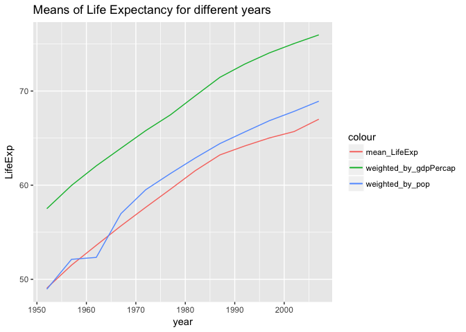

# hw03-Tang-Jiahui
Jiahui Tang  
2017/9/30  

## But I want to do more!

+ Layout stretch goal: get table and figure side-by-side. [This gist](https://gist.github.com/jennybc/e9e9aba6ba18c72cec26) might get you started.
*Applying this layout stretch to task03.*

+ ***The follow codes are kind of messy because I added CSS codes. You can find the result on hw03-Tang-Jiahui-I_want_do_more.html, or see the screenshot in /STAT545-hw-Tang-Jiahui/pics folder.***


```r
library(ggplot2)
suppressMessages(library(dplyr))
library("gapminder")
gtbl <- tbl_df(gapminder)
```
<style type="text/css">
.twoC {width: 100%}
.clearer {clear: both}
.twoC .table {max-width: 50%; float: left}
.twoC img {max-width: 50%; float: right}
</style>

<div class="twoC">


 year   mean_LifeExp   weighted_by_pop   weighted_by_gdpPercap
-----  -------------  ----------------  ----------------------
 1952       49.05762          48.94424                57.50267
 1957       51.50740          52.12189                59.97587
 1962       53.60925          52.32438                62.05187
 1967       55.67829          56.98431                63.92627
 1972       57.64739          59.51478                65.79301
 1977       59.57016          61.23726                67.47203
 1982       61.53320          62.88176                69.48395
 1987       63.21261          64.41635                71.45846
 1992       64.16034          65.64590                72.85761
 1997       65.01468          66.84934                74.05185
 2002       65.69492          67.83904                75.04541
 2007       67.00742          68.91909                75.96507

<!-- -->
</div>
<div class="clearer"></div>
