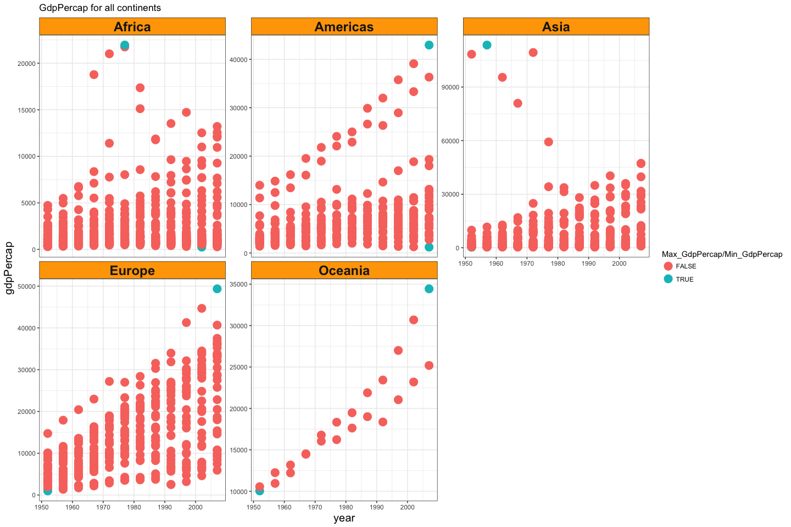
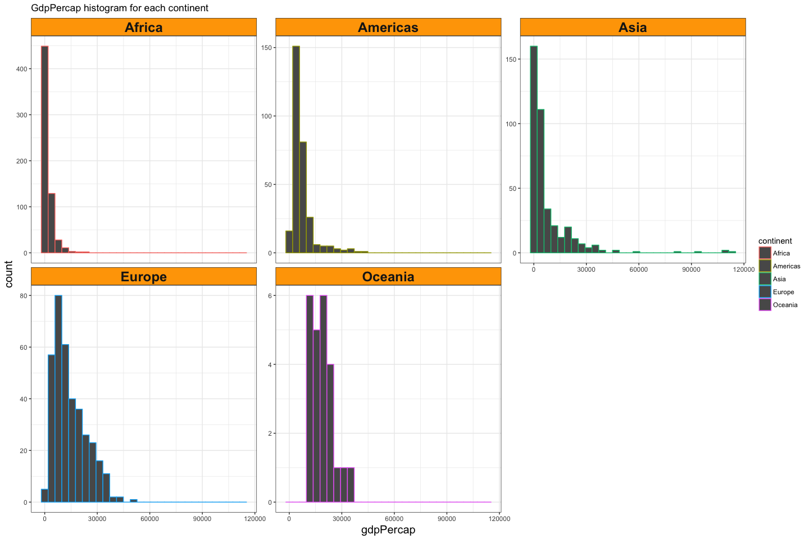
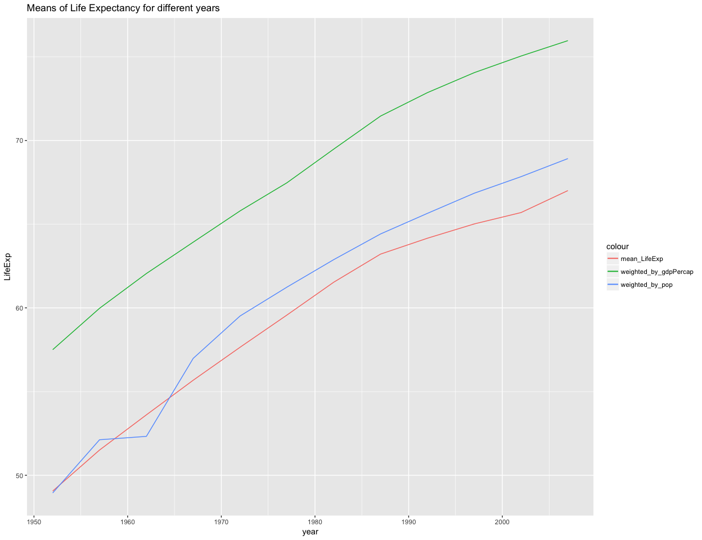
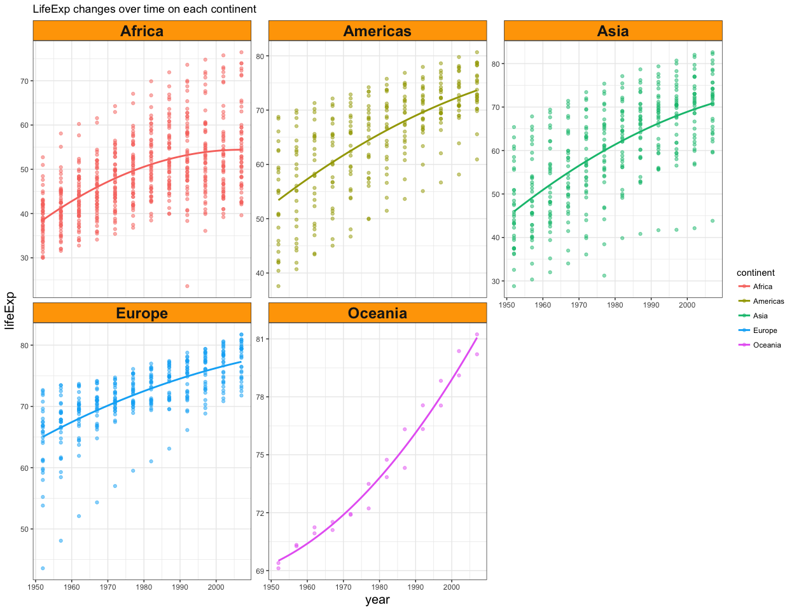
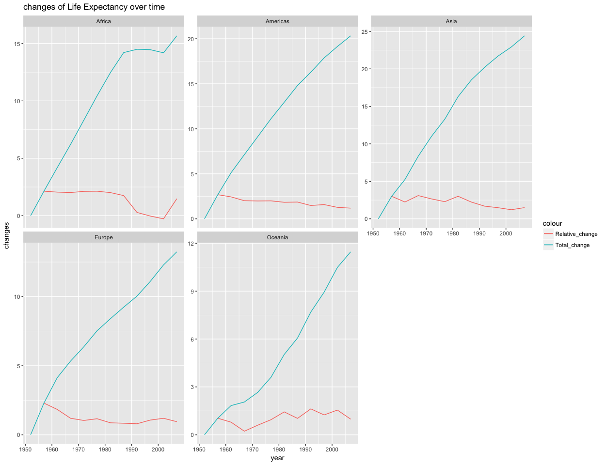

hw03-Tang-Jiahui
================
Jiahui Tang
2017/9/30

``` r
suppressPackageStartupMessages(library(tidyverse))  # The tidyverse contains ggplot2!
suppressPackageStartupMessages(library(gapminder))
knitr::opts_chunk$set(fig.width=15, fig.height=10)
```

Task1: Get the maximum and minimum of GDP per capita for all continents.
------------------------------------------------------------------------

*To get the maximum and minimum of GdpPercap for continents, I firstly used summarise() to obtain max and min values for each continent, then filter() and mutate() to print the detailed information of the countries which have the max or min GDP per capita, finally created a new data.frame to show all the values above.*

``` r
#get max/min values
T1 <- gapminder %>% 
  group_by(continent) %>% 
  summarise(Max_GdpPercap = max(gdpPercap), Min_GdpPercap = min(gdpPercap))
#print couuntry info
Max_country <- gapminder %>% 
  filter(gdpPercap %in% T1$Max_GdpPercap) %>% 
  arrange(continent) %>% 
  mutate(Max_country_info = paste(country, year))
Min_country <- gapminder %>% 
  filter(gdpPercap %in% T1$Min_GdpPercap) %>% 
  arrange(continent) %>% 
  mutate(Min_country_info = paste(country, year))
#create a new data.frame
Task1 <- data.frame(T1, Max_country$Max_country_info, Min_country$Min_country_info)

knitr::kable(Task1)
```

| continent |  Max\_GdpPercap|  Min\_GdpPercap| Max\_country.Max\_country\_info | Min\_country.Min\_country\_info |
|:----------|---------------:|---------------:|:--------------------------------|:--------------------------------|
| Africa    |        21951.21|        241.1659| Libya 1977                      | Congo, Dem. Rep. 2002           |
| Americas  |        42951.65|       1201.6372| United States 2007              | Haiti 2007                      |
| Asia      |       113523.13|        331.0000| Kuwait 1957                     | Myanmar 1952                    |
| Europe    |        49357.19|        973.5332| Norway 2007                     | Bosnia and Herzegovina 1952     |
| Oceania   |        34435.37|      10039.5956| Australia 2007                  | Australia 1952                  |

*I used `ggplot2` and `facetting` to make figures and distinguished the max/min GdpPercap and others in differnet colors.*

``` r
P1 <- gapminder %>% 
  ggplot(aes(x = year, y = gdpPercap))
P2 <- P1 + facet_wrap(~ continent, scales = "free_y") +
  geom_point(aes(color = (gdpPercap %in% c(T1$Max_GdpPercap, T1$Min_GdpPercap))), size = 5, alpha = 0.5) +
  theme_bw() +
  theme(strip.background = element_rect(fill="orange"),
        axis.title.x = element_text(size=15),
        axis.title.y = element_text(size=15),
        strip.text = element_text(size=18, face="bold"))+
  labs(title="GdpPercap for all continents")+
  scale_colour_discrete("Max_GdpPercap/Min_GdpPercap")
P2
```



Task2: Look at the spread of GDP per capita within the continents.
------------------------------------------------------------------

*We can directly use summarise() to get mean, sd and max/min values of GDP per capita for each continent.From the table shown below, we can find that the sd value of Asia is the largest, while Africa has the smallest sd value. In addition, Europe has the largest mean value of GdpPercap.*

``` r
T2 <-gapminder %>% 
  group_by(continent) %>% 
  summarise(min_gdpPercap = min(gdpPercap), max_gdpPercap = max(gdpPercap),
            mean_gdpPercap = mean(gdpPercap), sd_gdpPercap = sd(gdpPercap))

knitr::kable(T2)
```

| continent |  min\_gdpPercap|  max\_gdpPercap|  mean\_gdpPercap|  sd\_gdpPercap|
|:----------|---------------:|---------------:|----------------:|--------------:|
| Africa    |        241.1659|        21951.21|         2193.755|       2827.930|
| Americas  |       1201.6372|        42951.65|         7136.110|       6396.764|
| Asia      |        331.0000|       113523.13|         7902.150|      14045.373|
| Europe    |        973.5332|        49357.19|        14469.476|       9355.213|
| Oceania   |      10039.5956|        34435.37|        18621.609|       6358.983|

*We can use geom\_histogram() to make histograms of different continents. The results are similar to the table above.*

``` r
P3 <- gapminder %>%
  select(gdpPercap, continent) %>% 
  ggplot(aes(x = gdpPercap, color = continent))
P4 <- P3 + geom_histogram() +
  facet_wrap(~ continent, scales = "free_y") +
  theme_bw() +
  theme(strip.background = element_rect(fill="orange"),
        axis.title.x = element_text(size=15),
        axis.title.y = element_text(size=15),
        strip.text = element_text(size=18, face="bold"))+
  labs(title="GdpPercap histogram for each continent")
  
P4
```

    ## `stat_bin()` using `bins = 30`. Pick better value with `binwidth`.



Task3: Compute a trimmed mean of life expectancy for different years. Or a weighted mean, weighting by population. Just try something other than the plain vanilla mean.
------------------------------------------------------------------------------------------------------------------------------------------------------------------------

*We can easily use summarise() to get different kind of means of LifeExp, and weighted.mean() was uesd to compute the values of mean weighting by pop and gdpPercap.*

``` r
T3 <- gapminder %>% 
  group_by(year) %>% 
  summarise(mean_LifeExp = mean(lifeExp), 
            weighted_by_pop = weighted.mean(lifeExp, pop),
            weighted_by_gdpPercap = weighted.mean(lifeExp, gdpPercap))

knitr::kable(T3)
```

|  year|  mean\_LifeExp|  weighted\_by\_pop|  weighted\_by\_gdpPercap|
|-----:|--------------:|------------------:|------------------------:|
|  1952|       49.05762|           48.94424|                 57.50267|
|  1957|       51.50740|           52.12189|                 59.97587|
|  1962|       53.60925|           52.32438|                 62.05187|
|  1967|       55.67829|           56.98431|                 63.92627|
|  1972|       57.64739|           59.51478|                 65.79301|
|  1977|       59.57016|           61.23726|                 67.47203|
|  1982|       61.53320|           62.88176|                 69.48395|
|  1987|       63.21261|           64.41635|                 71.45846|
|  1992|       64.16034|           65.64590|                 72.85761|
|  1997|       65.01468|           66.84934|                 74.05185|
|  2002|       65.69492|           67.83904|                 75.04541|
|  2007|       67.00742|           68.91909|                 75.96507|

*Plotting different means of LifeExp as lines using ggplot2 on the same graph.*

``` r
P5 <- ggplot(T3, aes(x = year, y = LifeExp)) +
  geom_line(aes(y = mean_LifeExp, color = "mean_LifeExp")) +
  geom_line(aes(y = weighted_by_pop, color = "weighted_by_pop")) +
  geom_line(aes(y = weighted_by_gdpPercap, color = "weighted_by_gdpPercap")) +
  labs(title = "Means of Life Expectancy for different years")
P5
```



Task4: How is life expectancy changing over time on different continents?
-------------------------------------------------------------------------

*From the table below, we can find that almost all continents have positive trend from 1952 to 2007 years and Asians have the greatest change in life expectancy. However, the relative changes of each year are different in each continent.*

``` r
#lead() and lag() produce offset versions of a input vector that is either ahead of or behind the original vector
T4 <- gapminder %>% 
  group_by(continent, year) %>% 
  summarise(mean_LifeExp = mean(lifeExp)) %>% 
  mutate(Relative_change = mean_LifeExp - lag(mean_LifeExp), 
         Total_change = mean_LifeExp - mean_LifeExp[1])

knitr::kable(T4)
```

| continent |  year|  mean\_LifeExp|  Relative\_change|  Total\_change|
|:----------|-----:|--------------:|-----------------:|--------------:|
| Africa    |  1952|       39.13550|                NA|       0.000000|
| Africa    |  1957|       41.26635|         2.1308462|       2.130846|
| Africa    |  1962|       43.31944|         2.0530962|       4.183942|
| Africa    |  1967|       45.33454|         2.0150962|       6.199039|
| Africa    |  1972|       47.45094|         2.1164038|       8.315442|
| Africa    |  1977|       49.58042|         2.1294808|      10.444923|
| Africa    |  1982|       51.59287|         2.0124423|      12.457365|
| Africa    |  1987|       53.34479|         1.7519231|      14.209288|
| Africa    |  1992|       53.62958|         0.2847885|      14.494077|
| Africa    |  1997|       53.59827|        -0.0313077|      14.462769|
| Africa    |  2002|       53.32523|        -0.2730385|      14.189731|
| Africa    |  2007|       54.80604|         1.4808077|      15.670538|
| Americas  |  1952|       53.27984|                NA|       0.000000|
| Americas  |  1957|       55.96028|         2.6804400|       2.680440|
| Americas  |  1962|       58.39876|         2.4384800|       5.118920|
| Americas  |  1967|       60.41092|         2.0121600|       7.131080|
| Americas  |  1972|       62.39492|         1.9840000|       9.115080|
| Americas  |  1977|       64.39156|         1.9966400|      11.111720|
| Americas  |  1982|       66.22884|         1.8372800|      12.949000|
| Americas  |  1987|       68.09072|         1.8618800|      14.810880|
| Americas  |  1992|       69.56836|         1.4776400|      16.288520|
| Americas  |  1997|       71.15048|         1.5821200|      17.870640|
| Americas  |  2002|       72.42204|         1.2715600|      19.142200|
| Americas  |  2007|       73.60812|         1.1860800|      20.328280|
| Asia      |  1952|       46.31439|                NA|       0.000000|
| Asia      |  1957|       49.31854|         3.0041503|       3.004150|
| Asia      |  1962|       51.56322|         2.2446788|       5.248829|
| Asia      |  1967|       54.66364|         3.1004170|       8.349246|
| Asia      |  1972|       57.31927|         2.6556291|      11.004875|
| Asia      |  1977|       59.61056|         2.2912873|      13.296162|
| Asia      |  1982|       62.61794|         3.0073830|      16.303545|
| Asia      |  1987|       64.85118|         2.2332424|      18.536788|
| Asia      |  1992|       66.53721|         1.6860303|      20.222818|
| Asia      |  1997|       68.02052|         1.4833030|      21.706121|
| Asia      |  2002|       69.23388|         1.2133636|      22.919485|
| Asia      |  2007|       70.72848|         1.4946061|      24.414091|
| Europe    |  1952|       64.40850|                NA|       0.000000|
| Europe    |  1957|       66.70307|         2.2945667|       2.294567|
| Europe    |  1962|       68.53923|         1.8361667|       4.130733|
| Europe    |  1967|       69.73760|         1.1983667|       5.329100|
| Europe    |  1972|       70.77503|         1.0374333|       6.366533|
| Europe    |  1977|       71.93777|         1.1627333|       7.529267|
| Europe    |  1982|       72.80640|         0.8686333|       8.397900|
| Europe    |  1987|       73.64217|         0.8357667|       9.233667|
| Europe    |  1992|       74.44010|         0.7979333|      10.031600|
| Europe    |  1997|       75.50517|         1.0650667|      11.096667|
| Europe    |  2002|       76.70060|         1.1954333|      12.292100|
| Europe    |  2007|       77.64860|         0.9480000|      13.240100|
| Oceania   |  1952|       69.25500|                NA|       0.000000|
| Oceania   |  1957|       70.29500|         1.0400000|       1.040000|
| Oceania   |  1962|       71.08500|         0.7900000|       1.830000|
| Oceania   |  1967|       71.31000|         0.2250000|       2.055000|
| Oceania   |  1972|       71.91000|         0.6000000|       2.655000|
| Oceania   |  1977|       72.85500|         0.9450000|       3.600000|
| Oceania   |  1982|       74.29000|         1.4350000|       5.035000|
| Oceania   |  1987|       75.32000|         1.0300000|       6.065000|
| Oceania   |  1992|       76.94500|         1.6250000|       7.690000|
| Oceania   |  1997|       78.19000|         1.2450000|       8.935000|
| Oceania   |  2002|       79.74000|         1.5500000|      10.485000|
| Oceania   |  2007|       80.71950|         0.9795000|      11.464500|

*Graphs allow us to more clearly analyze changes. We can find some subtle changes:*

-   The growth rate of Oceanian's life expectancy is gradually increasing, while other continents' is slowing down.
-   Most continents have a growth in lifeExp compared to last year in most years, while Afirca experienced a decrease during 1980 to 2000.

``` r
#LifeExp changes over time on each continent
P6 <- gapminder %>% 
  ggplot(aes(x = year, y = lifeExp, color = continent)) 
P7 <- P6 + facet_wrap(~ continent, scales = "free_y") +
  geom_point(alpha = 0.5) +
  geom_smooth(lwd = 1, se = FALSE, span = 5) +
  theme_bw() +
  theme(strip.background = element_rect(fill="orange"),
        axis.title.x = element_text(size=15),
        axis.title.y = element_text(size=15),
        strip.text = element_text(size=18, face="bold")) +
  labs(title="LifeExp changes over time on each continent")
P7
```

    ## `geom_smooth()` using method = 'loess'



``` r
#relative change and total change of Life Expectancy over time
P8 <- ggplot(T4, aes(x = year, y = changes)) +
  facet_wrap(~ continent, scales = "free_y") +
  geom_line(aes(y = Relative_change, color = "Relative_change")) +
  geom_line(aes(y = Total_change, color = "Total_change")) +
  labs(title = "changes of Life Expectancy over time")
P8
```

    ## Warning: Removed 1 rows containing missing values (geom_path).


