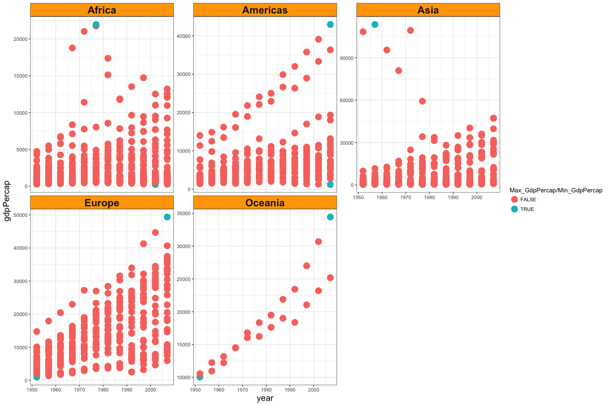
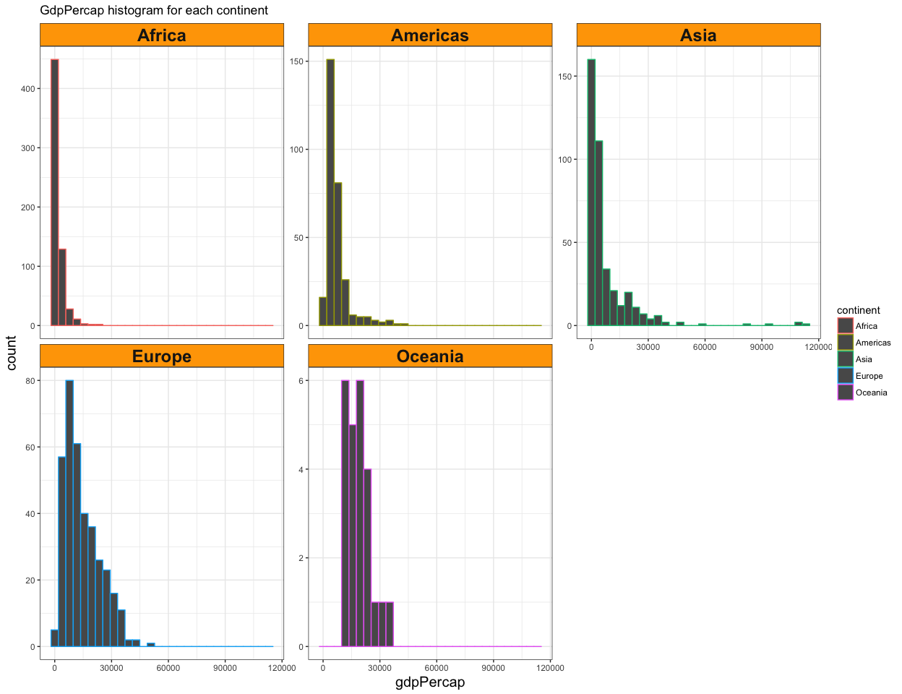
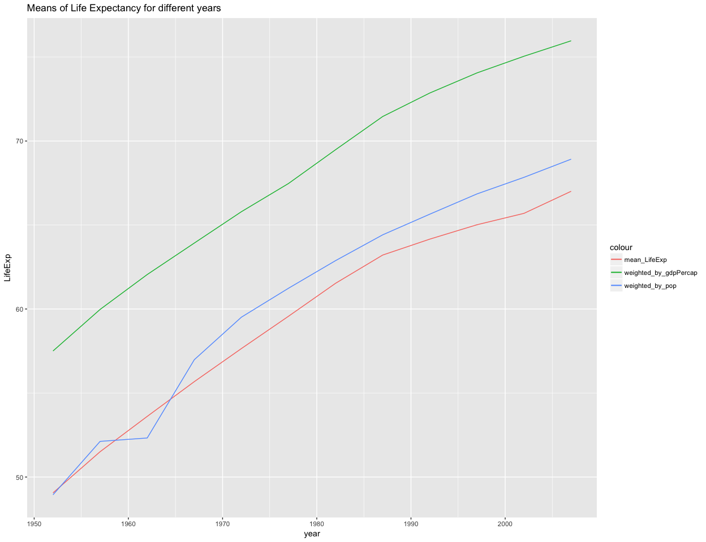
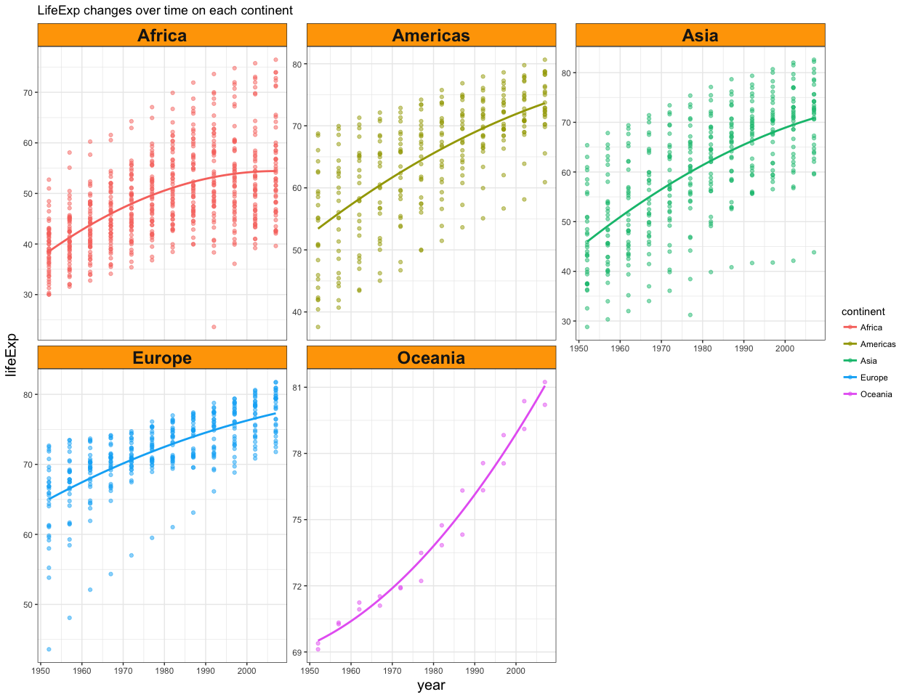
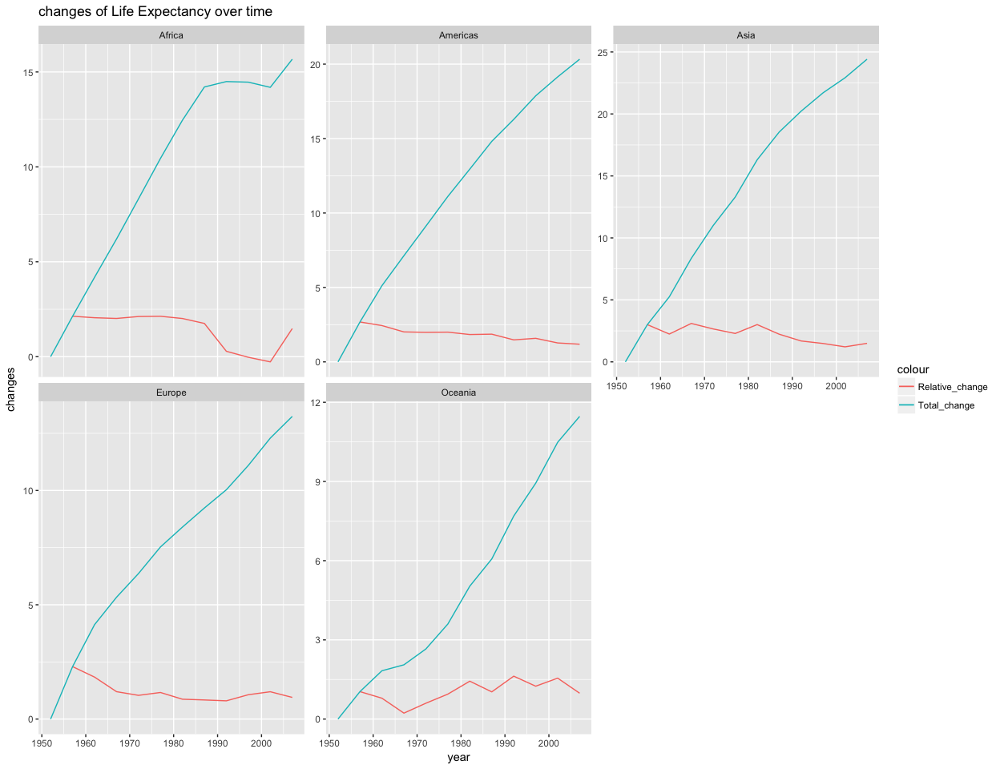
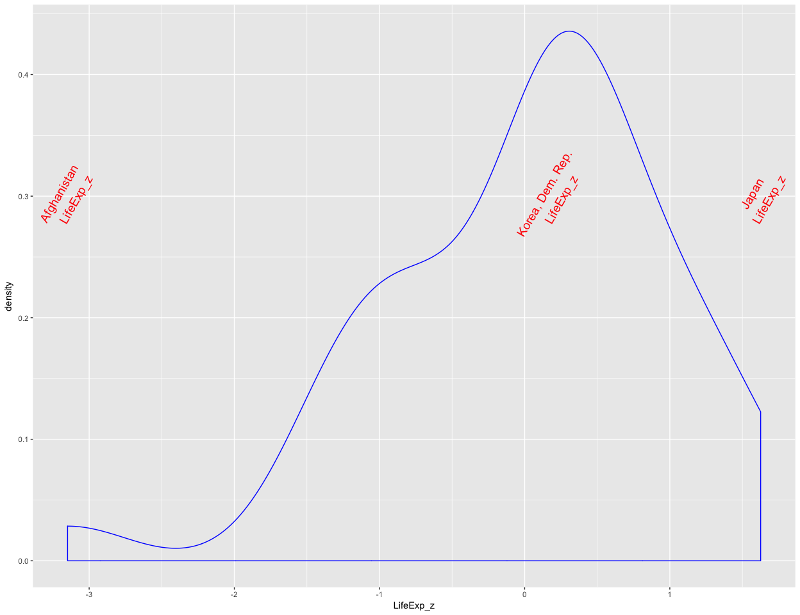
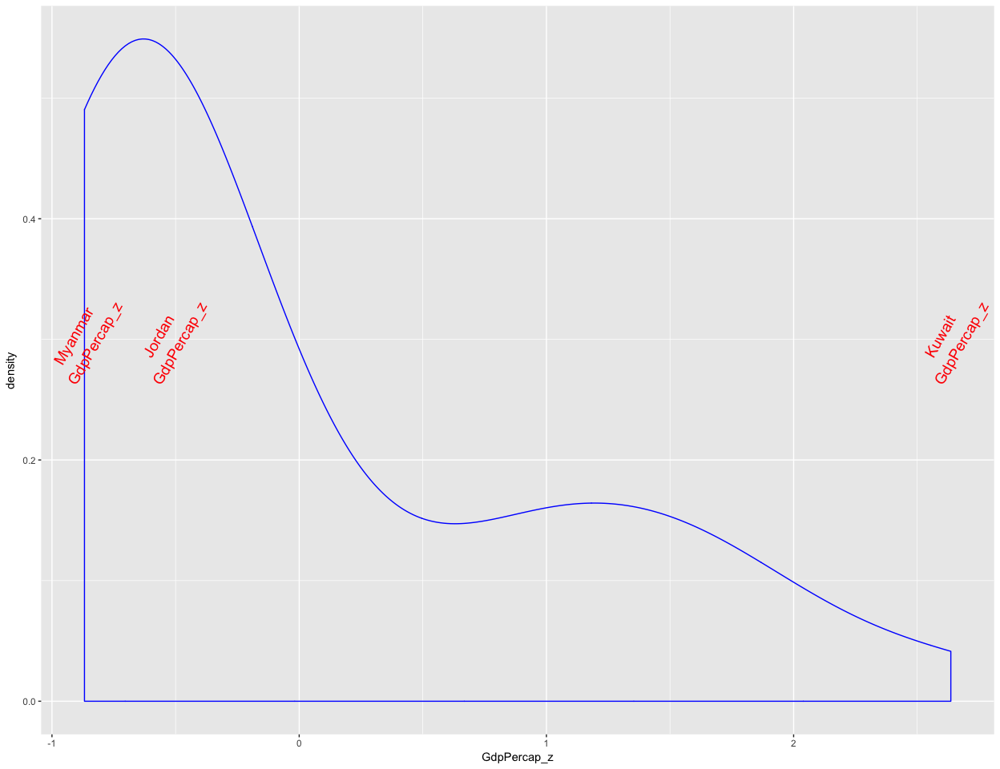
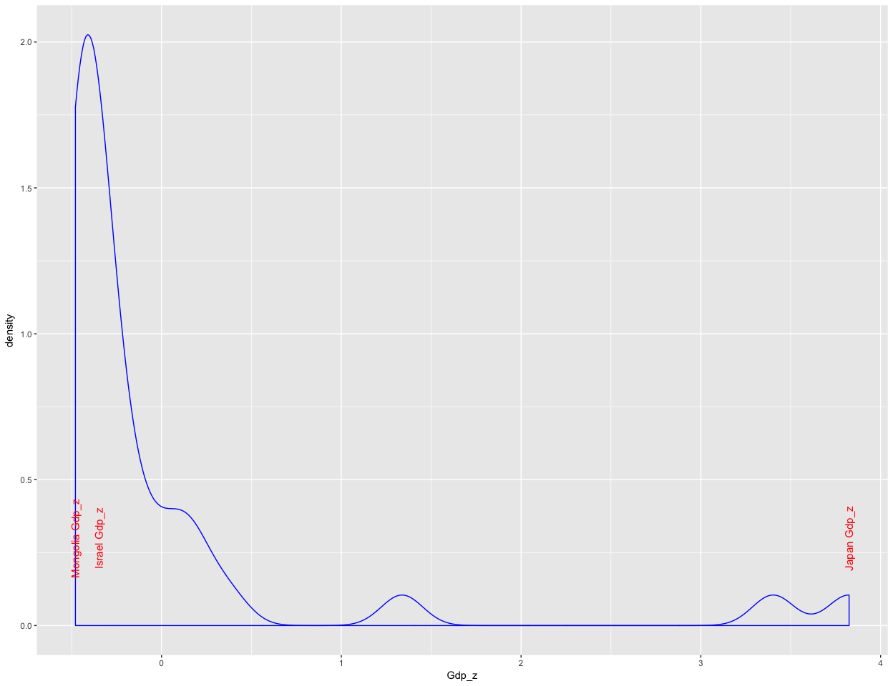

# hw03-Tang-Jiahui
Jiahui Tang  
2017/9/30  


```r
suppressPackageStartupMessages(library(tidyverse))  # The tidyverse contains ggplot2!
suppressPackageStartupMessages(library(gapminder))
knitr::opts_chunk$set(fig.width=13, fig.height=10)
```

## Task1: Get the maximum and minimum of GDP per capita for all continents.

*To get the maximum and minimum of GdpPercap for continents, I firstly used summarise() to obtain max and min values for each continent, then filter() and mutate() to print the detailed information of the countries which have the max or min GDP per capita, finally created a new data.frame to show all the values above.*

```r
#get max/min values
T1 <- gapminder %>% 
  group_by(continent) %>% 
  summarise(Max_GdpPercap = max(gdpPercap), Min_GdpPercap = min(gdpPercap))
#print country info
Max_country <- gapminder %>% 
  filter(gdpPercap %in% T1$Max_GdpPercap) %>% 
  arrange(continent) %>% 
  mutate(Max_country_info = paste(country, year))
Min_country <- gapminder %>% 
  filter(gdpPercap %in% T1$Min_GdpPercap) %>% 
  arrange(continent) %>% 
  mutate(Min_country_info = paste(country, year))
#create a new data.frame
Task1 <- data.frame(T1, Max_country$Max_country_info, Min_country$Min_country_info)

knitr::kable(Task1)
```


continent    Max_GdpPercap   Min_GdpPercap  Max_country.Max_country_info   Min_country.Min_country_info 
----------  --------------  --------------  -----------------------------  -----------------------------
Africa            21951.21        241.1659  Libya 1977                     Congo, Dem. Rep. 2002        
Americas          42951.65       1201.6372  United States 2007             Haiti 2007                   
Asia             113523.13        331.0000  Kuwait 1957                    Myanmar 1952                 
Europe            49357.19        973.5332  Norway 2007                    Bosnia and Herzegovina 1952  
Oceania           34435.37      10039.5956  Australia 2007                 Australia 1952               

*I used `ggplot2` and `facetting` to make figures and distinguished the max/min GdpPercap and others in differnet colors.*


```r
P1 <- gapminder %>% 
  ggplot(aes(x = year, y = gdpPercap))
P2 <- P1 + facet_wrap(~ continent, scales = "free_y") +
  geom_point(aes(color = (gdpPercap %in% c(T1$Max_GdpPercap, T1$Min_GdpPercap))), size = 5, alpha = 0.5) +
  theme_bw() +
  theme(strip.background = element_rect(fill="orange"),
        axis.title.x = element_text(size=15),
        axis.title.y = element_text(size=15),
        strip.text = element_text(size=18, face="bold"))+
  labs(title="GdpPercap for all continents")+
  scale_colour_discrete("Max_GdpPercap/Min_GdpPercap")
P2
```

<!-- -->

## Task2: Look at the spread of GDP per capita within the continents.

*We can directly use summarise() to get mean, sd and max/min values of GDP per capita for each continent.From the table shown below, we can find that the sd value of Asia is the largest, while Africa has the smallest sd value. In addition, Europe has the largest mean value of GdpPercap.*


```r
T2 <-gapminder %>% 
  group_by(continent) %>% 
  summarise(min_gdpPercap = min(gdpPercap), max_gdpPercap = max(gdpPercap),
            mean_gdpPercap = mean(gdpPercap), sd_gdpPercap = sd(gdpPercap))

knitr::kable(T2)
```


continent    min_gdpPercap   max_gdpPercap   mean_gdpPercap   sd_gdpPercap
----------  --------------  --------------  ---------------  -------------
Africa            241.1659        21951.21         2193.755       2827.930
Americas         1201.6372        42951.65         7136.110       6396.764
Asia              331.0000       113523.13         7902.150      14045.373
Europe            973.5332        49357.19        14469.476       9355.213
Oceania         10039.5956        34435.37        18621.609       6358.983

*We can use geom_histogram() to make histograms of different continents. The results are similar to the table above.*


```r
P3 <- gapminder %>%
  select(gdpPercap, continent) %>% 
  ggplot(aes(x = gdpPercap, color = continent))
P4 <- P3 + geom_histogram() +
  facet_wrap(~ continent, scales = "free_y") +
  theme_bw() +
  theme(strip.background = element_rect(fill="orange"),
        axis.title.x = element_text(size=15),
        axis.title.y = element_text(size=15),
        strip.text = element_text(size=18, face="bold"))+
  labs(title="GdpPercap histogram for each continent")
  
P4
```

```
## `stat_bin()` using `bins = 30`. Pick better value with `binwidth`.
```

<!-- -->

## Task3: Compute a trimmed mean of life expectancy for different years. Or a weighted mean, weighting by population. Just try something other than the plain vanilla mean.

*We can easily use summarise() to get different kind of means of LifeExp, and weighted.mean() was uesd to compute the values of mean weighting by pop and gdpPercap.*


```r
T3 <- gapminder %>% 
  group_by(year) %>% 
  summarise(mean_LifeExp = mean(lifeExp), 
            weighted_by_pop = weighted.mean(lifeExp, pop),
            weighted_by_gdpPercap = weighted.mean(lifeExp, gdpPercap))

knitr::kable(T3)
```


 year   mean_LifeExp   weighted_by_pop   weighted_by_gdpPercap
-----  -------------  ----------------  ----------------------
 1952       49.05762          48.94424                57.50267
 1957       51.50740          52.12189                59.97587
 1962       53.60925          52.32438                62.05187
 1967       55.67829          56.98431                63.92627
 1972       57.64739          59.51478                65.79301
 1977       59.57016          61.23726                67.47203
 1982       61.53320          62.88176                69.48395
 1987       63.21261          64.41635                71.45846
 1992       64.16034          65.64590                72.85761
 1997       65.01468          66.84934                74.05185
 2002       65.69492          67.83904                75.04541
 2007       67.00742          68.91909                75.96507

*Plotting different means of LifeExp as lines using ggplot2 on the same graph.*


```r
P5 <- ggplot(T3, aes(x = year, y = LifeExp)) +
  geom_line(aes(y = mean_LifeExp, color = "mean_LifeExp")) +
  geom_line(aes(y = weighted_by_pop, color = "weighted_by_pop")) +
  geom_line(aes(y = weighted_by_gdpPercap, color = "weighted_by_gdpPercap")) +
  labs(title = "Means of Life Expectancy for different years")
P5
```

<!-- -->

## Task4: How is life expectancy changing over time on different continents?

*From the table below, we can find that almost all continents have positive trend from 1952 to 2007 years and Asians have the greatest change in life expectancy. However, the relative changes of each year are different in each continent.*

```r
#lead() and lag() produce offset versions of a input vector that is either ahead of or behind the original vector
T4 <- gapminder %>% 
  group_by(continent, year) %>% 
  summarise(mean_LifeExp = mean(lifeExp)) %>% 
  mutate(Relative_change = mean_LifeExp - lag(mean_LifeExp), 
         Total_change = mean_LifeExp - mean_LifeExp[1])

knitr::kable(T4)
```


continent    year   mean_LifeExp   Relative_change   Total_change
----------  -----  -------------  ----------------  -------------
Africa       1952       39.13550                NA       0.000000
Africa       1957       41.26635         2.1308462       2.130846
Africa       1962       43.31944         2.0530962       4.183942
Africa       1967       45.33454         2.0150962       6.199039
Africa       1972       47.45094         2.1164038       8.315442
Africa       1977       49.58042         2.1294808      10.444923
Africa       1982       51.59287         2.0124423      12.457365
Africa       1987       53.34479         1.7519231      14.209288
Africa       1992       53.62958         0.2847885      14.494077
Africa       1997       53.59827        -0.0313077      14.462769
Africa       2002       53.32523        -0.2730385      14.189731
Africa       2007       54.80604         1.4808077      15.670538
Americas     1952       53.27984                NA       0.000000
Americas     1957       55.96028         2.6804400       2.680440
Americas     1962       58.39876         2.4384800       5.118920
Americas     1967       60.41092         2.0121600       7.131080
Americas     1972       62.39492         1.9840000       9.115080
Americas     1977       64.39156         1.9966400      11.111720
Americas     1982       66.22884         1.8372800      12.949000
Americas     1987       68.09072         1.8618800      14.810880
Americas     1992       69.56836         1.4776400      16.288520
Americas     1997       71.15048         1.5821200      17.870640
Americas     2002       72.42204         1.2715600      19.142200
Americas     2007       73.60812         1.1860800      20.328280
Asia         1952       46.31439                NA       0.000000
Asia         1957       49.31854         3.0041503       3.004150
Asia         1962       51.56322         2.2446788       5.248829
Asia         1967       54.66364         3.1004170       8.349246
Asia         1972       57.31927         2.6556291      11.004875
Asia         1977       59.61056         2.2912873      13.296162
Asia         1982       62.61794         3.0073830      16.303545
Asia         1987       64.85118         2.2332424      18.536788
Asia         1992       66.53721         1.6860303      20.222818
Asia         1997       68.02052         1.4833030      21.706121
Asia         2002       69.23388         1.2133636      22.919485
Asia         2007       70.72848         1.4946061      24.414091
Europe       1952       64.40850                NA       0.000000
Europe       1957       66.70307         2.2945667       2.294567
Europe       1962       68.53923         1.8361667       4.130733
Europe       1967       69.73760         1.1983667       5.329100
Europe       1972       70.77503         1.0374333       6.366533
Europe       1977       71.93777         1.1627333       7.529267
Europe       1982       72.80640         0.8686333       8.397900
Europe       1987       73.64217         0.8357667       9.233667
Europe       1992       74.44010         0.7979333      10.031600
Europe       1997       75.50517         1.0650667      11.096667
Europe       2002       76.70060         1.1954333      12.292100
Europe       2007       77.64860         0.9480000      13.240100
Oceania      1952       69.25500                NA       0.000000
Oceania      1957       70.29500         1.0400000       1.040000
Oceania      1962       71.08500         0.7900000       1.830000
Oceania      1967       71.31000         0.2250000       2.055000
Oceania      1972       71.91000         0.6000000       2.655000
Oceania      1977       72.85500         0.9450000       3.600000
Oceania      1982       74.29000         1.4350000       5.035000
Oceania      1987       75.32000         1.0300000       6.065000
Oceania      1992       76.94500         1.6250000       7.690000
Oceania      1997       78.19000         1.2450000       8.935000
Oceania      2002       79.74000         1.5500000      10.485000
Oceania      2007       80.71950         0.9795000      11.464500

*Graphs allow us to more clearly analyze changes. We can find some subtle changes:*

+ The growth rate of Oceanian's life expectancy is gradually increasing, while other continents' is slowing down.
+ Most continents have a growth in lifeExp compared to last year in most years, while Afirca experienced a decrease during 1980 to 2000.

```r
#LifeExp changes over time on each continent
P6 <- gapminder %>% 
  ggplot(aes(x = year, y = lifeExp, color = continent)) 
P7 <- P6 + facet_wrap(~ continent, scales = "free_y") +
  geom_point(alpha = 0.5) +
  geom_smooth(lwd = 1, se = FALSE, span = 5) +
  theme_bw() +
  theme(strip.background = element_rect(fill="orange"),
        axis.title.x = element_text(size=15),
        axis.title.y = element_text(size=15),
        strip.text = element_text(size=18, face="bold")) +
  labs(title="LifeExp changes over time on each continent")
P7
```

```
## `geom_smooth()` using method = 'loess'
```

<!-- -->

```r
#relative change and total change of Life Expectancy over time
P8 <- ggplot(T4, aes(x = year, y = changes)) +
  facet_wrap(~ continent, scales = "free_y") +
  geom_line(aes(y = Relative_change, color = "Relative_change")) +
  geom_line(aes(y = Total_change, color = "Total_change")) +
  labs(title = "changes of Life Expectancy over time")
P8
```

```
## Warning: Removed 1 rows containing missing values (geom_path).
```

<!-- -->

## Task6: Find countries with interesting stories. 

*I analyzed the level of development on Asian countries since 1980 by tables and figures.I computed the z-scores of LifeExp, gdpPercap and gdp in different countries. We can easily find that:*

+ A small part of country's gdp such as Japan and China was far more than most of the Asian countries' during this period. Japan's overall GDP was the highest, while Mongolia had the lowest.
+ The life expectancy of Japanese was the highest, while this value for Afghans was much lower than the average.
+ Kuwait and Singapore's gdp per capita was far more than the average during this time.


```r
T5 <- gapminder %>% 
  filter(year > 1980, continent == "Asia") %>% 
  group_by(country) %>% 
  summarise(mean_LifeExp = mean(lifeExp), 
            mean_gdpPercap = mean(gdpPercap),
            mean_gdp = mean(gdpPercap * pop)) %>% 
  mutate(LifeExp_z = ((mean_LifeExp - mean(mean_LifeExp)) / sd(mean_LifeExp)),
         GdpPercap_z = ((mean_gdpPercap - mean(mean_gdpPercap)) / sd(mean_gdpPercap)),
         Gdp_z = ((mean_gdp - mean(mean_gdp)) / sd(mean_gdp)))

knitr::kable(T5)
```


country               mean_LifeExp   mean_gdpPercap       mean_gdp    LifeExp_z   GdpPercap_z        Gdp_z
-------------------  -------------  ---------------  -------------  -----------  ------------  -----------
Afghanistan               41.67833         802.7341   1.643003e+10   -3.1486200    -0.8408466   -0.4642984
Bahrain                   72.79300       21710.3958   1.239705e+10    0.7206047     1.2134333   -0.4696032
Bangladesh                57.38883         961.1976   1.199549e+11   -1.1949608    -0.8252768   -0.3281257
Cambodia                  55.61383         889.1607   1.027476e+10   -1.4156887    -0.8323548   -0.4723948
China                     69.48400        2394.1232   2.955961e+12    0.3091182    -0.6844848    3.4022515
Hong Kong, China          78.82567       26278.0387   1.664686e+11    1.4707893     1.6622265   -0.2669433
India                     60.78567        1442.4067   1.386517e+12   -0.7725519    -0.7779956    1.3378623
Indonesia                 64.04267        2530.3785   4.981141e+11   -0.3675318    -0.6710971    0.1692908
Iran                      66.14317        8432.8227   5.095137e+11   -0.1063268    -0.0911531    0.1842854
Iraq                      60.32417        6974.1899   1.262570e+11   -0.8299412    -0.2344709   -0.3198362
Israel                    77.61500       19811.0855   1.053451e+11    1.3202384     1.0268168   -0.3473429
Japan                     80.07217       26277.0313   3.277102e+12    1.6257962     1.6621275    3.8246672
Jordan                    68.53217        4008.5746   1.664127e+10    0.1907542    -0.5258571   -0.4640206
Korea, Dem. Rep.          68.56850        2811.6103   5.635705e+10    0.1952724    -0.6434647   -0.4117799
Korea, Rep.               73.24867       14139.3276   6.521251e+11    0.7772686     0.4695389    0.3718711
Kuwait                    75.22017       36187.1834   6.891473e+10    1.0224320     2.6358484   -0.3952620
Lebanon                   69.58117        8073.0632   2.794895e+10    0.3212013    -0.1265013   -0.4491469
Malaysia                  71.23600        8373.2691   1.729981e+11    0.5269860    -0.0970046   -0.2583546
Mongolia                  62.40717        2210.4629   5.287004e+09   -0.5709124    -0.7025304   -0.4789555
Myanmar                   59.67000         521.0000   2.238513e+10   -0.9112892    -0.8685283   -0.4564653
Nepal                     57.06817         925.2007   2.094007e+10   -1.2348369    -0.8288137   -0.4583661
Oman                      70.66517       18579.9678   4.192581e+10    0.4560007     0.9058534   -0.4307622
Pakistan                  61.02533        1977.9927   2.646729e+11   -0.7427485    -0.7253717   -0.1377691
Philippines               67.20767        2575.0283   1.874308e+11    0.0260477    -0.6667100   -0.2393704
Saudi Arabia              68.83517       23498.1863   4.351188e+11    0.2284334     1.3890924    0.0864292
Singapore                 76.16800       29247.7241   1.110666e+11    1.1402986     1.9540126   -0.3398170
Sri Lanka                 70.30250        2554.7562   4.733167e+10    0.4109018    -0.6687019   -0.4236515
Syria                     69.92267        3751.4779   5.435774e+10    0.3636681    -0.5511181   -0.4144097
Taiwan                    75.07667       17642.8493   3.824803e+11    1.0045872     0.8137770    0.0171904
Thailand                  67.44667        4869.4966   2.909019e+11    0.0557683    -0.4412673   -0.1032684
Vietnam                   67.87267        1351.4980   1.027960e+11    0.1087429    -0.7869279   -0.3506958
West Bank and Gaza        69.67633        5018.7315   1.250723e+10    0.3330356    -0.4266043   -0.4694583
Yemen, Rep.               56.44333        2076.9784   3.205191e+10   -1.3125373    -0.7156459   -0.4437500

```r
T6 <- arrange(T5, LifeExp_z) %>% 
  select(country, LifeExp_z)

knitr::kable(T6)
```


country                LifeExp_z
-------------------  -----------
Afghanistan           -3.1486200
Cambodia              -1.4156887
Yemen, Rep.           -1.3125373
Nepal                 -1.2348369
Bangladesh            -1.1949608
Myanmar               -0.9112892
Iraq                  -0.8299412
India                 -0.7725519
Pakistan              -0.7427485
Mongolia              -0.5709124
Indonesia             -0.3675318
Iran                  -0.1063268
Philippines            0.0260477
Thailand               0.0557683
Vietnam                0.1087429
Jordan                 0.1907542
Korea, Dem. Rep.       0.1952724
Saudi Arabia           0.2284334
China                  0.3091182
Lebanon                0.3212013
West Bank and Gaza     0.3330356
Syria                  0.3636681
Sri Lanka              0.4109018
Oman                   0.4560007
Malaysia               0.5269860
Bahrain                0.7206047
Korea, Rep.            0.7772686
Taiwan                 1.0045872
Kuwait                 1.0224320
Singapore              1.1402986
Israel                 1.3202384
Hong Kong, China       1.4707893
Japan                  1.6257962

```r
T7 <- arrange(T5, GdpPercap_z) %>% 
  select(country, GdpPercap_z)

knitr::kable(T7)
```


country               GdpPercap_z
-------------------  ------------
Myanmar                -0.8685283
Afghanistan            -0.8408466
Cambodia               -0.8323548
Nepal                  -0.8288137
Bangladesh             -0.8252768
Vietnam                -0.7869279
India                  -0.7779956
Pakistan               -0.7253717
Yemen, Rep.            -0.7156459
Mongolia               -0.7025304
China                  -0.6844848
Indonesia              -0.6710971
Sri Lanka              -0.6687019
Philippines            -0.6667100
Korea, Dem. Rep.       -0.6434647
Syria                  -0.5511181
Jordan                 -0.5258571
Thailand               -0.4412673
West Bank and Gaza     -0.4266043
Iraq                   -0.2344709
Lebanon                -0.1265013
Malaysia               -0.0970046
Iran                   -0.0911531
Korea, Rep.             0.4695389
Taiwan                  0.8137770
Oman                    0.9058534
Israel                  1.0268168
Bahrain                 1.2134333
Saudi Arabia            1.3890924
Japan                   1.6621275
Hong Kong, China        1.6622265
Singapore               1.9540126
Kuwait                  2.6358484

```r
T8 <- arrange(T5, Gdp_z) %>% 
  select(country, Gdp_z)

knitr::kable(T8)
```


country                    Gdp_z
-------------------  -----------
Mongolia              -0.4789555
Cambodia              -0.4723948
Bahrain               -0.4696032
West Bank and Gaza    -0.4694583
Afghanistan           -0.4642984
Jordan                -0.4640206
Nepal                 -0.4583661
Myanmar               -0.4564653
Lebanon               -0.4491469
Yemen, Rep.           -0.4437500
Oman                  -0.4307622
Sri Lanka             -0.4236515
Syria                 -0.4144097
Korea, Dem. Rep.      -0.4117799
Kuwait                -0.3952620
Vietnam               -0.3506958
Israel                -0.3473429
Singapore             -0.3398170
Bangladesh            -0.3281257
Iraq                  -0.3198362
Hong Kong, China      -0.2669433
Malaysia              -0.2583546
Philippines           -0.2393704
Pakistan              -0.1377691
Thailand              -0.1032684
Taiwan                 0.0171904
Saudi Arabia           0.0864292
Indonesia              0.1692908
Iran                   0.1842854
Korea, Rep.            0.3718711
India                  1.3378623
China                  3.4022515
Japan                  3.8246672

*Making some plots to analyze.*

```r
#plotting and print max median min 
P9 <- ggplot(T6, aes(x = LifeExp_z)) +
               geom_density(color = "blue")+
               geom_text(aes(x = LifeExp_z, y = 0.3), 
               label = ifelse
               (T6$LifeExp_z == max(T6$LifeExp_z) | T6$LifeExp_z == median(T6$LifeExp_z)|
                 T6$LifeExp_z == min(T6$LifeExp_z), paste(T6$country, "\n LifeExp_z"), NA),
                angle = 60, size = 5, color = "red")
P9
```

```
## Warning: Removed 30 rows containing missing values (geom_text).
```

<!-- -->

```r
P10 <- ggplot(T7, aes(x = GdpPercap_z)) +
               geom_density(color = "blue")+
               geom_text(aes(x = GdpPercap_z, y = 0.3), 
               label = ifelse
               (T7$GdpPercap_z == max(T7$GdpPercap_z) | T7$GdpPercap_z == median(T7$GdpPercap_z)|
                 T7$GdpPercap_z == min(T7$GdpPercap_z), paste(T7$country, "\n GdpPercap_z"), NA),
                angle = 60, size = 5, color = "red")
P10
```

```
## Warning: Removed 30 rows containing missing values (geom_text).
```

<!-- -->

```r
P11 <- ggplot(T8, aes(x = Gdp_z)) +
               geom_density(color = "blue")+
               geom_text(aes(x = Gdp_z, y = 0.3), 
               label = ifelse
               (T8$Gdp_z == max(T8$Gdp_z) | T8$Gdp_z == median(T8$Gdp_z)|
                 T8$Gdp_z == min(T8$Gdp_z), paste(T8$country, "Gdp_z"), NA),
                angle = 90, size = 4, color = "red")
P11
```

```
## Warning: Removed 30 rows containing missing values (geom_text).
```

<!-- -->

