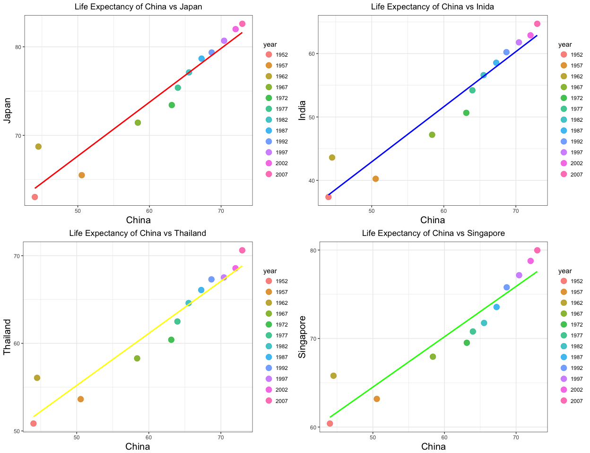

hw04-Tang-Jiahui
================
Jiahui Tang
2017/10/5

``` r
library(tidyverse)
```

    ## Loading tidyverse: ggplot2
    ## Loading tidyverse: tibble
    ## Loading tidyverse: tidyr
    ## Loading tidyverse: readr
    ## Loading tidyverse: purrr
    ## Loading tidyverse: dplyr

    ## Conflicts with tidy packages ----------------------------------------------

    ## filter(): dplyr, stats
    ## lag():    dplyr, stats

``` r
library(tidyr)
library(gapminder)
library(knitr)
suppressPackageStartupMessages(library(tidyverse))
suppressPackageStartupMessages(library(gapminder))
```

General data reshaping and relationship to aggregation
------------------------------------------------------

***Activity \#1***

-   Make you own [cheatsheet for tidyr](https://github.com/Tangjiahui26/STAT545-hw-Tang-Jiahui/blob/master/hw04/Cheatsheet-tidyr.md).

***Activity \#2***

-   Make a tibble with one row per year and columns for life expectancy for two or more countries.
    -   Use knitr::kable() to make this table look pretty in your rendered homework.
    -   Take advantage of this new data shape to scatterplot life expectancy for one country against that of another.

*I am here to select five Asian countries: China, Japan, India, Thailand, Singapore*

``` r
A1 <- gapminder %>% 
  filter(country %in% c("China", "Japan", "India", "Thailand", "Singapore")) %>% 
  select(country, year, lifeExp) %>% 
  spread(country, lifeExp)

knitr::kable(A1, caption = "Life Expectancy by Countries")
```

|  year|     China|   India|   Japan|  Singapore|  Thailand|
|-----:|---------:|-------:|-------:|----------:|---------:|
|  1952|  44.00000|  37.373|  63.030|     60.396|    50.848|
|  1957|  50.54896|  40.249|  65.500|     63.179|    53.630|
|  1962|  44.50136|  43.605|  68.730|     65.798|    56.061|
|  1967|  58.38112|  47.193|  71.430|     67.946|    58.285|
|  1972|  63.11888|  50.651|  73.420|     69.521|    60.405|
|  1977|  63.96736|  54.208|  75.380|     70.795|    62.494|
|  1982|  65.52500|  56.596|  77.110|     71.760|    64.597|
|  1987|  67.27400|  58.553|  78.670|     73.560|    66.084|
|  1992|  68.69000|  60.223|  79.360|     75.788|    67.298|
|  1997|  70.42600|  61.765|  80.690|     77.158|    67.521|
|  2002|  72.02800|  62.879|  82.000|     78.770|    68.564|
|  2007|  72.96100|  64.698|  82.603|     79.972|    70.616|

``` r
A1 %>% 
  ggplot(aes(x = China, y = Japan)) +
  geom_point(size = 4, alpha = 0.8, aes(color = factor(year))) +
  theme_bw() +
  theme(axis.title.x = element_text(size=15),
        axis.title.y = element_text(size=15),
        plot.title = element_text(hjust = 0.5))+
  labs(title="Life Expectancy of China and Japan")+
  scale_colour_discrete("year")
```



***Activity \#3***

-   Compute some measure of life expectancy (mean? median? min? max?) for all possible combinations of continent and year. Reshape that to have one row per year and one variable for each continent. Or the other way around: one row per continent and one variable per year.

***Activity \#4***

-   In Window functions, we formed a tibble with 24 rows: 2 per year, giving the country with both the lowest and highest life expectancy (in Asia). Take that table (or a similar one for all continents) and reshape it so you have one row per year or per year \* continent combination.

***Activity \#5***

-   Previous TA Andrew MacDonald has a nice data manipulation sampler. Make up a similar set of exercises for yourself, in the abstract or (even better) using Gapminder or other data, and solve them.

Join, merge, look up
--------------------

***Activity \#1***

-   Create a second data frame, complementary to Gapminder. Join this with (part of) Gapminder using a dplyr join function and make some observations about the process and result. Explore the different types of joins.

***Activity \#2***

-   reate your own cheatsheet patterned after mine but focused on something you care about more than comics!

***Activity \#3***

-   his is really an optional add-on to either of the previous activities.
-   Explore the base function merge(), which also does joins. Compare and contrast with dplyr joins.
-   Explore the base function match(), which is related to joins and merges, but is really more of a “table lookup”. Compare and contrast with a true join/merge.
