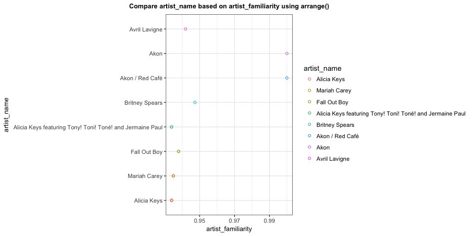
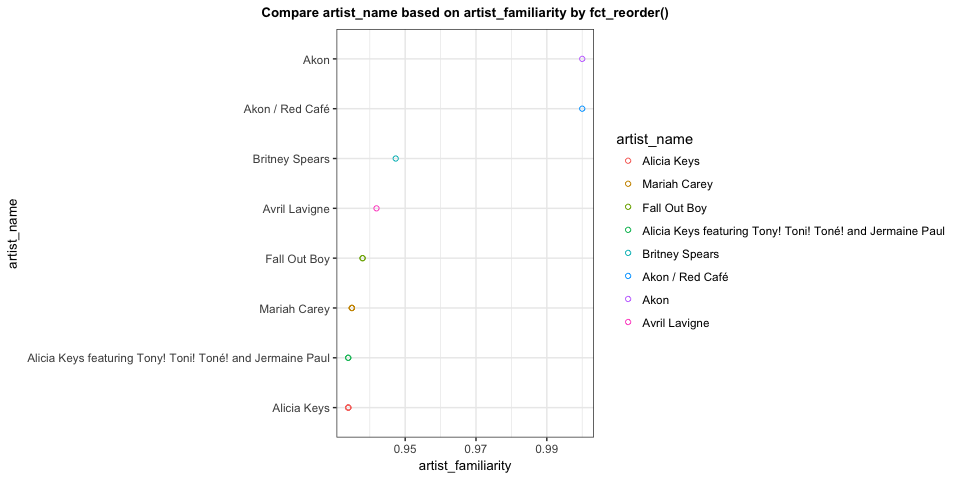
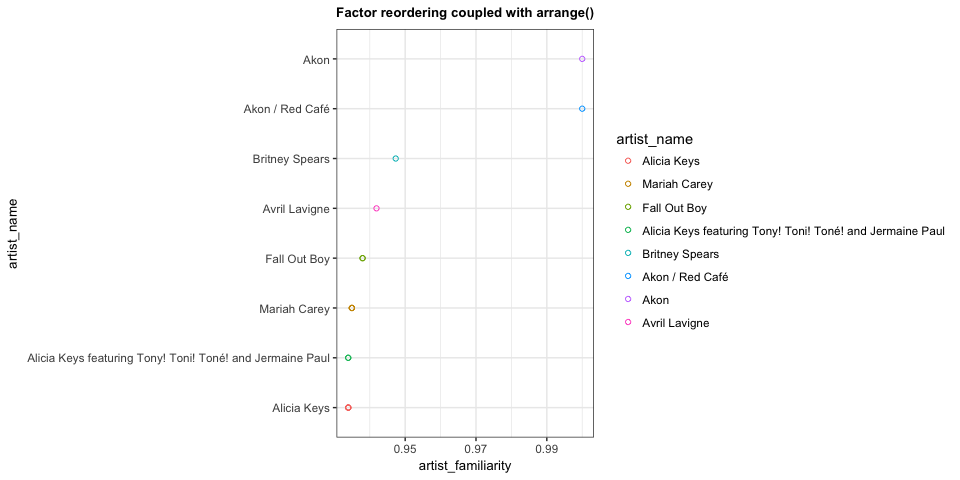

hw05-Tang-Jiahui
================
Jiahui Tang
2017/10/12

``` r
suppressPackageStartupMessages(library(tidyverse))
suppressPackageStartupMessages(library(gapminder))
suppressPackageStartupMessages(library(singer))
suppressPackageStartupMessages(library(forcats))
knitr::opts_chunk$set(fig.width=10, fig.height=5)
```

Factor Management
-----------------

I chosen the `Singer`dataframe to explore in this part.

### Factorise

*Transform some of the variable in the singer\_locations dataframe into factors: pay attention at what levels you introduce and their order. Try and consider the difference between the base R as.factor and the forcats-provided functions.*

-   First let's look at this dataset by using`glimpse()`, and we can find that the type of variables are not`factor`. Then I transform three variables,`artisit_name`,`year`and`city`into factors.

``` r
data("singer_locations")
glimpse(singer_locations)
```

    ## Observations: 10,100
    ## Variables: 14
    ## $ track_id           <chr> "TRWICRA128F42368DB", "TRXJANY128F42246FC",...
    ## $ title              <chr> "The Conversation (Cd)", "Lonely Island", "...
    ## $ song_id            <chr> "SOSURTI12A81C22FB8", "SODESQP12A6D4F98EF",...
    ## $ release            <chr> "Even If It Kills Me", "The Duke Of Earl", ...
    ## $ artist_id          <chr> "ARACDPV1187FB58DF4", "ARYBUAO1187FB3F4EB",...
    ## $ artist_name        <chr> "Motion City Soundtrack", "Gene Chandler", ...
    ## $ year               <int> 2007, 2004, 1998, 1995, 1968, 2006, 2003, 2...
    ## $ duration           <dbl> 170.4485, 106.5530, 527.5947, 695.1179, 237...
    ## $ artist_hotttnesss  <dbl> 0.6410183, 0.3937627, 0.4306226, 0.3622792,...
    ## $ artist_familiarity <dbl> 0.8230522, 0.5700167, 0.5039940, 0.4773099,...
    ## $ latitude           <dbl> NA, 41.88415, 40.71455, NA, 42.33168, 40.99...
    ## $ longitude          <dbl> NA, -87.63241, -74.00712, NA, -83.04792, -7...
    ## $ name               <chr> NA, "Gene Chandler", "Paul Horn", NA, "Doro...
    ## $ city               <chr> NA, "Chicago, IL", "New York, NY", NA, "Det...

-   We can use different ways to transform variables to factors: the base R as.factor and the forcats-provided functions`as_factor`.

-   However, when I tried to transform`year<int>`and`city<chr>`, I came across some ERRORS. Since year is numerical, it did not work if I use`as_factor()`directly, I changed it from integer into character first. As for`city`, which is a character variable with NA, we should add a value for NA.

*the base R as.factor*

``` r
singer_factor_base <- singer_locations %>% 
  mutate(artist_name = as.factor(artist_name),
         year = as.factor(year),
         city = as.factor(city))

str(singer_factor_base$artist_name)
```

    ##  Factor w/ 7498 levels "'t Hof Van Commerce",..: 4458 2487 4943 5439 1897 585 7247 7393 5763 5204 ...

``` r
str(singer_factor_base$year)
```

    ##  Factor w/ 70 levels "0","1922","1926",..: 67 64 58 55 28 66 63 67 26 66 ...

``` r
str(singer_factor_base$city)
```

    ##  Factor w/ 1316 levels "?, Illinois",..: NA 225 804 NA 305 910 NA NA NA NA ...

*the forcats-provided functions`as_factor`*

``` r
singer_factor <- singer_locations %>% 
  mutate(artist_name = as_factor(artist_name),
         city = ifelse(is.na(city), "NA", city),
         city = as_factor(city),
         year = as_factor(as.character(year)))

str(singer_factor$artist_name)
```

    ##  Factor w/ 7498 levels "Motion City Soundtrack",..: 1 2 3 4 5 6 7 8 9 10 ...

``` r
str(singer_factor$year)
```

    ##  Factor w/ 70 levels "2007","2004",..: 1 2 3 4 5 6 7 1 8 6 ...

``` r
str(singer_factor$city)
```

    ##  Factor w/ 1317 levels "NA","Chicago, IL",..: 1 2 3 1 4 5 1 1 1 1 ...

*From the results above, we can find that`as_factor()`would change the order of factor, while`as.factor`does not. Besides, the`levels`are different because we added some vaules into`city`.*

### Drop 0

*Filter the`singer_locations`data to remove observations associated with the uncorrectly inputed`year`0. Additionally, remove unused factor levels. Provide concrete information on the data before and after removing these rows and levels; address the number of rows and the levels of the affected factors.*

-   Filter() was used to remove unexpected observations, and we can find that the number of rows are changed from 10100 to 10000. However, unused levels of artist\_name and city were not removed. droplevels() can be exploited to solve this problem.

``` r
a = dim(singer_factor)[1]
b = nlevels(singer_factor$year)
c = nlevels(singer_factor$artist_name)
d = nlevels(singer_factor$city)

singer_FB_year <- singer_factor %>% 
  filter(year != 0) %>% 
  mutate(year = as_factor(as.character(year)))

singer_year_dropped <- singer_FB_year %>% 
  droplevels()
e = dim(singer_year_dropped)[1]
f = nlevels(singer_year_dropped$year)
g = nlevels(singer_year_dropped$artist_name)
h = nlevels(singer_year_dropped$city)


mytable <- cbind(before_drop = c(a,b,c,d),after_drop = c(e,f,g,h))
rownames(mytable) <- c("Rows", "year_levels","artist_levels", "city_levels")
knitr::kable(mytable)
```

|                |  before\_drop|  after\_drop|
|----------------|-------------:|------------:|
| Rows           |         10100|        10000|
| year\_levels   |            70|           69|
| artist\_levels |          7498|         7408|
| city\_levels   |          1317|         1309|

*The table above shows how the number of rows and levels of factors changed before and after removing. After using`droplevels()`, we now have 7408 and 1309 levels respectively for artist\_name and city, which means there are 90 and 8 levels affected.*

### Reorder the levels of`year`, `artist_name` or `title`.

*Use the forcats package to change the order of the factor levels, based on a principled summary of one of the quantitative variables. Consider experimenting with a summary statistic beyond the most basic choice of the median.*

-   In this part, fct\_reorder() was applied to the factor levels, and we can order`artist_name`and`year` by another quantitative variable`artist_familiarity`.

``` r
##  order according to max artist_familiarity
fct_reorder(singer_year_dropped$artist_name, singer_year_dropped$artist_familiarity, max) %>% 
  levels() %>%  head()
```

    ## [1] "Captain Capa"                        
    ## [2] "Ella Washington"                     
    ## [3] "Madness"                             
    ## [4] "The (International) Noise Conspiracy"
    ## [5] "Ludovico Einaudi & Ballaké Sissoko" 
    ## [6] "Fight K5"

``` r
## backwards
fct_reorder(singer_year_dropped$year, singer_year_dropped$artist_familiarity,desc = TRUE) %>% 
  levels() %>%  head()
```

    ## [1] "1945" "1947" "1922" "1940" "1929" "1937"

### Common part

*Characterize the (derived) data before and after your factor re-leveling.*

-   Frist I would simlpy our dataset using filter(), and use `arrange` to compare artist\_name based on `artist_familiarity`.

``` r
singer_factor %>% 
  arrange(artist_familiarity) %>% 
  filter(artist_familiarity >= 0.93) %>% 
  ggplot(aes(x = artist_familiarity, y = artist_name)) +
  geom_point(shape = 1,aes(color = artist_name)) +
  labs(title="Compare artist_name based on artist_familiarity using arrange()")+
  theme_bw()+
  theme( axis.title = element_text(size = 10),
         plot.title = element_text(size = 10, face = "bold", hjust = 0.5))
```



-   Then I use `fct_reorder()` to compare artist\_name based on `artist_familiarity`.

``` r
singer_factor %>% 
  filter(artist_familiarity >= 0.93) %>% 
  ggplot(aes(x = artist_familiarity, y = fct_reorder(artist_name, artist_familiarity, desc = TRUE))) +
  geom_point(shape = 1,aes(color = artist_name)) +
  labs(title="Compare artist_name based on artist_familiarity by fct_reorder()",
       y = "artist_name")+
  theme_bw()+
  theme( axis.title = element_text(size = 10),
         plot.title = element_text(size = 10, face = "bold", hjust = 0.5))
```



-   Finally I used factor reordering coupled with arrange() to make the plot.

``` r
singer_factor %>% 
  arrange(artist_familiarity) %>% 
  filter(artist_familiarity >= 0.93) %>% 
  ggplot(aes(x = artist_familiarity, y = fct_reorder(artist_name, artist_familiarity, desc = TRUE))) +
  geom_point(shape = 1,aes(color = artist_name)) +
  labs(title="Factor reordering coupled with arrange()",
       y = "artist_name")+
  theme_bw()+
  theme( axis.title = element_text(size = 10),
         plot.title = element_text(size = 10, face = "bold", hjust = 0.5))
```



-   As we can see from above figures, arrange() did not change the order, while reordering or fct\_reorder coupled with arrange() will change the order of factors.

File I/O
--------

*Experiment with one or more of`write_csv()/read_csv()`(and/or`TSV`friends),`saveRDS()/readRDS()`,`dput()/dget()`. Create something new, probably by filtering or grouped-summarization of Singer or Gapminder.*

``` r
singer_new_for_IO <- singer_year_dropped %>% 
  mutate(artist_name = fct_reorder(artist_name, artist_familiarity, max, desc = TRUE)) %>% 
  group_by(artist_name) %>% 
  filter(artist_familiarity >= 0.85) %>% 
  summarise(max_artist_familiarity = max(artist_familiarity))
glimpse(singer_new_for_IO)
```

    ## Observations: 121
    ## Variables: 2
    ## $ artist_name            <fctr> Coheed and Cambria, Hot Chip, Pussycat...
    ## $ max_artist_familiarity <dbl> 0.8783131, 0.8526389, 0.8544883, 0.9339...

-   First I would use `write_csv()/read_csv()` to write to file and read back in.

``` r
write_csv(singer_new_for_IO, "singer_new_for_IO.csv")
glimpse(read_csv("singer_new_for_IO.csv"))
```

    ## Parsed with column specification:
    ## cols(
    ##   artist_name = col_character(),
    ##   max_artist_familiarity = col_double()
    ## )

    ## Observations: 121
    ## Variables: 2
    ## $ artist_name            <chr> "Coheed and Cambria", "Hot Chip", "Puss...
    ## $ max_artist_familiarity <dbl> 0.8783131, 0.8526389, 0.8544883, 0.9339...

-   Then I employed`saveRDS()/readRDS()` to write to file and read back in.

``` r
saveRDS(singer_new_for_IO, "singer_new_for_IO.rds")
glimpse(readRDS("singer_new_for_IO.rds"))
```

    ## Observations: 121
    ## Variables: 2
    ## $ artist_name            <fctr> Coheed and Cambria, Hot Chip, Pussycat...
    ## $ max_artist_familiarity <dbl> 0.8783131, 0.8526389, 0.8544883, 0.9339...

-   I employed`dput()/dget()` to write to file and read back in.

``` r
dput(singer_new_for_IO, "singer_new_for_IO.pdf")
glimpse(dget("singer_new_for_IO.pdf"))
```

    ## Observations: 121
    ## Variables: 2
    ## $ artist_name            <fctr> Coheed and Cambria, Hot Chip, Pussycat...
    ## $ max_artist_familiarity <dbl> 0.8783131, 0.8526389, 0.8544883, 0.9339...

*According to the results, we find that there is no change if using `saveRDS()/readRDS()` or `dput()/dget()`, but the factor varible `artist_name` will change into charactor if we are using`write_csv()/read_csv()`.*

Visualization design
--------------------

*Remake at least one figure or create a new one, in light of something you learned in the recent class meetings about visualization design and color. Maybe juxtapose your first attempt and what you obtained after some time spent working on it. Reflect on the differences.*

Writing figures to file
-----------------------

*Use`ggsave()`to explicitly save a plot to file. Then use``to load and embed it in your report.*

But I want to do more!
----------------------

*Make a deeper exploration of the forcats packages, i.e. try more of the factor level reordering functions.*
