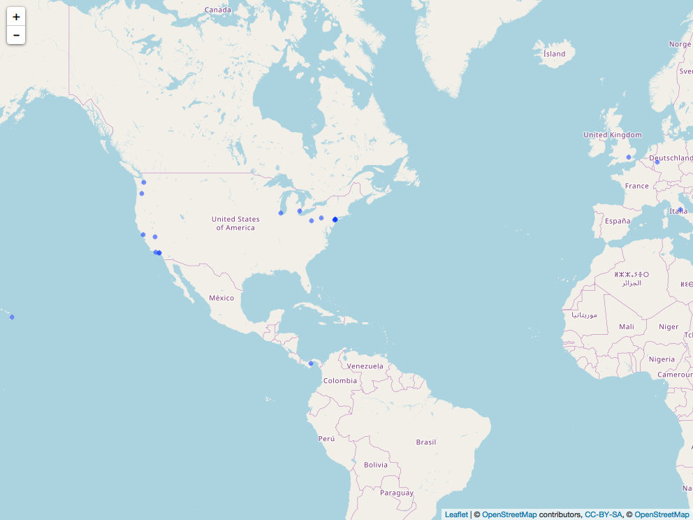

Work with the singer data
================
Jiahui Tang
2017/11/7

``` r
knitr::opts_chunk$set(warning = F)
suppressPackageStartupMessages(library(tidyverse))
```

    ## Warning: package 'purrr' was built under R version 3.4.2

``` r
suppressPackageStartupMessages(library(singer))
suppressPackageStartupMessages(library(stringr))
suppressPackageStartupMessages(library(forcats))
suppressPackageStartupMessages(library(purrr))
suppressPackageStartupMessages(library(repurrrsive))
suppressPackageStartupMessages(library(ggmap))
suppressPackageStartupMessages(library(leaflet))
suppressPackageStartupMessages(library(mapview))
```

    ## Warning: package 'mapview' was built under R version 3.4.2

``` r
suppressPackageStartupMessages(library(htmlwidgets))
suppressPackageStartupMessages(library(webshot))
knitr::opts_chunk$set(fig.width=10, fig.height=5)
```

Work with the`singer`data
-------------------------

-   The singer\_location dataframe in the singer package contains geographical information stored in two different formats: 1. as a (dirty!) variable named city; 2. as a latitude / longitude pair (stored in latitude, longitude respectively). The function revgeocode from the ggmap library allows you to retrieve some information for a pair (vector) of longitude, latitude (warning: notice the order in which you need to pass lat and long). Read its manual page.

-   Use purrr to map latitude and longitude into human readable information on the band’s origin places. Notice that revgeocode(... , output = "more") outputs a dataframe, while revgeocode(... , output = "address") returns a string: you have the option of dealing with nested dataframes. You will need to pay attention to two things:

    -   Not all of the track have a latitude and longitude: what can we do with the missing information? (filtering, …)
    -   Not all of the time we make a research through revgeocode() we get a result. What can we do to avoid those errors to bite us? (look at possibly() in purrr…)

*As for the track without a latitude and longitude, we need to filter all rows with latitude and longitude are NAs. Then we apply map2() to call revgeocode() for all pairs of longitude and latitude.*

*When revgeocode() goes wrong, there will be a error like this:*

``` r
reverse geocode failed - bad location? location = "-87.63241"reverse geocode failed - bad location? location = "41.88415"
```

*we can use`possibly(revgeocode, NA)`to avoid this.*

``` r
#View(singer_locations)
#First we need to filter all rows with latitude and longitude are NAs.
filter_NA_locations <- singer_locations %>% 
  filter(!is.na(latitude) | !is.na(longitude)) %>% 
      mutate(id = 1:nrow(.)) %>% 
      filter(id <= 20)
#glimpse(filter_NA_locations)

#Then we use map2 to apply revgeocode
loc <- map2(filter_NA_locations$longitude,
                                filter_NA_locations$latitude, 
                                ~ revgeocode(c(.x, .y)))
locations <- cbind(location = loc,city = filter_NA_locations$city)
knitr::kable(locations)
```

| location                                             | city                         |
|:-----------------------------------------------------|:-----------------------------|
| 123-135 North LaSalle Street, Chicago, IL 60602, USA | Chicago, IL                  |
| 80 Chambers St, New York, NY 10007, USA              | New York, NY                 |
| 2-44 Michigan Ave, Detroit, MI 48226, USA            | Detroit, MI                  |
| 997 Sand Ridge Rd, Howard, PA 16841, USA             | Pennsylvania                 |
| 349 3rd Street, Oxnard, CA 93030, USA                | Oxnard, CA                   |
| An der Evangelischen Kirche 6, 53113 Bonn, Germany   | Bonn                         |
| Unnamed Road, Hawaii, USA                            | Hawaii                       |
| 262-298 W 1st St, Los Angeles, CA 90012, USA         | Los Angeles, CA              |
| 215 Arthur Kill Rd, Staten Island, NY 10306, USA     | Staten Island, NY            |
| Pacific Hwy W, Portland, OR 97201, USA               | Portland, OR                 |
| 18-20 Whitehall, Westminster, London SW1A, UK        | UK - England - London        |
| Via Roma, 24, 02018 Poggio Bustone RI, Italy         | Poggio Bustone, Rieti, Italy |
| 408-414 Grant St, Pittsburgh, PA 15219, USA          | Pittsburgh, PA               |
| 80 Chambers St, New York, NY 10007, USA              | New York, NY                 |
| 320-398 Van Ness Ave, San Francisco, CA 94102, USA   | New York, NY                 |
| 80 Chambers St, New York, NY 10007, USA              | New York, NY                 |
| 262-298 W 1st St, Los Angeles, CA 90012, USA         | Los Angeles, CA              |
| Stump Springs Rd, Lakeshore, CA 93634, USA           | California                   |
| Calle Aviacion, Río Hato, Panama P                   | anama                        |
| 220-298 4th Ave S, Kent, WA 98032, USA               | KENT, WASHINGTON             |

-   Then we should figure out wether the place in city corresponds to the information you retrieved.

*To check how many places were correctly predicted by`revgeocode()`, I firstly made all the city variables separate into single words and also deleted all punctuation.* *Then as for the information I retrieved from `revgeocode()`, I did the similar operations: first using regexp to find all City names(I assume that the words between "," are city names), abbreviations like "NY" and "USA"（all capitalized words). Then I replaced all "," to make it cleaner.* *Last I just compared all columns and return "TRUE" or "FALSE" to get the final result. Although the way I uesd is kind of "brute force", I didnot figure out a better way to solve it.*

``` r
#divide into single words.
city_new<-filter_NA_locations %>% 
 select(city) %>% 
 separate(city,into = c("1","2","3"),sep=" ") 
#delete punctuation
city_new <- mapply(str_replace_all,city_new,"[[:punct:]]","") 
knitr::kable(city_new)
```

| 1            | 2          | 3       |
|:-------------|:-----------|:--------|
| Chicago      | IL         | NA      |
| New          | York       | NY      |
| Detroit      | MI         | NA      |
| Pennsylvania | NA         | NA      |
| Oxnard       | CA         | NA      |
| Bonn         | NA         | NA      |
| Hawaii       | NA         | NA      |
| Los          | Angeles    | CA      |
| Staten       | Island     | NY      |
| Portland     | OR         | NA      |
| UK           |            | England |
| Poggio       | Bustone    | Rieti   |
| Pittsburgh   | PA         | NA      |
| New          | York       | NY      |
| New          | York       | NY      |
| New          | York       | NY      |
| Los          | Angeles    | CA      |
| California   | NA         | NA      |
| Panama       | NA         | NA      |
| KENT         | WASHINGTON | NA      |

``` r
#using regexp to find all City names, abbreviations like "NY" and "USA"
loc_chr <- as.character(loc)
loc_chr_new <- str_extract_all(loc_chr[str_detect(loc_chr,
                                              "\\, [A-Z0-9].*[a-z]\\,|\\b[A-Z]{2,}\\b")],
                           "\\, [A-Z0-9].*[a-z]\\,|\\b[A-Z]{2,}\\b",simplify = TRUE)
City <- str_replace_all(loc_chr_new[,1],", |,", "")
loc_chr_new[,1] = City
knitr::kable(loc_chr_new)
```

|               |     |     |
|:--------------|:----|:----|
| Chicago       | IL  | USA |
| New York      | NY  | USA |
| Detroit       | MI  | USA |
| Howard        | PA  | USA |
| Oxnard        | CA  | USA |
| 53113 Bonn    |     |     |
| Hawaii        | USA |     |
| Los Angeles   | CA  | USA |
| Staten Island | NY  | USA |
| Portland      | OR  | USA |
| Westminster   | UK  |     |
| RI            |     |     |
| Pittsburgh    | PA  | USA |
| New York      | NY  | USA |
| San Francisco | CA  | USA |
| New York      | NY  | USA |
| Los Angeles   | CA  | USA |
| Lakeshore     | CA  | USA |
| Río Hato      |     |     |
| Kent          | WA  | USA |

``` r
#Compare
a <- (loc_chr_new[,1]==city_new[,1])
b <- (loc_chr_new[,1]==city_new[,2])
c <- (loc_chr_new[,1]==city_new[,3])
d <- (loc_chr_new[,2]==city_new[,1])
e <- (loc_chr_new[,2]==city_new[,2])
f <- (loc_chr_new[,2]==city_new[,3])
g <- (loc_chr_new[,3]==city_new[,1])
h <- (loc_chr_new[,3]==city_new[,2])
i <- (loc_chr_new[,3]==city_new[,3])
result <- (a | b | c | d | e |f |g |h |i)
result
```

    ##  [1]  TRUE  TRUE  TRUE    NA  TRUE    NA  TRUE  TRUE  TRUE  TRUE  TRUE
    ## [12] FALSE  TRUE  TRUE FALSE  TRUE  TRUE    NA    NA    NA

*From the result we can find that all "NA" and "FALSE" means there are incorrect in my way. Actually it has some true nagetives like `Stump Springs Rd, Lakeshore, CA 93634 USA and "California"`,`"An der Evangelischen Kirche 6", 53113 Bonn, Germany" and "Bonn"`. Besides, it also has some false postives like`"320-398 Van Ness Ave, San Francisco, CA 94102, USA" and "New York, NY"`.I did not find a better way to verify these information, but the results are kind of acceptable.*

-   Give a look to the library leaflet and plot some information about the bands.

*Finally We can use leaflet() to plot some information about the bands. Making a map figure is kind of easy, but I dont konw how to convert it into a .png file. I looked around on the Internet, and finally found a way to realized it like codes showing below. Actually we can also use`` once we have a png picture.*

``` r
map <- leaflet()  %>%   
addTiles() %>%
addCircles( lat=filter_NA_locations$latitude,lng=filter_NA_locations$longitude,
            popup = filter_NA_locations$title) %>% 
  addProviderTiles(providers$OpenStreetMap)

saveWidget(map, "map.html", selfcontained = FALSE)
webshot("map.html", file = "map.png",
        cliprect = "viewport")
```



``` r
#mapshot(map, file = "./map.png")
```
