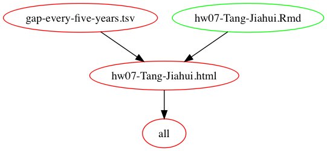

# STAT547M-hw07-Jiahui-Tang

Hi, Everyone! Welcome to this repo for Homework07.:smirk:

## Homework07 Materials

### [Homework 07: Automating Data-analysis Pipelines](https://stat545.com/hw07_automation.html)

***Big picture***

+ Write (or extract from a previous analysis) three or more R scripts to carry out a small data analysis.
+ The output of the first script must be the input of the second, and so on.
+ Something like this:

    - First script: download some data.
    - Second script: read the data, perform some analysis and write numerical data to file in CSV or TSV format.
    - Third script: read the output of the second script, generate some figures and save them to files.
    - Fourth script: an Rmd, actually, that presents original data, the statistical summaries, and/or the figures in a little report.
    - A fifth script to rule them all, i.e. to run the others in sequence.
    
You can use Make, Remake or (if you feel the urge for something more) a combinantion of Make and Remake.

## Report My Process

gapminder
Error in file(file, "rt"): 

## Links

