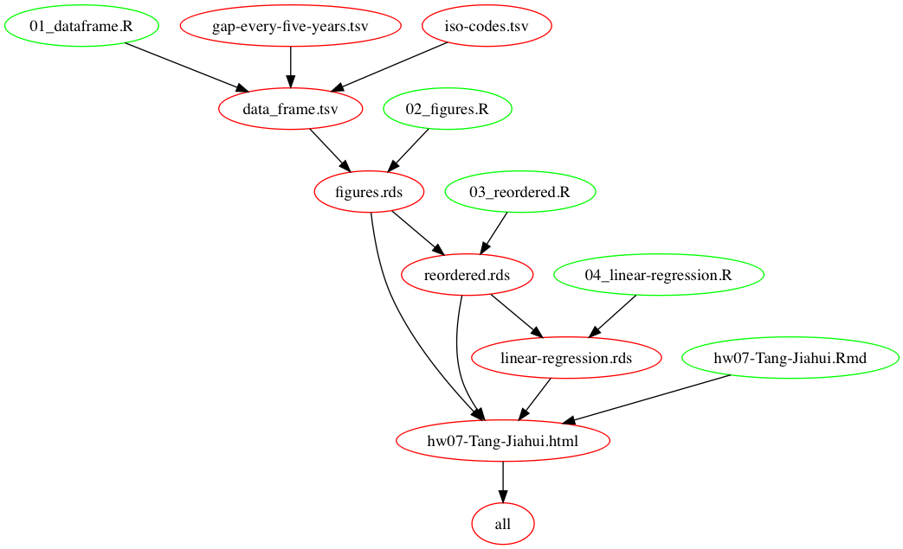

# STAT547M-hw07-Jiahui-Tang

Hi, Everyone! Welcome to this repo for Homework07.:smirk:

## Homework07 Materials

[hw07-Tang-Jiahui.md](https://github.com/Tangjiahui26/STAT545-hw-Tang-Jiahui/blob/master/hw07/hw07-Tang-Jiahui.md)

[Makefile](https://github.com/Tangjiahui26/STAT545-hw-Tang-Jiahui/blob/master/hw07/Makefile)

[source.R](https://github.com/Tangjiahui26/STAT545-hw-Tang-Jiahui/blob/master/hw07/source.R) and [clean.R](https://github.com/Tangjiahui26/STAT545-hw-Tang-Jiahui/blob/master/hw07/clean.R)

All figures are [here](https://github.com/Tangjiahui26/STAT545-hw-Tang-Jiahui/tree/master/hw07/figures)

All files(.rds files what we need to save) are [here](https://github.com/Tangjiahui26/STAT545-hw-Tang-Jiahui/tree/master/hw07/files)

### [Homework 07: Automating Data-analysis Pipelines](https://stat545.com/hw07_automation.html)

***Big picture***

+ Write (or extract from a previous analysis) three or more R scripts to carry out a small data analysis.
+ The output of the first script must be the input of the second, and so on.
+ Something like this:

    - First script: download some data.
    - Second script: read the data, perform some analysis and write numerical data to file in CSV or TSV format.
    - Third script: read the output of the second script, generate some figures and save them to files.
    - Fourth script: an Rmd, actually, that presents original data, the statistical summaries, and/or the figures in a little report.
    - A fifth script to rule them all, i.e. to run the others in sequence.
    
You can use Make, Remake or (if you feel the urge for something more) a combinantion of Make and Remake.

## Report My Process

From the picture above, we can mainly understand the whole process of the pipeline. Everything started from downloading data from Internet and saved in [gap-every-five-tears.tsv](https://github.com/Tangjiahui26/STAT545-hw-Tang-Jiahui/blob/master/hw07/gap-every-five-tears.tsv). Then four different Rscript files were executed sequentially:[01_dataframe.R](https://github.com/Tangjiahui26/STAT545-hw-Tang-Jiahui/blob/master/hw07/01_dataframe.R), [02_figures.R](https://github.com/Tangjiahui26/STAT545-hw-Tang-Jiahui/blob/master/hw07/02_figures.R), [03_reordered](https://github.com/Tangjiahui26/STAT545-hw-Tang-Jiahui/blob/master/hw07/03_reordered.R) and [04_linear-regression](https://github.com/Tangjiahui26/STAT545-hw-Tang-Jiahui/blob/master/hw07/04_linear-regression.R). Finally the markdown file`hw07-Tang-Jiahui.md`was rendered using rmarkdown::render() command.

Actually we can set the pipeline to execute different steps in [Makefile](https://github.com/Tangjiahui26/STAT545-hw-Tang-Jiahui/blob/master/hw07/Makefile), so it is very conveninent for us to change and manage our codes. 

Besides, actually I download two .tsv files from Internet since the links on the homework page was expired. The second .tsv file called iso-codes.tsv. I think it is useful, so I just simply make it joined with gapminder and created a new dataframe. Maybe I can use it to do other futher works in the future.

I encountered with a problem at first. It is a simple error, so I just want to put it here to reminder anyone who may have the same problem. To solve it, the easiest way is set your homework file as working Directory.
`Error in file(file, "rt") : cannot open the connection`

## Links
[nesting](http://stat545.com/block024_group-nest-split-map.html)

[broom](https://www.rdocumentation.org/packages/broom/versions/0.4.2)

[makefile2graph](https://github.com/lindenb/makefile2graph)
