***Make some figures first***

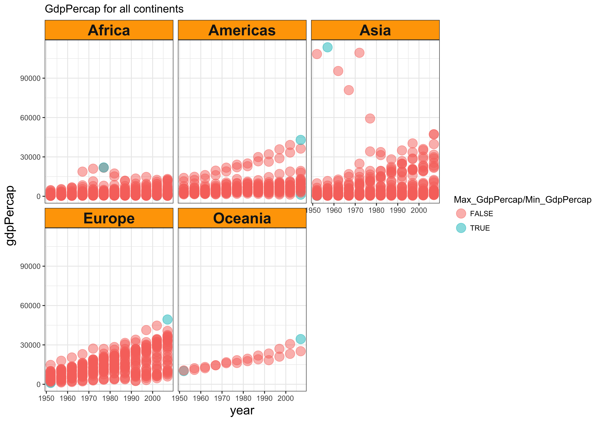

The spread of GDP per capita within the continents

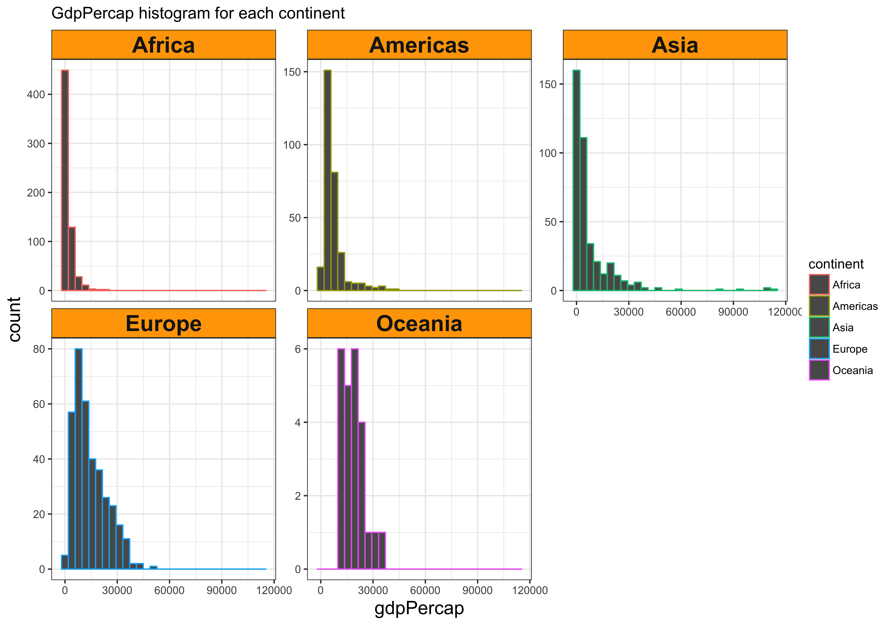


Plot mean of life expectancy for different years

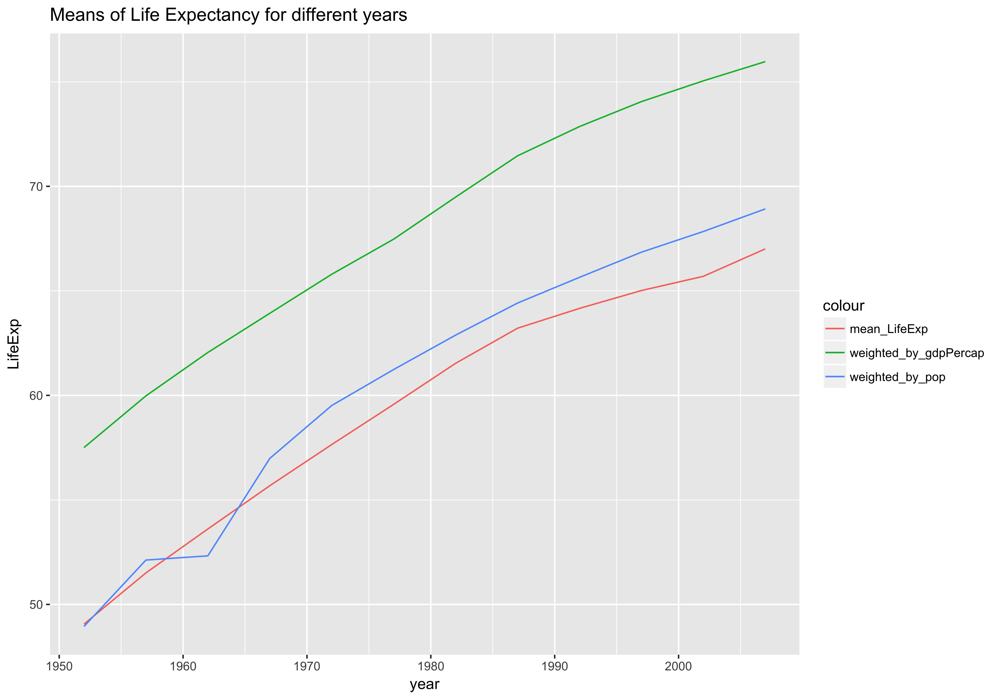


Make a plot of GDP for countries' iso_code between 120 and 170

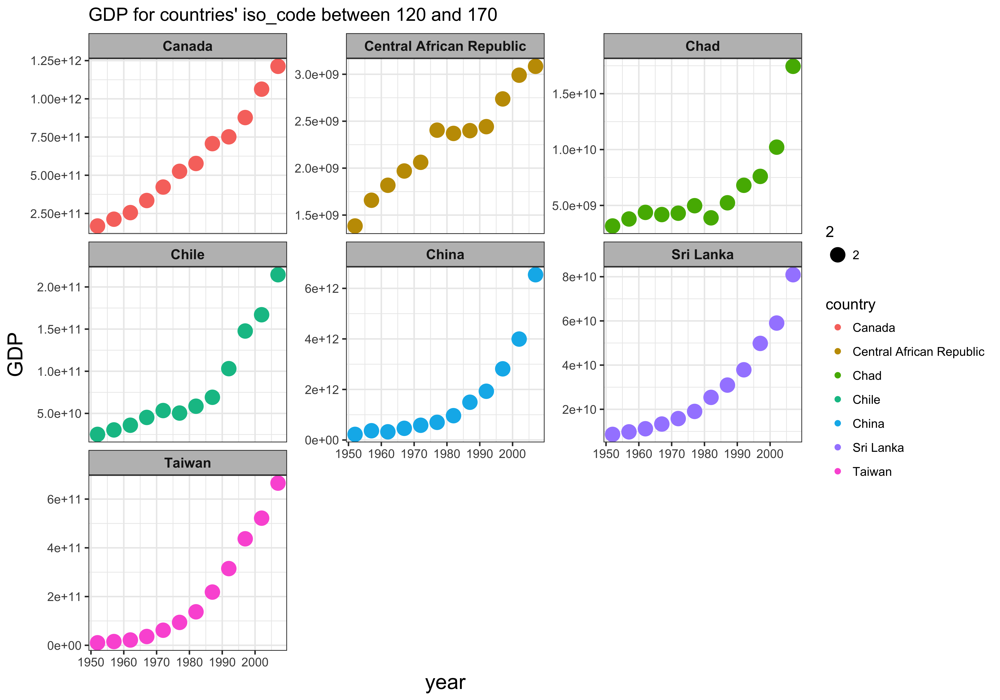

***Reorder the continents based on life expectancy.***
+ Use the forcats package to change the order

```{r}
reordered_data <- read.delim("03_reordered.rds")
head(reordered_data)
```

Reorder the continents based on life expectancy 
Plot the two different figures
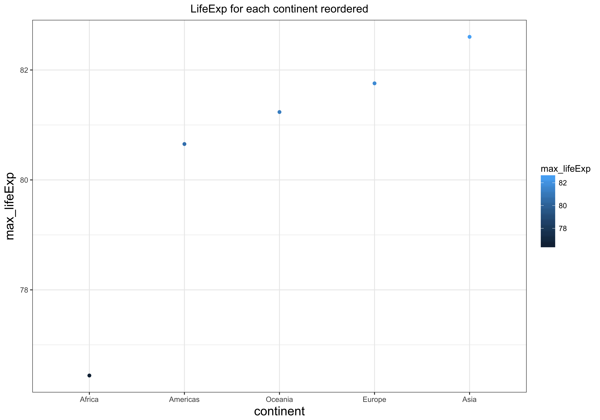

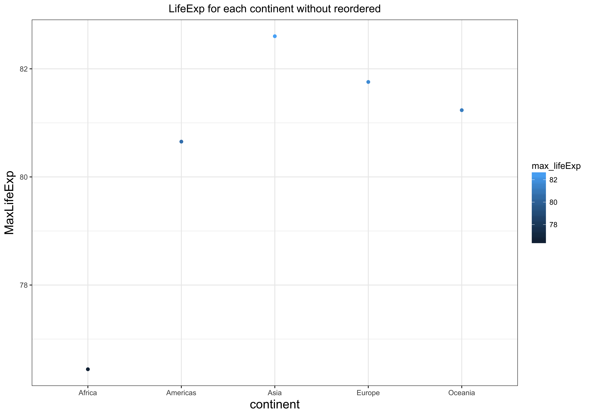

Create a figure for each continent, and write one file per continent, with an informative name. 

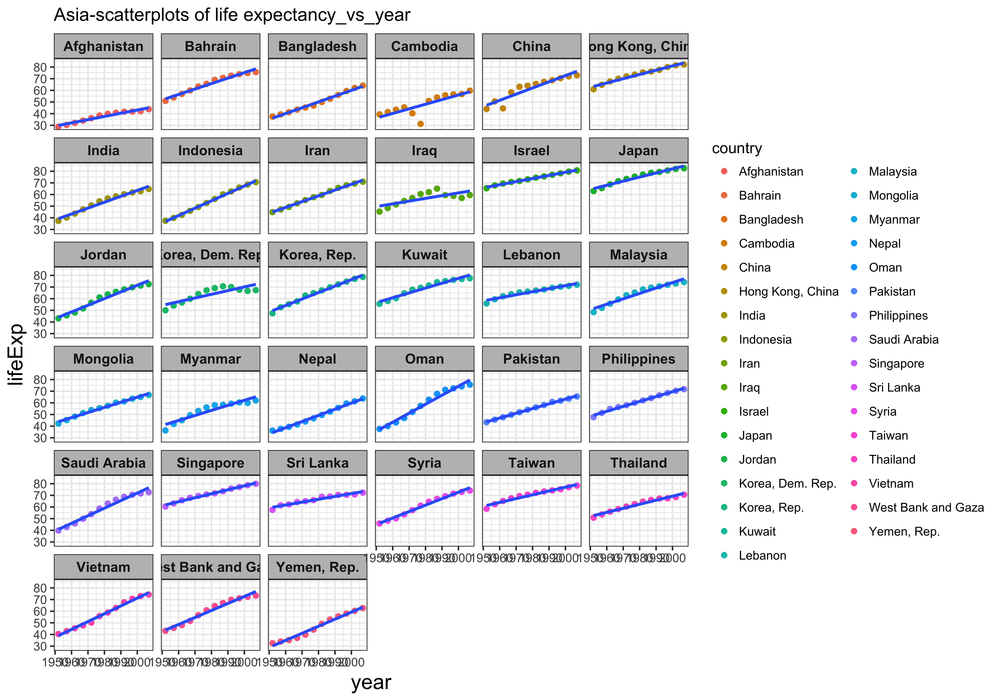


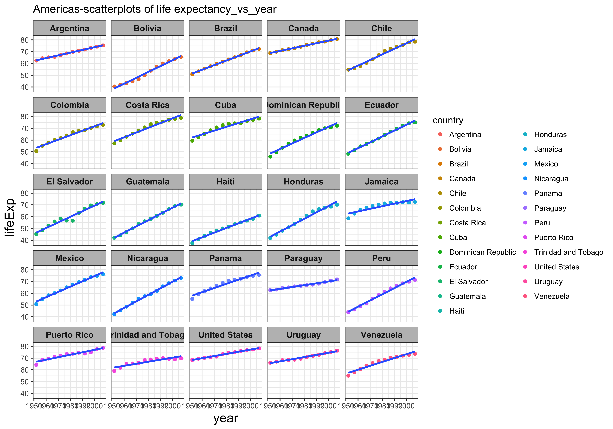

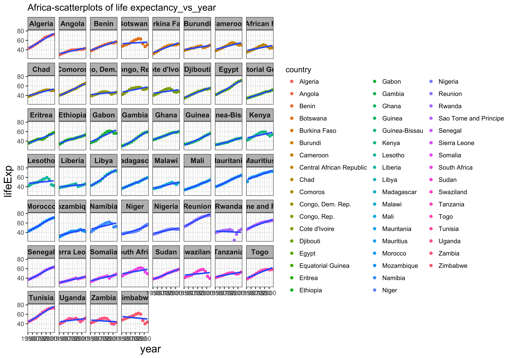

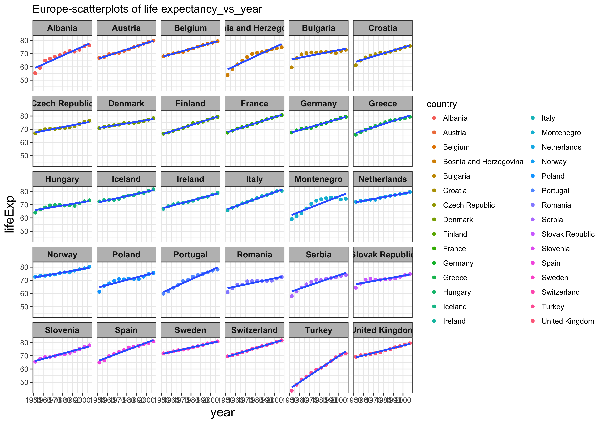

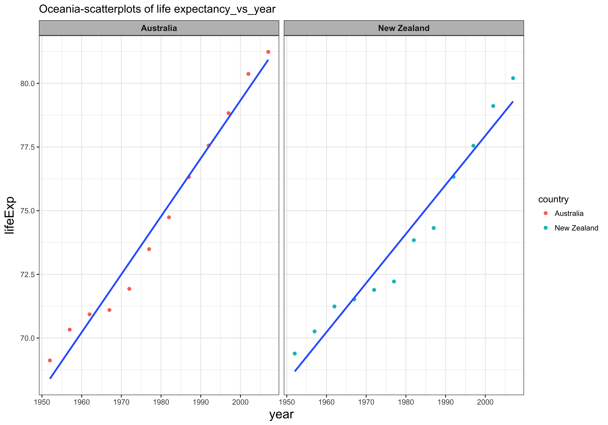
