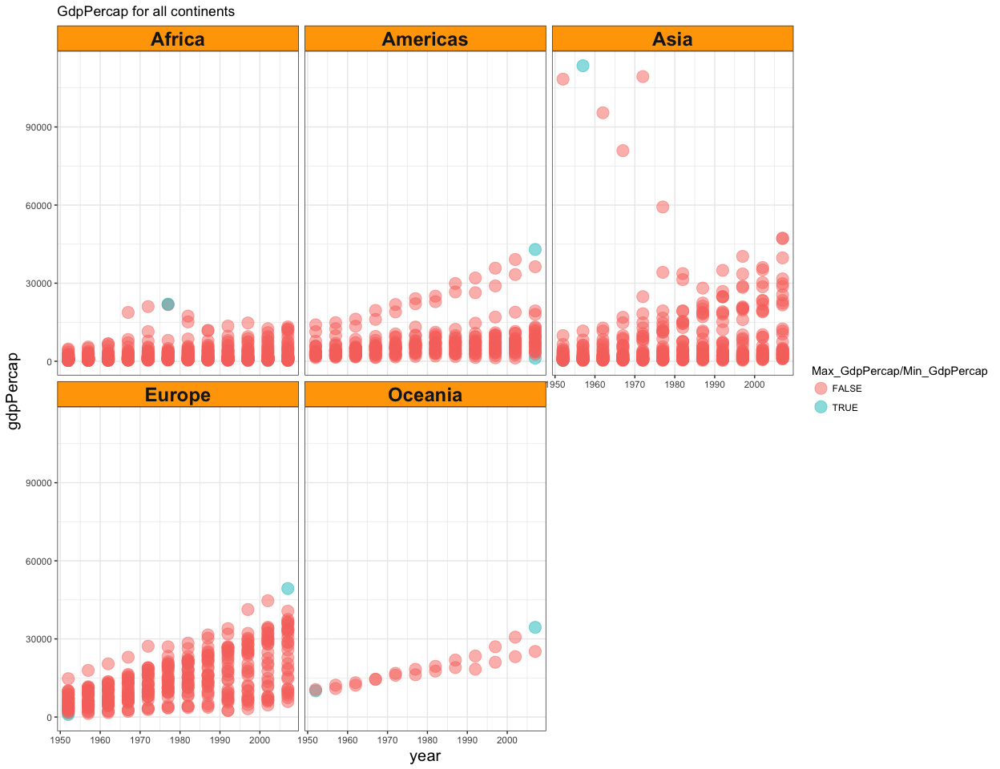
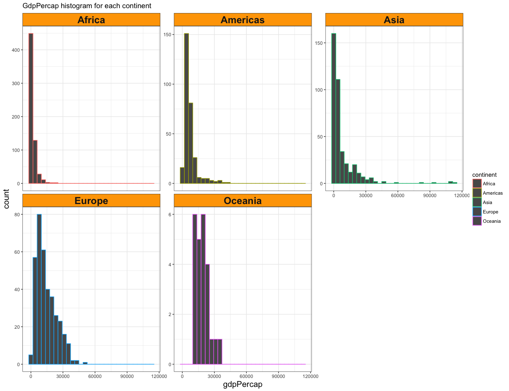
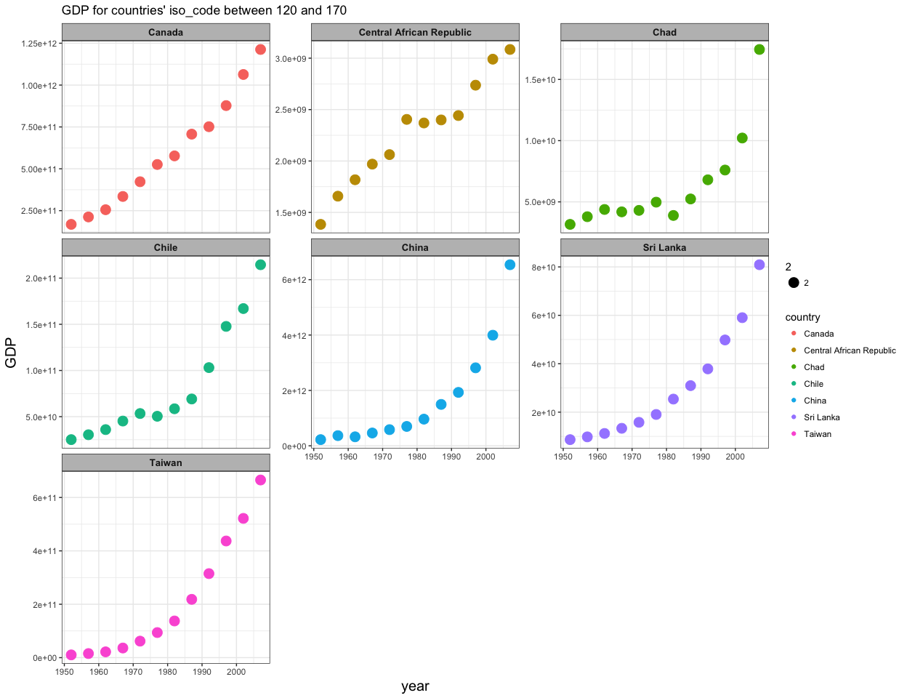
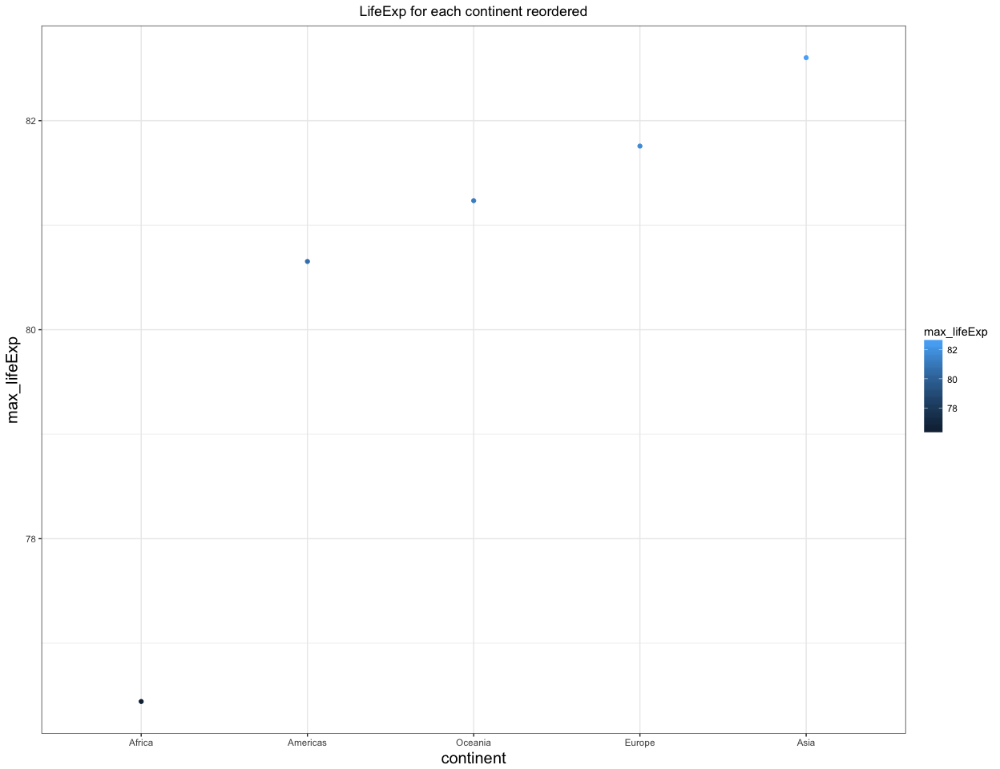
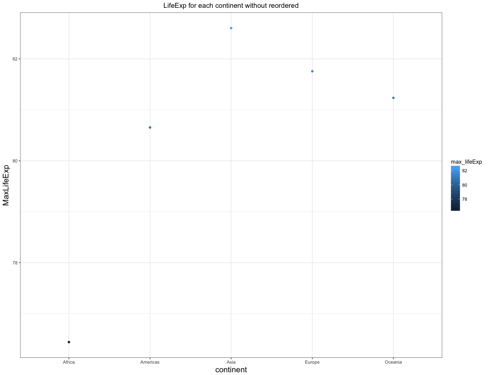
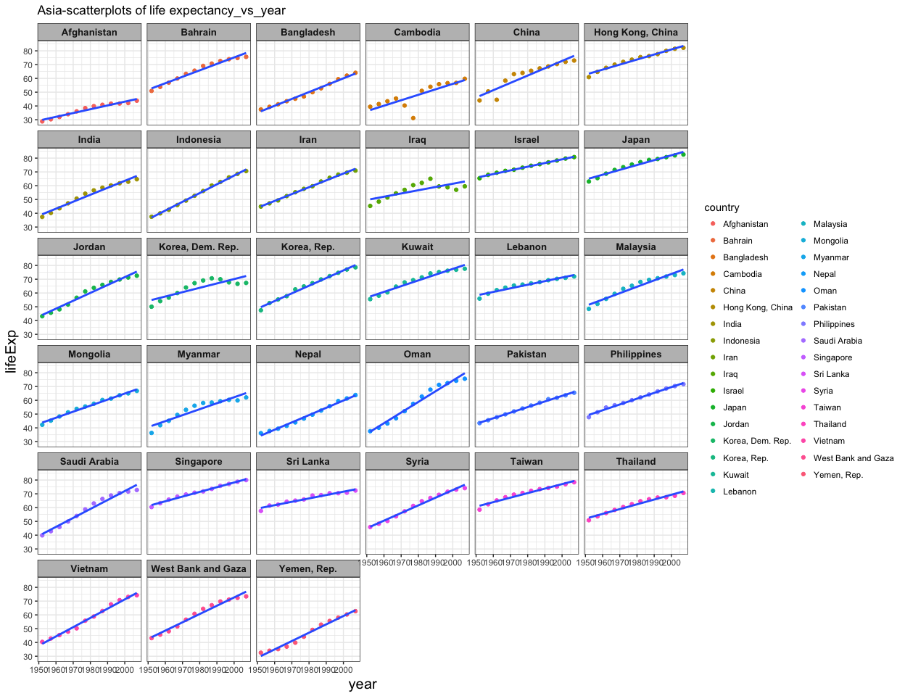
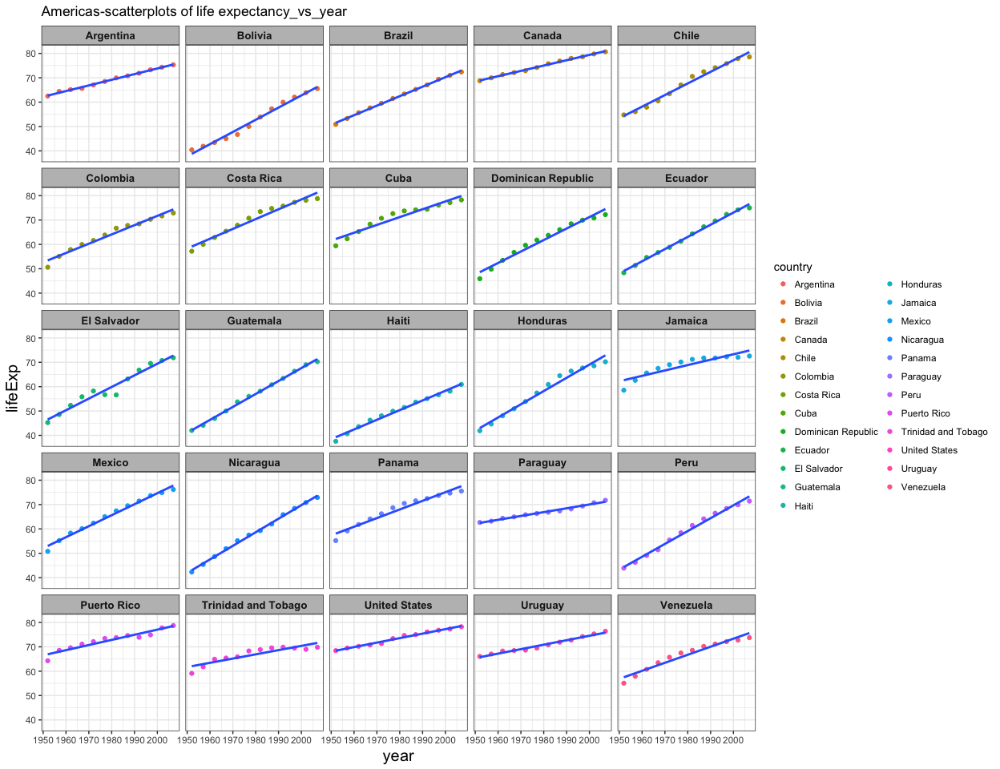
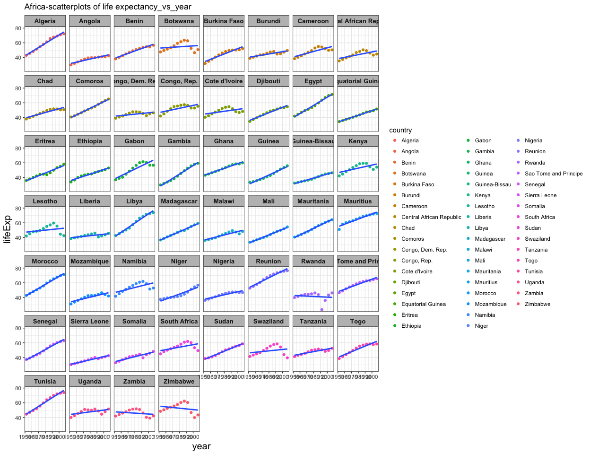
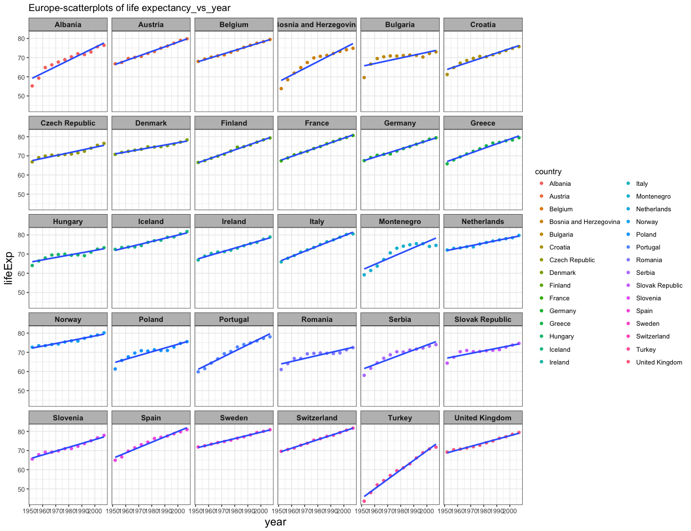
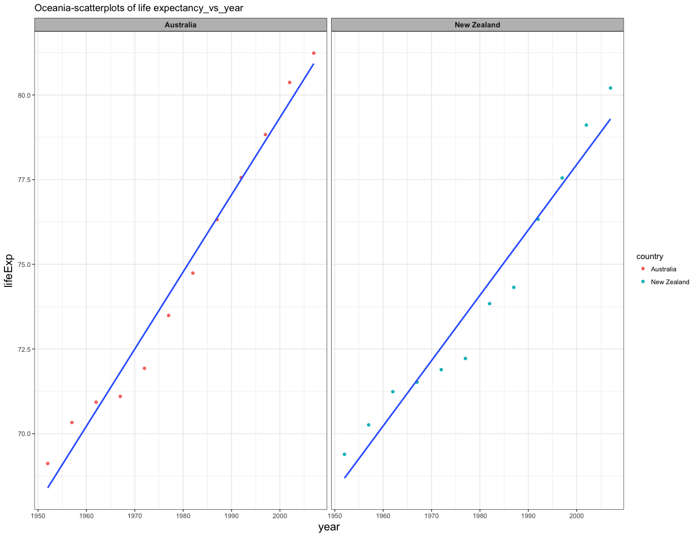

hw07-Tang-Jiahui
================
Jiahui Tang
2017/11/14

``` r
library(purrr)
```

    ## Warning: package 'purrr' was built under R version 3.4.2

``` r
library(tidyverse)
```

    ## Loading tidyverse: ggplot2
    ## Loading tidyverse: tibble
    ## Loading tidyverse: tidyr
    ## Loading tidyverse: readr
    ## Loading tidyverse: dplyr

    ## Conflicts with tidy packages ----------------------------------------------

    ## filter(): dplyr, stats
    ## lag():    dplyr, stats

``` r
library(forcats)
library(broom)
library(ggmap)
gapminder <- read.delim("gap-every-five-years.tsv")
ios_codes <- read.delim("iso-codes.tsv")
knitr::opts_chunk$set(fig.width=13, fig.height=10)
```

***Create a new dateframe***

-   Use left\_join to create a new data\_frame called country\_codes which contains
-   gapminder and ios\_codes of each countries

``` r
country_codes <- left_join(gapminder, ios_codes)
```

    ## Joining, by = "country"

    ## Warning: Column `country` joining factors with different levels, coercing
    ## to character vector

***Make some figures first***

``` r
T1 <- country_codes %>% 
    group_by(continent) %>% 
    summarise(Max_GdpPercap = max(gdpPercap), Min_GdpPercap = min(gdpPercap))
              
P1 <- country_codes %>% 
    ggplot(aes(x = year, y = gdpPercap))+
    facet_wrap(~ continent) +
    geom_point(aes(color = (gdpPercap %in% c(T1$Max_GdpPercap, T1$Min_GdpPercap))), size = 5, alpha = 0.5) +
    theme_bw() +
    theme(strip.background = element_rect(fill="orange"),
          axis.title.x = element_text(size=15),
          axis.title.y = element_text(size=15),
          strip.text = element_text(size=18, face="bold",hjust=0.5))+
    labs(title="GdpPercap for all continents")+
    scale_colour_discrete("Max_GdpPercap/Min_GdpPercap")
print(P1)   
```



``` r
#ggsave("./figures/GdpPercap for all continents.png",P1,device = "png", width = 10, 
#      height = 7,dpi = 500)
```

``` r
#The spread of GDP per capita within the continents

P2 <- country_codes %>%
    select(gdpPercap, continent) %>% 
    ggplot(aes(x = gdpPercap, color = continent))+
    geom_histogram() +
    facet_wrap(~ continent, scales = "free_y") +
    theme_bw() +
    theme(strip.background = element_rect(fill="orange"),
          axis.title.x = element_text(size=15),
          axis.title.y = element_text(size=15),
          strip.text = element_text(size=18, face="bold"))+
    labs(title="GdpPercap histogram for each continent")
print(P2) 
```

    ## `stat_bin()` using `bins = 30`. Pick better value with `binwidth`.



``` r
#ggsave("./figures/GdpPercap histogram for each continent.png",P2,device = "png", width = 10, 
#       height = 7,dpi = 500)
```

``` r
#Plot mean of life expectancy for different years
T2 <- country_codes %>% 
    group_by(year) %>% 
    summarise(mean_LifeExp = mean(lifeExp), 
              weighted_by_pop = weighted.mean(lifeExp, pop),
              weighted_by_gdpPercap = weighted.mean(lifeExp, gdpPercap))

P3 <- ggplot(T2, aes(x = year, y = LifeExp)) +
    geom_line(aes(y = mean_LifeExp, color = "mean_LifeExp")) +
    geom_line(aes(y = weighted_by_pop, color = "weighted_by_pop")) +
    geom_line(aes(y = weighted_by_gdpPercap, color = "weighted_by_gdpPercap")) +
    labs(title = "Means of Life Expectancy for different years")
print(P3) 
```


``` r
#ggsave("./figures/Means of Life Expectancy for different years.png",P3,device = "png", width = 10, 
#       height = 7,dpi = 500)
```

``` r
#Make a plot of GDP for countries' iso_code between 120 and 170

P4 <- country_codes %>% 
    filter(iso_num >120 & iso_num <170) %>% 
    ggplot(aes(x = year, y = (gdpPercap*pop)))+
    facet_wrap(~ country , scales = "free_y") +
    geom_point(aes(color = country, size = 2)) +
    theme_bw() +
    theme(strip.background = element_rect(fill="grey"),
    axis.title.x = element_text(size=15),
    axis.title.y = element_text(size=15),
    strip.text = element_text(size=10, face="bold",hjust=0.5))+
    labs(title="GDP for countries' iso_code between 120 and 170")+
    scale_y_continuous("GDP")   
print(P4)
```



``` r
#ggsave("./figures/GDP for some countries or areas.png",P4,device = "png", width = 10, 
#       height = 7,dpi = 500)


#country_codes %>% 
#    saveRDS("02_figures.rds")
```

***Reorder the continents based on life expectancy.*** + Use the forcats package to change the order

``` r
reordered_data <- country_codes %>% 
    mutate(continent = fct_reorder(continent, lifeExp, max))

#Reorder the continents based on life expectancy 
#Plot the two different figures

P5 <- reordered_data %>% 
    group_by(continent) %>% 
    summarise(max_lifeExp = max(lifeExp)) %>% 
    ggplot(aes(x = continent, y = max_lifeExp, color = max_lifeExp))+ 
    geom_point() + 
    theme_bw() +
    theme(axis.title.x = element_text(size=15),
          axis.title.y = element_text(size=15),
          plot.title=element_text(hjust=0.5)) +
    labs(title="LifeExp for each continent reordered")

print(P5)
```



``` r
#ggsave("./figures/MaxLifeExp for each continent reordered.png",P5,device = "png", width = 10, 
#       height = 7,dpi = 500)

P6 <- country_codes %>% 
    group_by(continent) %>% 
    summarise(max_lifeExp = max(lifeExp)) %>% 
    ggplot(aes(x = continent, y = max_lifeExp, color = max_lifeExp))+ 
    geom_point() + 
    theme_bw() +
    theme(axis.title.x = element_text(size=15),
          axis.title.y = element_text(size=15),
          plot.title=element_text(hjust=0.5)) +
    labs(title="LifeExp for each continent without reordered") +
    scale_y_continuous("MaxLifeExp")   

print(P6)
```



``` r
#ggsave("./figures/MaxLifeExp for each continent unreordered.png",P6,device = "png", width = 10, 
#       height = 7,dpi = 500)

#reordered_data %>% 
#    saveRDS("03_reordered.rds")
```

-   Fit a linear regression of life expectancy on year within each country.
-   Write the estimated intercepts, slopes, and residual error variance (or sd) to file.
-   The R package broom may be useful here.

``` r
country_nested <- country_codes %>% 
    group_by(continent, country) %>% 
    nest()

life_vs_year <- function(df) {
    lm(lifeExp ~ I(year - 1950), data = df)
}

country_nested <- country_nested %>% 
    mutate(fit = map(data, life_vs_year),
           tidy = map(fit, tidy)) %>% 
    select(continent, country, tidy) %>% 
    unnest(tidy)

intercepts_and_slope <- country_nested %>%
        mutate(term = recode(term,
                             `(Intercept)` = "intercept",
                             `I(year - 1950)` = "slope"))
#intercepts_and_slope %>% 
#    saveRDS("./files/intercepts_and_slope.rds")

#Create a figure for each continent, and write one file per continent, with an informative name. 

Asia <- country_codes %>% 
    filter(continent == "Asia") %>% 
    ggplot(aes(x=year,y=lifeExp)) +
    facet_wrap(~country) + 
    geom_point(aes(color = country)) + 
    geom_smooth(method="lm",se=FALSE) +
    theme_bw() +
    theme(strip.background = element_rect(fill="grey"),
          axis.title.x = element_text(size=15),
          axis.title.y = element_text(size=15),
          strip.text = element_text(size=10, face="bold",hjust=0.5))+
    labs(title="Asia-scatterplots of life expectancy_vs_year")
print(Asia)
```



``` r
#ggsave("./figures/Asia-scatterplots of life expectancy_vs_year.png",Asia,device = "png", width = 10, 
#       height = 7,dpi = 500)

Americas <- country_codes %>% 
    filter(continent == "Americas") %>% 
    ggplot(aes(x=year,y=lifeExp)) +
    facet_wrap(~country) + 
    geom_point(aes(color = country)) + 
    geom_smooth(method="lm",se=FALSE) +
    theme_bw() +
    theme(strip.background = element_rect(fill="grey"),
          axis.title.x = element_text(size=15),
          axis.title.y = element_text(size=15),
          strip.text = element_text(size=10, face="bold",hjust=0.5))+
    labs(title="Americas-scatterplots of life expectancy_vs_year")
print(Americas)
```



``` r
#ggsave("./figures/Americas-scatterplots of life expectancy_vs_year.png",Americas,device = "png", width = 10, 
#       height = 7,dpi = 500)

Africa <- country_codes %>% 
    filter(continent == "Africa") %>% 
    ggplot(aes(x=year,y=lifeExp)) +
    facet_wrap(~country) + 
    geom_point(aes(color = country)) + 
    geom_smooth(method="lm",se=FALSE) +
    theme_bw() +
    theme(strip.background = element_rect(fill="grey"),
          axis.title.x = element_text(size=15),
          axis.title.y = element_text(size=15),
          strip.text = element_text(size=10, face="bold",hjust=0.5))+
    labs(title="Africa-scatterplots of life expectancy_vs_year")
print(Africa)
```



``` r
#ggsave("./figures/Africa-scatterplots of life expectancy_vs_year.png",Africa,device = "png", width = 10, 
 #      height = 7,dpi = 500)

Europe <- country_codes %>% 
    filter(continent == "Europe") %>% 
    ggplot(aes(x=year,y=lifeExp)) +
    facet_wrap(~country) + 
    geom_point(aes(color = country)) + 
    geom_smooth(method="lm",se=FALSE) +
    theme_bw() +
    theme(strip.background = element_rect(fill="grey"),
          axis.title.x = element_text(size=15),
          axis.title.y = element_text(size=15),
          strip.text = element_text(size=10, face="bold",hjust=0.5))+
    labs(title="Europe-scatterplots of life expectancy_vs_year")
print(Europe)
```



``` r
#ggsave("./figures/Europe-scatterplots of life expectancy_vs_year.png",Europe,device = "png", width = 10, 
#       height = 7,dpi = 500)

Oceania <- country_codes %>% 
    filter(continent == "Oceania") %>% 
    ggplot(aes(x=year,y=lifeExp)) +
    facet_wrap(~country) + 
    geom_point(aes(color = country)) + 
    geom_smooth(method="lm",se=FALSE) +
    theme_bw() +
    theme(strip.background = element_rect(fill="grey"),
          axis.title.x = element_text(size=15),
          axis.title.y = element_text(size=15),
          strip.text = element_text(size=10, face="bold",hjust=0.5))+
    labs(title="Oceania-scatterplots of life expectancy_vs_year")
print(Oceania)
```



``` r
#ggsave("./figures/Oceania-scatterplots of life expectancy_vs_year.png",Oceania,device = "png", width = 10, 
#       height = 7,dpi = 500)

#find the best and worst 4 countries in Asia
#best countires may have a smallest std.error
#worst countires may have a highest std.error
#then save the countries into files

Asia_best4 <- country_nested %>% 
    filter(continent == "Asia") %>% 
    arrange(std.error) %>% 
    head(4L)
knitr::kable(Asia_best4)
```

| continent | country   | term           |   estimate|  std.error|  statistic|  p.value|
|:----------|:----------|:---------------|----------:|----------:|----------:|--------:|
| Asia      | Israel    | I(year - 1950) |  0.2671063|  0.0061169|   43.66662|        0|
| Asia      | Pakistan  | I(year - 1950) |  0.4057923|  0.0067390|   60.21549|        0|
| Asia      | Indonesia | I(year - 1950) |  0.6346413|  0.0107967|   58.78112|        0|
| Asia      | Iran      | I(year - 1950) |  0.4966399|  0.0111159|   44.67841|        0|

``` r
Asia_worst4 <- country_nested %>% 
    filter(continent == "Asia") %>% 
    arrange(desc(std.error)) %>% 
    head(4L)
knitr::kable(Asia_worst4)
```

| continent | country          | term        |  estimate|  std.error|  statistic|  p.value|
|:----------|:-----------------|:------------|---------:|----------:|----------:|--------:|
| Asia      | Cambodia         | (Intercept) |  36.22362|   3.218354|   11.25532|    5e-07|
| Asia      | Iraq             | (Intercept) |  49.64304|   2.319155|   21.40566|    0e+00|
| Asia      | Korea, Dem. Rep. | (Intercept) |  54.27275|   2.222595|   24.41864|    0e+00|
| Asia      | China            | (Intercept) |  46.12905|   2.204768|   20.92240|    0e+00|

``` r
#Asia_best4 %>% 
#    saveRDS("./files/Asia_best4.rds")
#Asia_worst4 %>% 
#    saveRDS("./files/Asia_worst4.rds")
```
